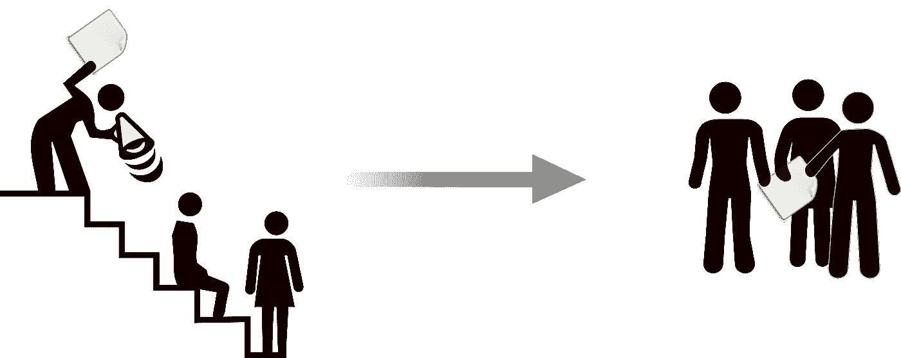

# 为什么人们不采取主动？

> 原文：<https://betterprogramming.pub/why-arent-people-taking-initiative-41d7fea34279>

安娜·鲍尔(自己的作品)[CC BY-SA 3.0([http://creativecommons.org/licenses/by-sa/3.0](http://creativecommons.org/licenses/by-sa/3.0))]，通过维基共享

## 短篇小说

*几年前，X 公司是一家五人创业公司。每个人每天都与每个人交谈，非常清楚需要完成什么——如果有人看到有什么事情没有完成，他们就会去做。这很混乱，但早期的员工也发现这种“身兼多职”的模式令人振奋和鼓舞。*

*随着 X 公司的成长，它陷入了另一种混乱。增加了几个管理级别，沟通孤岛开始发展，人们不再那么积极主动。*

处于“顶层”和“底层”的人之间存在理解上的裂痕，对双方来说，这似乎是一种绝望的处境。领导者感到沮丧的是，现场的工程师、设计师和产品经理没有想法，过于寻求许可，或者不够自信。与此同时，这些人感到窒息，并努力完成他们的任务，很少或没有关于他们如何影响组织的背景。工程师和设计师似乎缺乏热情，执行速度似乎很慢很慢。工程师说他们在设计上受阻，设计说他们在产品方向上受阻。技术领导和产品经理开始管理越来越小的任务。

*管理层开始重新评估他们是否在筛选合适的使命驱动型积极进取的人。工程师们开始觉得他们的学习停滞不前，一些内部招聘邮件开始变得更有吸引力。*

这听起来熟悉吗？这是一个假设的故事，但随着初创公司的扩大，这是一种常见的模式。

问题的关键在于:**人们没有被授权或信任去采取主动。**

在创业公司中作为个人贡献者工作的人并非天生懒惰。他们不会因为想赚更少的钱而自愿更努力地工作。他们想去一个能及时解决问题并对一些事情做出决定的地方，而不是每次都被击落。

所以如果这是你的现实，你能怎么办？

## 听

缺乏沟通是许多扩展挑战的原因。当存在沟通孤岛时，不仅关于战略和优先事项的重要背景无法传达给团队中的个人，而且经理和高管也无法获得关于团队动态的有价值的信息。你可能会对为什么某些工程师看起来不再有动力感到困惑，但是对于其他人来说，为什么可能会非常清楚。

找几个人脉更广、情商更高的人，和他们坦诚交谈。你可能会发现团队中有一种有害的东西，那就是否决想法——每个工程师两三次就足够了。也许公司的优先事项和战略经常改变，他们不知道当前的优先事项，直到他们有一个 sprint 价值的工作已经分配。或者可能是没有足够的时间去思考或做除了已经确定范围的项目工作之外的任何事情。

## 调整你的团队

人们需要有足够的背景和高层次的一致性来自己做出好的决策；否则，你会让人们采取主动，但却做一些毫无帮助的事情。

当创业公司达到 10-20 人时，突然之间，不是每个人都能出席所有的产品和战略会议。虽然公司的领导们仍然得到和以前一样水平的讨论和战略讨论，但是个人贡献者通常得到的要少得多，如果有的话。

你如何知道你是否提供了足够的背景和高层次的使命和战略一致性？你可以直接问某人——比如说，“嘿，有时候很难判断我是否表达得足够清楚，所以我想要一些反馈。你认为我们本周(周/月/季度)最优先考虑的是什么？”感谢他们，尤其是当他们的答案与你的不符时——他们已经帮助你成功地找出了沟通上的差距。不要找借口——如果他们那天不在办公室，那也没关系。想想你能做些什么来修复它。例如，下次，在全体会议后发一封电子邮件。

## 引入变革元素

其他人不会明白你已经决定是时候改变了。他们埋头于所有已经占据了他们时间的工作。如果你期望你会看到结果，只是因为你已经决定应该有所改变，你可能会失望，并得出结论，这些人只是没有积极性。但还记得他们是什么时候吗？当公司规模较小，他们做各种创造性的事情，或者当你采访他们，看到和听到他们眼中对工作的热情？

你需要一个[变化元素](https://betterhumans.coach.me/a-simple-organizational-design-framework-change-elements-8225e5163430):相当于当头一棒的东西(但不要真的这么做)，它说，*“嘿！我们所做的还可以，但并不伟大！让我们把事情改变一下！”也许这是一周或几天的休息时间，或者是一次团队头脑风暴。与此同时，可以就最新的优先事项进行清晰的沟通。*

反复改变现状比有意引入改变元素并设置适当的奖励来激励期望的行为更困难。

## 设置护栏

授权人们采取主动并不意味着一场混战。如果你已经提供了高水平的对齐，你还需要一些护栏。一些例子:

*   创建一个策略，实验可以发送到 2%的用户群，并且必须在 2 个月内进行分析和评估。
*   围绕一个非常具体的目标(例如增加每周返回的用户)，并分配时间和资源来构建生产中的最佳原型。
*   指定工程师 80%的时间应该用于范围项目，剩下的 20%应该用于探索或项目，这些项目*也满足团队的目的*。让工程师写下或展示他们的探索。

## 故意奖励行为

公司中的另一个现象是，声音最大、看起来最自信的员工会采取主动——或者更确切地说，当他们采取主动时，他们经历的摩擦会少得多，因此人们会将他们视为领导者。当不符合这种模式的人提出他们认为对公司有益的建议时，他们通常会遭遇更多的反对和质疑。

因此，确保你以公平的方式奖励行为。你可能还想和其他人商量一下，以获得更多的意见。如果有人主动开始一些入职文档(很好)，但沟通能力很差，完全忽略了她已经承诺的编码工作(不太好)，那么在私人反馈中要清楚下次如何改进。

同样，如果你是管理经理，奖励那些通过公开表扬或令人兴奋的机会成功授权给团队的经理。如果他们做得很成功，可能会感觉他们“做得更少”，所以要注意。

记住——无论你公开奖励什么，都会被效仿。

## 1:1 秒

一对一的会议是一个很好的时间来监控和推动人们朝着正确的方向前进，并调试这个过程中的任何混乱。如果你正在管理经理，在一个不太频繁的时间表中与他们的报告进行一对一的交流(有时称为跳过一级 1:1 ),以防止沟通障碍。发现新兴的领导者和高潜力的个人，并以一对一的方式鼓励他们发挥更大的主动性。

当人们提出他们遇到的问题时，指导他们思考他们会怎么做，并鼓励他们这样做，以帮助他们从“别人应该这样做”到“我应该这样做”的心理跳跃或者你会发现仍然有一些你可以帮助他们清除的障碍。

你也可以在会议中这样做，在更公开的场合表达观点。

当然，所有这一切都依赖于这样一个前提，即在组织的各个层面上赋予个人权力是一件值得做的事情，并且对公司有益。如果你发现自己质疑这个前提，花点时间探究一下为什么。是缺乏信任吗？还是担心你会显得无关紧要？

坦率地说，命令和控制的管理哲学不会给你的团队带来最好的结果。正如 l·大卫·马奎特在《T2》中所写的那样，将船调头，

> "那些接受命令的人通常跑得很慢，没有充分利用他们的想象力和主动性."