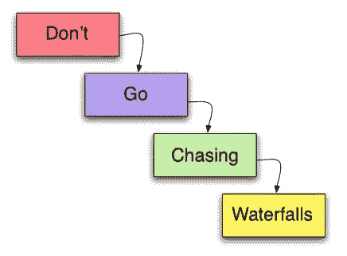
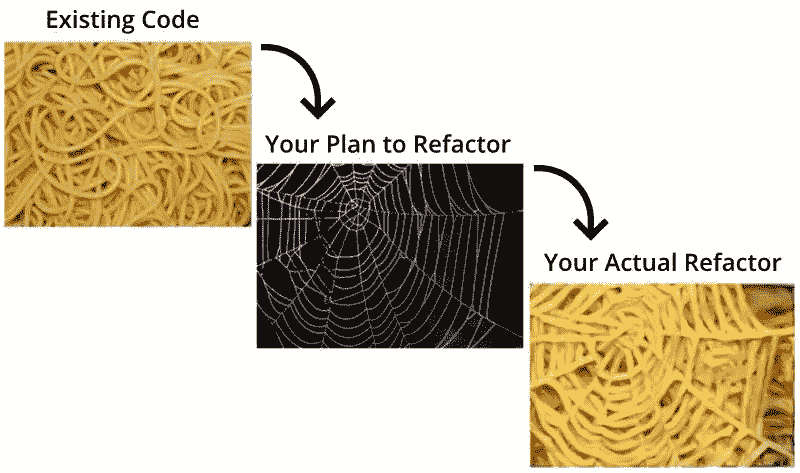

# 为什么重写对于保持软件活力至关重要

> 原文：<https://betterprogramming.pub/why-code-rewriting-is-essential-for-keeping-software-alive-81c7307e7f6>

## 定期重写软件组件，以避免最终全部重写

在过去的十年里，软件业发生了巨大的变化。变化最大的事情之一是软件开发过程。

这种变化是由新用户需求的实施、打包和交付速度的持续增长引发的。今天的软件制造商不再等待一年或更长时间来发布下一个软件版本，而是每月、每周甚至每天(或每晚)发布一次。

过去，*瀑布*是流行的软件开发生命周期(SDLC)模型。这个过程只有一个设计和开发的周期，之后软件进入一个漫长的维护阶段，直到死亡，使得“死亡”成为过程中的一个固有阶段。

TLC 很早就理解了这个模型的问题

随着软件产业的成熟，软件公司转向 i *增量/原型*模型，在这种模型中，软件被增量地设计和开发，每次增加更多的功能。

随着 c *持续集成和交付* (CI/CD)的实践，这个过程进一步发展，到了开发和维护之间的界限已经完全模糊的程度。软件从无生命的变成了动态的。

今天的软件就像一个活的有机体。它需要适当的营养来维持生命，为此，它必须保持健康的饮食。在我看来，这种饮食应该基于一种重要的营养:重写。

# **重写**

把软件开发想象成用铅笔画画。如果你需要改变你之前画的东西，你可以擦掉它，然后重新画。但是，这样做永远不会完全删除以前的铅笔标记。总会有些剩菜。

在艺术界，这种现象被称为*犹豫标记*。这些标记是艺术家思维过程的视觉证据，被一些人认为是审美愉悦的。然而，即使是这种现象最热切的支持者也会同意，报纸所能承受的是有限度的。总有一天你不得不重新开始。

代码重构就像铅笔擦除

虽然在艺术界，犹豫标记可能被认为是一种美学上的职业，但软件开发界却努力追求一种更优雅的外观。

软件世界中犹豫标记的等价物是混乱的、不可读的代码(又名*意大利面条代码*)，这通常是需求变化的结果，就像擦除标记是艺术家改变想法的结果一样。

当客户决定他们想要一个新的特性或者对现有特性的改变时，代码混乱的局面就开始了。客户的需求被转化为新的需求，在经历了评审和设计之后，开发人员收到了这些需求，是时候深入研究代码了。这种情况经常发生，就像用铅笔画一样，很快代码就不再美观，变成一团乱麻。

# 为什么要重写？

处理混乱的代码并不有趣。你必须花很多时间去阅读和理解它，但你从来没有真正做到。当你最终决定接触代码并改变一些东西时，事情往往会出乎意料地糟糕。代码不再可维护。那么，我们错在哪里呢？

当开发人员收到与原始需求集不同的新需求，并且当前代码不容易支持这些新需求时，他们有两种选择:

1.  **重构组件。**通过应用一个变通方法，强制代码与新的需求一起工作。这是“快速和肮脏”的解决方案。
2.  **改写成分。**根据新的需求和从旧代码中学到的经验，从头开始编写代码。这是“缓慢而干净”的解决方案。

开发人员和管理人员通常倾向于第一种选择。管理层认为这是更便宜、更快速的选择，而开发人员认为这是更容易的选择(我不怪他们)。

虽然第一种选择在短期内可能更快更便宜，但从长期来看，它要昂贵得多，更耗时，也更复杂。如果我们希望我们的软件能够长期存在，短期利益应该很少比长期利益更受青睐。如果你打算长期参与，你应该选择第二个选项。原因如下:

1.  **代码是其需求的反映。如果需求集被重写，代码必须被重写以反映这一点。**
2.  变通办法和部分解决方案只是推迟了问题，并没有解决问题。最终，你会在变通和重写上花费时间和金钱。
3.  被拖延的问题越拖越严重。当你最终意识到你必须重写时，这比你以前做过的要困难得多。
4.  **变通方法使得代码更难阅读和修改。**不可读的代码导致脆弱性，并增加引入新缺陷的机会。
5.  **不可读的代码也会伤害开发人员的生产力和积极性。**极端情况下，可能导致开发者离开一个项目。

根据 Robert C. Martin 的《[干净的代码:敏捷软件工艺手册](https://www.amazon.com/Clean-Code-Handbook-Software-Craftsmanship/dp/0132350882)》所说，写代码最快的方法是慢慢来。因此，“快”重构很慢，“慢”重写实际上很快。

# 何时重写

由于在持续时间和价格方面的权衡，需要在重构和重写之间保持平衡。当你选择一个而不是另一个时，你应该谨慎。以下特征很好地表明您的组件是时候重写了:

1.  **当代码变得不可读时。**这发生在经历了几次重构之后，或者可能一开始就写得很差。再次重构只会让事情变得更糟。
2.  当新需求偏离太远时。代码是基于某些假设编写的，现在随着新需求的出现，这些假设不再成立。在这种情况下，重构是不够的。
3.  **当新信息打开通往更好设计的道路时。有时，新的需求会比以前的需求更清晰。这一点，加上从以前的实施中吸取的经验教训，可能会带来一个改进的解决方案。**
4.  **当新技术出现时。**了解最新技术非常重要。这包括使用您的编程语言的最新特性，使您的第三方软件包保持最新，以及跟上最新的趋势。保持你的代码新鲜是很重要的，否则，它会慢慢衰退到不可用的状态。

定期重写软件组件，以避免最终全部重写。

# 如何重写

有两种类型的重写:*内部*和*外部*。

内部重写改变了组件的内部结构，而不影响组件公开的 API，让它的依赖者不知道这种改变。

外部重写可能会也可能不会改变组件的内部结构，但是它会改变组件公开的 API。这种重写会影响组件的依赖项，有两种方法可以处理它。

## **弃用和采用**

当您无法控制组件的依赖项时，或者当它们太多而无法一次更新时，这是一种选择。

在这种方法中，新组件和旧组件共存，直到所有使用旧组件的从属组件都采用新组件。

旧组件收到一个弃用状态，这可以通过它的名字(即`MyComponent`将被重命名为`DeprecatedMyComponent`或`DEPRECATED_MyComponent`，不管你的约定是什么)或在文档中表示出来(例如， [JSDoc](https://jsdoc.app/) 支持`@deprecated`关键字)。

## **依赖/依赖修改**

当您对组件的依赖项拥有完全控制权，并且没有太多的依赖项需要一次更新时，可以选择这种方法。

在这种方法中，新组件替换了旧组件，所有依赖组件都被重构以使用新组件，而没有废弃过程。

# 结论

我试着把重点放在重写的案例上，因为，根据我的经验，与重构相比，重写被低估了，令人害怕。更糟糕的是，重写经常被开发团队视为承认失败，使他们为不能编写灵活的代码和预测未来需求而感到内疚。

但是，正如产品所有者/经理不可能预测每一个可能的未来需求一样，开发人员也不可能(甚至是有害的)以这种方式编写代码。

这并不意味着没有重构的理由。但是当重写被同等地考虑时，重构和重写之间的微妙平衡得到了更好的维护。