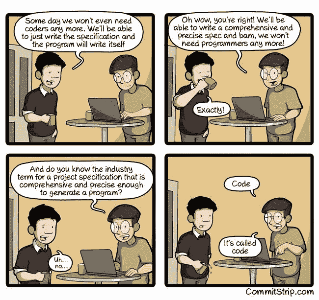

# 为什么 GitHub Copilot 不会改变编程

> 原文：<https://betterprogramming.pub/why-github-copilot-will-not-change-programming-1bef41f35f6d>

## 别担心，它不会抢你的工作

[梁杰森](https://unsplash.com/@ninjason?utm_source=unsplash&utm_medium=referral&utm_content=creditCopyText)在 [Unsplash](https://unsplash.com/s/photos/artificial-intelligence?utm_source=unsplash&utm_medium=referral&utm_content=creditCopyText) 上的照片

上周最热门的新技术是 [GitHub Copilot](https://copilot.github.com/) 。似乎几乎所有的程序员都在玩或等着玩这个新的花哨的 AI 编码助手。

有人说这是一个创新的游戏规则改变者，将完全改变编程世界！

但我对此并不乐观。从我作为一个老派程序员的角度来看，这种工具看起来很花哨，但并不像一些人声称的那样有用。更不用说，它将无法替代真正的程序员。

让我解释一下。

# 编码更快不是什么大事

想想吧。你花多少时间在编码上？

事实上，在大多数软件公司中，我们花在编写代码上的时间在整个软件开发周期中所占的比例并不高——甚至不到四分之一。

我们花更多的时间在需求分析、技术设计、测试、调试和团队协作上。

软件工程很难，主要是因为现实世界的高度复杂性。我们无法改变这一点——随着时间的推移，计算中的抽象是不可避免的。没有一个项目因为缓慢的编码而失败。

commitstrip.com

编码更快不会让你成为更好的程序员。抽象、设计和现实世界工程的经验会让你成为更好的软件工程师。

一些年长的程序员由于视力不好而打字很慢，但他们写出了无错误的代码。

# 它能帮助我们更快地编码吗？

几年前，我对这种编程辅助工具非常着迷。Emacs 中有一个流行的模板系统叫做 [snippets](https://github.com/joaotavora/yasnippet) 。我们定义自己的模板和函数，然后一个快捷方式生成一个代码模板，我们只需填写剩下的。

看起来很酷，真的很酷。它让我变成了超级程序员，就像电影里一样！

但是，在我深入了解之后，我发现它并没有我想象的那么有用。编码速度不是我的瓶颈，随着职业的发展，我花在编码上的时间越来越少。

[Tabnine](https://www.tabnine.com/) 是一个类似于 Copilot 的 AI 编程辅助工具，它根据你之前的输入生成部分代码。Copilot 甚至会根据你的评论、功能名称等等提出建议。

问题是，当我用它编码时，*我需要不断地检查自动完成是否正确。*

这对我是一种干扰。想象你是一个经验丰富且扎实的程序员——你正在配对编码的这个人工智能工具是一个天真且偶尔愚蠢的工具。不，我不要！

根据我的经验，让我编程更快的最好方法是:

*   *聚焦，聚焦，聚焦*。
*   编码前想清楚

快捷键、变量补全、类属性和方法名补全都有助于更快地编码——它们将帮助您的输入跟上思维。

但是代码生成是另一回事。它会分散你的注意力，甚至超过 50%的完成抓住了你的编码意图，其他无意义的部分会让你慢下来。

当然，如果代码库包含大量重复的片段或逻辑，这种工具绝对可以加快你的编码速度。例如，大多数前端编程和 web 编程都包含大量类似的 CRUD 逻辑。

但是我不相信这些东西会给编程带来根本性的改变。而且，至少对我来说，我不会用它编码更快。

# 对学习编程有帮助吗？

Copilot 将有助于减少重复的任务，如从网上搜索代码。作为一个学习编程的初学者，它可能会帮助你，因为当你键入一些关键字时，代码片段就会出现在你面前。

但是，让我提醒你，复制并使其工作并不是提高你的编码能力或工作质量的好方法。

即时的代码建议可能会让你在编码时感到高兴，但从长远来看，它们对你没有帮助。

unsplash.com/@freestocks 摄

编程一门手艺，就像写字画画一样。我们写源代码是为了表达思想。你认为让一个人工智能来帮助学习者理解下一个句子或段落是什么是个好主意吗？

*单词自动补全会有帮助，但是句子自动补全会成为负担。*

和写字是一样的。如果我们想更好的编程，唯一的方法就是大量的编码和阅读。

[约翰·卡马克](https://d3dvortex.blogspot.com/2005/07/programming-advice-from-john-carmack-i.html)，在谈到学习编程时说:

> 避免“食谱式编程”,即复制并粘贴你找到的一些代码，使之工作。确保你完全理解它实际上在做什么，并且你在其他情况下也能自如地运用这些技巧。

# 潜在的风险

人工智能编码辅助有几个风险:

*   潜在的漏洞。如果用户没有注意审查生成的代码，这将是一场噩梦。
*   代码的版权和所有权问题。如果一个代码片段是从 GPL 授权代码库生成的[，被商业公司改编，如果不行是谁的错？代码生成时谁是所有者？](https://twitter.com/mitsuhiko/status/1410886329924194309)
*   安全。黑客有没有可能密集训练一些代码片段，诱导攻击代码给用户？

# 潜在的好处

当然，作为一个新生事物，Copilot 在某些场景下也可能带来一些好处。

*   为了让这个工具更有用，我们可能会倾向于写更有意义的名字和更好的文档。
*   如果允许我们使用，面试可能会更容易。
*   它可能会给你一种感觉，有人总是在你身边，你在编程时并不孤单。也许是比小黄鸭更好的感觉吧！

## [加入我的电子邮件列表，获得更多关于软件工程的有用见解，免费。](https://codercat.substack.com/)