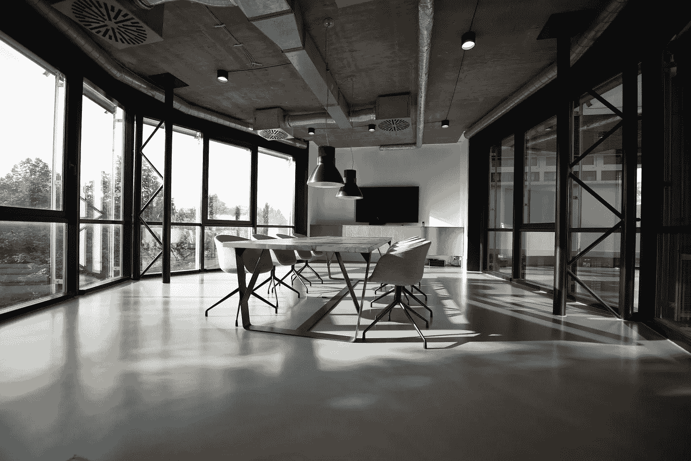

# 为什么我讨厌开放式办公室

> 原文：<https://betterprogramming.pub/why-i-despise-open-offices-8e87152234ff>

## 我们需要独处、尊重和长时间不间断的专注

在 [Unsplash](https://unsplash.com/s/photos/open-office?utm_source=unsplash&utm_medium=referral&utm_content=creditCopyText) 上由 [Nastuh Abootalebi](https://unsplash.com/@sunday_digital?utm_source=unsplash&utm_medium=referral&utm_content=creditCopyText) 拍摄的照片

开放式办公室是热垃圾。它们扼杀生产力，造成无情的干扰，并让你陷入厚厚的、不必要的审查之中。

我第一次体验真正的开放式办公室是在旧金山的一家大型科技公司。我从一个更小的中西部城市的地下室办公室(是的，地下室)加入了这家公司。在我的小办公室里，我有自己的隐私，和同事有点隔离，也很安静。

我当时并不知道，但这间小办公室是真正完成工作的理想环境。

我的下一个新的“高科技”办公室很时尚，到处都是优雅的家具和小吃。每个会议室都是玻璃做的，你很难在整个办公室里找到一个别人看不到你在做什么的地方。

持续的监督导致生产率下降。

每个人在不同的条件和不同的环境下工作得最好。有些人可能喜欢背景有点噪音，有些人可能喜欢安静。对我来说，要长时间专注于工作，我需要感觉自己没有被持续监视。

开放式办公室的一个副产品是每个人都能看到你在做什么。当你没做错什么的时候会感觉不舒服。这并没有提高生产率，反而给 T4 制造了压力，让它看起来很忙。

停下来看 YouTube 的时候要非常小心，因为当你这么做的时候，不可避免地会有人走过，心想:“他们又在看 YouTube 了……”

很长一段时间，我都不明白为什么我这么讨厌开放式办公室。我知道一些困扰我的情况，比如被监视或没有安静的空间，但我不知道具体原因。

在我开始软件工程师的职业生涯之前，我想成为一名录音室工程师。我在我的地下室建了一个小工作室，录制当地乐队，并在大学完成了音频制作学位。

我喜欢声音。我喜欢与录音和制作相关的技术。

长时间独自呆在温暖、发光的录音棚后面灯光昏暗的录音室里，效率极高。我会一遍又一遍地听同一个音轨，一边做决定，一边继续应用压缩、均衡器等等。

这是焦点。孤独。

没有同事。没有会议。没有打扰。没有关于我周末过得如何的无聊闲聊(很好，凯伦)。

在这条路上的某个地方，我意识到作为一名录音工程师谋生是极其困难的。我向前看了。软件和技术是相似的激情，所以我决定改变方向，开始走这条路。

从外面看，事情似乎是相似的。我会花一些时间独自呆在电脑前，就像我在录音棚一样。同样的工程，同样的侧重点，不同的内容。

*错了*。

我被扔进了一个每天都有站立会议、决策会议、结对编程的世界，办公桌离你的同事如此之近，以至于你可以共用同一个键盘。几乎不可能调整。

当你戴着耳机工作时，有人站在你身后等着你，这种感觉是世界上最令人不安的事情。这个人认为他们是在帮你的忙，因为你看起来很忙(你确实很忙)，但他们无意中做的是在接下来的 10 分钟、15 分钟甚至 20 分钟里破坏你的生产力。

即使在冒犯的人问了他们的问题并离开你的空间后，你为回答他们的问题而进行的上下文切换会重置你的任何焦点，迫使你重新开始。

也许你很幸运，得到了一份完全远程的工作，或者你可以大部分时间在家工作。也许你还有一个小隔间(草不会更绿，小隔间的存在是有原因的)。认为自己很幸运，没有被发生在开放式办公室里的生产力暗杀所伤害。

随着时间的推移，情况对我来说稍微好了一些。我已经学会了屏蔽我的周围环境，更经常地戴上耳机，当我处于“最佳状态”时，试着为同事设定界限。即使有了这些对策，在一个开放的办公室里，我仍然经常感到焦虑和注意力不集中。

我们不需要更多满是员工的仓库楼层被捆绑成一个大的超级员工；那不是一件事。

我们需要独处、尊重，以及完成复杂的工作任务需要长时间不间断的专注的观念。