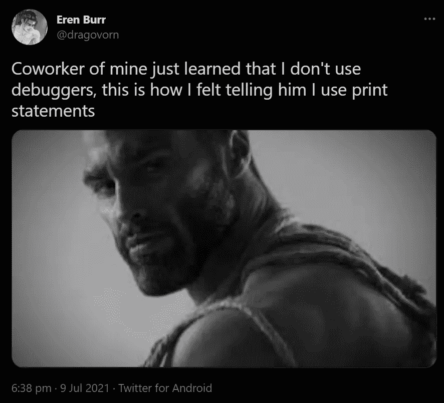

# 为什么我不再使用调试器

> 原文：<https://betterprogramming.pub/why-i-stopped-using-debuggers-bc6064d3ca2d>

## "调试器是一种浪费时间的东西."—鲍勃叔叔

来源:[维基媒体](https://commons.wikimedia.org/wiki/File:Debug_teddy_bear.jpg)

一个软件开发人员的整个人生可以概括为两个字:*编程*和*调试*。

如果他们不是在编码，他们就是在努力修复一个 bug。如果他们不是在调试，他们就是在写代码。[Edsger w . Dijkstra](https://www.goodreads.com/author/quotes/1013817.Edsger_W_Dijkstra),*一门编程学科*的作者说:

> “如果调试是去除软件 bug 的过程，那么编程一定是把 bug 放进去的过程。”

有趣的是，调试通常比编码需要更长的时间。

我的编程之旅是从 C 开始的。C 不是一种你可以轻易驯服的编程语言。通常，它会反抗并试图说服我放弃编程。

虫子们非常乐意和我玩捉迷藏。我会修复一个 bug，只为了一个新的、更可怕的 bug 出现。

与汇编或 Fortran 相比，C 可能不是最难的编程语言，但作为一个千禧一代，C 是一种激烈的编程语言——尤其是当我面对一段肮脏的代码时。

然而，事后看来，学习 C 是值得的。

对于我后来使用的语言:C++、MATLAB、JAVA 和 Python 来说，这是一个很好的热身。

奇怪或愚蠢的是——选择你想要的——我花了一半的编程时间进行调试，却不知道存在像*调试器*这样的助手工具。

我第一次使用调试器是在我开始编码五年后——正好是我开始用 Python 编码的时候。

我的第一个 IDE 是 [Code::Blocks](https://www.codeblocks.org/) ，虽然 Code::Blocks 有调试器，但我并没有意识到。

# 调试器之前

当我开始编码时，我的主要调试方法是我的数学教授的建议。他说:

> "每当你遇到困难时，调整代码并寻找模式."

这对我很有效，因为我用这种方法调试了相当多的程序。也就是说，这很费时间。

此外，在软件世界里，你学得越多，曲线就变得越陡。你真的永远不会解决问题。结果，因为调试越来越难，时间越来越短，我意识到我需要额外的调试方法。

我最终发现并添加了两个新方法到我的调试清单中。我会:

*   在一张纸上记下我的代码的细节。
*   撒在`printf`或者其他语言的等效物上。

这三种方法结合起来让我成功地调试了最脏的代码。多亏了这个，至今没有一只虫子逃过我的视线。

也许将来这种情况会改变。希望不会。

有些 bug 花了我几个小时，几天，甚至几周。但我最终会赢。我的黄金编程特质过去是，现在仍然是坚持不懈。

后来，我在 Reddit 编程线程上偶然发现了调试器。

# 调试器之后

当我碰到调试器时，我发现它们是一个有趣的发明。

在任意位置插入断点。逐行检查代码。见证变量变化。这些都是有趣的特征。

就像机器在给你做演示一样。

因此，我喜欢调试器，并马上开始使用它们。

事实上，我放弃了我的调试方法，代价是使用调试器。我会用一个调试器来调试可能出现的最小的 bug。有时，我甚至会在运行程序之前运行一个调试器。

这让我成为了一个懒惰的程序员。

我的编程效率在下降。分析我的代码并在一张纸上写下我的编程方法的日子一去不复返了。

罗伯特·c·马丁(敏捷的创始人)的文章总结了我对调试器的感受，“调试器是一种浪费时间的想法。”

> “我认为调试器是一种毒品——一种瘾。程序员可能会养成依赖调试器而不是依赖大脑的可怕习惯。”罗伯特·c·马丁的

事实上，当我使用调试器时，我通常需要修复的错误比我粗略调试时要多。

我需要一个解决方案。

有一天，我坐下来想，“没有调试器我也很好。为什么我现在需要调试器？”因此，我决定重新使用我以前的调试方法，完全抛弃调试器。

不使用调试器对我来说非常好。我需要付出更多的努力，但这是值得的。我使用其他工具，如分析器、杀毒器和单元测试，但不使用调试器。

# 我并不孤单

当我决定放弃调试器时，我以为只有我一个人。也很疯狂。直到我发现我不是。

计算机科学界的许多关键人物对调试器不屑一顾。

《不可思议的 Python》的作者吉多·范·罗苏姆曾经说过，他 90%的时间都在使用`print`。

prime UNIX 和 GO 的撰稿人 Brian Kernighan 和 Rob Pike 分别在他们的书*编程的实践*中写道:

> “我们发现，单步调试一个程序不如努力思考、在关键地方添加输出语句和自检代码更有效率。”

更糟糕的是，Linux 背后的智囊 Linus Torvalds 写了一封[电子邮件](https://lwn.net/2000/0914/a/lt-debugger.php3)表达他对调试器的蔑视。这封电子邮件以下面的陈述开始:

> “我不喜欢调试器。从来没有，可能永远也不会……”

托沃兹是我最不可能怀疑会背弃调试器的人。换句话说，在没有调试器的情况下管理拥有超过 2600 万行代码的 Linux 内核会让人怀疑调试器的用处。

但故事并没有到此结束。这些只是在互联网上粗略搜索的结果。我敢肯定，如果你深入挖掘，你会发现更多的人对调试器持反对意见。

可悲的是，使用调试器的后果不仅仅是生产力、懒惰和上瘾。

调试器的一个核心实际问题是*可伸缩性*。

当我使用调试器时，我觉得我只是在修剪 bug，导致许多其他 bug 的逃脱。然而，当我绞尽脑汁，分析我所做的，并试图模仿机器时，我确信我彻底根除了这个错误。

换句话说，调试器有助于解决众多问题中的一个问题。

事实上，魁北克大学计算机科学教授 Daniel Lemire 和经验丰富的游戏开发者 Ben Deane,[都表达了他们对调试器不能规模化的担忧。](http://www.elbeno.com/blog/?p=1598)

考虑到所有讨论的结果，我应该使用调试器吗？

不用了，谢谢。我还是用老办法吧。

# 长话短说

简而言之，调试器是一个方便的工具，程序员可以在需要时参考它。没有人能否认他们节省时间。但这是有代价的。

你是否选择支付这笔费用取决于你自己。我选择不要。我可能不会很快改变主意。

事实上，我不记得上次使用调试器是什么时候了。幸运的是，我仍然赢得了我参加的每一次调试会议。

这条推文准确描述了我不使用调试器时的感受:

来源:[推特](https://twitter.com/dragovorn/status/1413553158668816388)

我认为调试器不适合我，因为我缺乏纪律性。

你看，尽管调试器很有吸引力，但它们是作为最后的手段来使用的。我的问题是我通常会滥用有吸引力的东西。