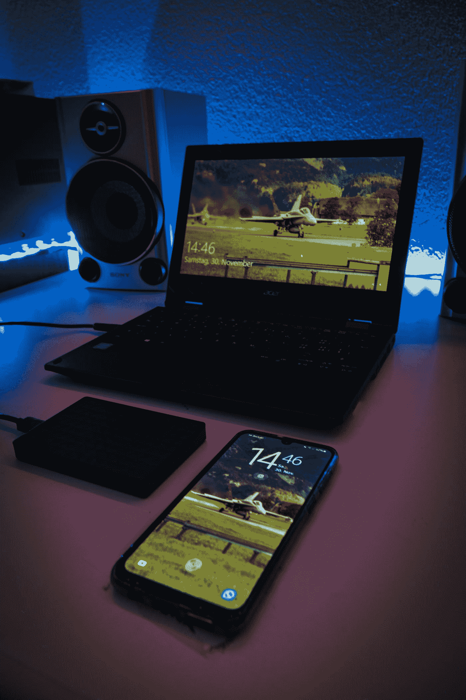

# 为什么是时候考虑为桌面电子颤振了

> 原文：<https://betterprogramming.pub/why-its-time-to-consider-flutter-over-electron-for-the-desktop-213bba8930fa>

## 移动应用的性能、优化和潜力

卢克·范·济尔在 [Unsplash](https://unsplash.com?utm_source=medium&utm_medium=referral) 上拍摄的照片。

今天，我们在桌面上使用的大量应用程序都是由[电子](https://www.electronjs.org/)开发的。似乎越来越少的公司选择用本地语言为平台开发应用程序。相反，他们选择了跨平台解决方案。事实上，电子似乎已经成为创建桌面应用程序的公司事实上的选择。理论上，这个价值主张非常好，因为你也许可以重用你的 HTML 和 JS 知识来创建桌面应用程序。

最近，Flutter 已经进入测试阶段，可以在 Windows、Linux 和 macOS 等桌面操作系统上使用。就我个人而言，我相信这项技术有潜力占据桌面应用程序市场相当重要的一部分。

但是，为什么你会想到使用 Flutter，而现在这么多高质量的应用程序都在使用 Electron 呢？要了解这一点，我们先来了解一下为什么这几天电子这么受欢迎。

# 电子可以让你在桌面应用程序中使用网络技术

电子公司在他们网站上的标语是“如果你能建立一个网站，你就能建立一个桌面应用。”很快，这吸引了那些已经很擅长创建网站的人，他们想重用他们的知识来创建一个桌面应用程序。理论上，这听起来很神奇，但是我想说 web 技术不太适合创建桌面应用程序。在当今以网络为先的世界里，这种观点似乎不合时宜，但我一次又一次地发现这是真理。让我们来看看为什么。

## 它会很快变得复杂

通常，用一些基本的 HTML、JavaScript 和 CSS 创建一个电子应用程序是非常容易的。许多人的第一个应用程序都是如此简单，他们有一个可以在 Windows、Linux 或 Mac 上运行的应用程序。这个世界一切都好。

当你想完成稍微复杂一点的事情时，你可能会开始利用第三方 JavaScript 框架，比如 Angular、React 或 Vue。然后，这些框架也会有依赖关系。因此，接下来，您需要配置 webpack 来捆绑所有的依赖项，并将它们放在一起供 electronic 使用。

Webpack 是一个制作精良、非常复杂的工具。此外，webpack 的任务本身非常复杂。它将你所有的代码和你的应用程序的依赖项连接成一堆 JavaScript，供浏览器使用(或者，在这种情况下，是电子版)。进展顺利的关键重要性怎么强调都不为过。如果你做错了，你的应用程序就无法运行——或者更糟，应用程序的某些部分无法正常运行。如果您引入了新的依赖项，这些依赖项有些陈旧或者已经很久没有维护过了，这将使 webpack 变得更加困难，因为它试图将您的所有内容打包到一个单一的内聚脚本中。

没有普遍接受的方法可以通过 webpack 之类的工具捆绑你的应用，你可能会得到一个完全错误的配置。在这种情况下，很难找出问题到底出在哪里，或者如何前进。很快就会变得很沮丧。

我们为什么要这样做呢？因为我们试图使用一个最初为网站设计的工具，用于我们的桌面应用程序。Webpack 不是为桌面创建的。它是为网络创建的*。至少可以说，设置这个[的配置有点笨拙。webpack 提供的许多功能(如拆分包等。)只是网络上的一个好主意。对于你的桌面应用来说，这是一个不同的故事。](https://stackoverflow.com/a/49054932/3943525)*

## 磁盘使用

现在，你的电脑上有不止一个电子应用程序。因为电子本质上是一个“盒子里的浏览器”，这意味着每一个电子应用程序都带有电子框架，其重量达到惊人的 120MB。由于 Electron 的工作方式，你不能将框架安装到电脑上，然后让所有其他使用 Electron 的应用程序使用它。每个应用都有自己的框架。这意味着，如果你有十个在 electronic 中开发的应用程序，即使这些应用程序本身只是“hello world”应用程序，它们也会占用一个以上的内存。

它之所以这么大，是因为可再发行版包含了 Chromium 框架的大部分内容，所以它可以读取和解析 HTML 并解释 JavaScript。这些依赖关系增加了电脑上已安装应用程序的容量。

## 可用性和响应性

在 Electron 中制作应用程序意味着你使用 HTML 来定义应用程序的外观，然后使用 JavaScript 来定义业务逻辑。因为 JavaScript 是及时编译的(JIT ),而不是提前编译的(AOT ),所以你的应用运行起来会稍微慢一点。“一点点”是非常主观的，但是随着你的应用程序的复杂性增加，它包含了更多令人兴奋的功能，你的应用程序的性能可能会开始下降一点点。

当然，现在击败“JavaScript 很慢”这匹马是非常酷的。但事实仍然是，即使我们看到 JavaScript 引擎随着时间的推移有了显著的改进，它的性能仍然不如提供 AOT 编译的框架。最近，我们看到 WebAssembly 等技术的兴起，它们提供了比 JavaScript 更好的性能。WebAssembly 非常适合运行在您通过浏览器进行交互的网站上的应用程序，即使您的应用程序由于使用了 WebAssembly 而执行得更快，您仍然需要使用 HTML 来直观地描述您的应用程序。

照片来自[扑](https://flutter.dev/)。

# 颤振的原因

Flutter 仅在相对较短的时间内可用于手机，现在它也开始为桌面环境提供初步支持。或许现在还不是*发布*一款通用应用的最佳时机(因为桌面支持还没有最终确定)，但这绝对是开始学习桌面版 Flutter 的最佳时机。

我们为什么要这么做呢？作为开发者，我们已经有了相当多的跨平台解决方案，比如 electronic。既然已经有解决方案可以让我们完成这项任务，我们为什么还要学习另一个框架呢？不仅如此，我们为什么要开始学习一个桌面产品还不稳定的框架呢？有几个很好的理由。

## 表演

电子应用程序使用 HTML 来设计 UI，也使用 JavaScript 来实现业务逻辑。我只想说:HTML 不适合桌面应用程序。它从来没有被设计用来描述桌面应用程序的 UI，虽然它是可能的，但这样做是不表达的或不直观的。另外，除非你的应用只是一组静态的页面，否则如果不使用 JavaScript 来调整 DOM，你实际上无法让你的 HTML 做任何事情。

许多公司已经成功地使用电子技术创建了应用程序，然后将这些应用程序发布出去，但是这些应用程序从来都没有“本地”的感觉，也没有本地的性能。它们有时非常接近，但与本地应用相比，电子应用总是有不一致的性能和更多的内存使用。

在“非常接近”类别中，我们有桌面上的 Slack 客户端和 Discord 客户端等应用程序。这两个都是电子应用程序，运行得相当好。这些应用程序的性能可能是由于这些公司中异常聪明的人为 web 开发了这些应用程序的高性能客户端，这些好处已经简单地流向了桌面应用程序。

然而，从性能角度来看，一些电子应用程序很糟糕，在使用时经常死机或变得没有反应。微软团队就是一个很好的例子。我在日常工作中使用团队，甚至完成像在标签页之间切换这样的基本任务也要花费太多时间。性能问题在整个应用程序中非常普遍。我是[不是](https://answers.microsoft.com/en-us/msoffice/forum/msoffice_other-mso_win10-mso_o365b/teams-is-slow/4feb84b2-7fd8-4727-b056-827dcb2d8741)[只有](https://answers.microsoft.com/en-us/msteams/forum/msteams_meet/why-is-teams-so-slow-and-unresponsive-when-with/59dda1d7-8621-446f-86d3-5802712dfc6e) [人](https://www.reddit.com/r/MicrosoftTeams/comments/il64zy/why_is_microsoft_teams_so_slow/)有这个[问题](https://techcommunity.microsoft.com/t5/microsoft-teams/very-slow-and-lagging-ui-in-teams/m-p/38960)。桌面团队的前身是 Lync，虽然 Lync 肯定有它的问题，但它是为 Windows 编写的计算机上的原生体验。这两种实现之间的性能差异再明显不过了。在 Lync 中切换标签几乎是即时的，而在团队中更改标签可能需要 5-10 秒钟。这种暂停真的会破坏用户的体验，让人们质疑你的应用程序的质量。这也让用户觉得应用程序本身质量不高。

在手机上，Flutter 编译成机器码，所以性能非常好。在桌面上，也是一样的。没有时间花在尝试动态解释你的代码上，因为它是提前编译的，确保你的应用程序是高性能的。即使有复杂的绘制调用，Flutter 也能推出数量惊人的 UI，并保持每秒 60 帧的速度。

因为 Flutter 不是运行 Chromium 的实例来呈现你的应用程序，而是作为一个本地应用程序在机器上运行，所以性能大大提高了。内存使用减少，应用程序感觉更快更灵敏。

更快的应用带来更好的用户体验(图片由 [Glenn Carstens-Peters](https://unsplash.com/@glenncarstenspeters?utm_source=medium&utm_medium=referral) 在 [Unsplash](https://unsplash.com?utm_source=medium&utm_medium=referral) 上拍摄)。

## 类型安全的用户界面定义

如果你用电子和 HTML 编写你的应用程序，你的代码要么完全错误，要么有点不可靠，电子仍然会尽最大努力解析和显示你写的内容。HTML 标准已经存在很长时间了，现代浏览器使用各种巧妙的方法来确保网页正确显示。如果你正在使用一个更新的框架，比如 Angular with Electron，你可能有一些类型安全的优点，使得你的应用程序在编译时失败(因为你的 HTML 是无效的)，但这仍然是非常小的。这使得很难弄清楚为什么你的应用程序不能以某种方式显示，或者为什么它有一个奇怪的视觉呈现。

有了 Flutter，当你用编写业务逻辑的同一种语言为你的应用程序设计 UI 时，它实际上不会让你编写不正确的 UI 代码。您的 UI 最终拥有与应用程序的业务逻辑相同的类型安全级别，这令人印象深刻。这些安全措施最终会节省您的时间，因为减少了花在调试应用程序问题上的时间。

## 更好地利用空间

正如我们上面提到的，electronic 中的“Hello World”大约需要 100MB，并且对于用户计算机上的每个 electronic 应用程序都是重复的，这种大容量的原因是每个 electronic 应用程序都有大部分的 Chromium 浏览器和节点。在 macOS 上，从我刚刚创建的一个应用程序来看，它重约 50MB。很快，这比电子应用程序减少了 50%。由于应用程序的构建和链接方式，Flutter 能够更好地利用空间。

对于一个电子应用程序，用户会收到一个轻量级的 Chromium 实例以及对应用程序本身的依赖。但是由于 JavaScript 的一些特性，要彻底改变你的电子应用程序(或者仅仅保留应用程序中被使用的部分)并不容易。JavaScript 也有反射作为一种语言特性，所以这进一步阻碍了有效地动摇你的应用程序的能力。你可以优化你的捆绑和缩小过程，以剥离更多的应用程序并进一步减小大小，但这增加了意外剥离应用程序正在使用的部分的风险(这将导致运行时错误)。

Dart(编写 Flutter 的语言)*没有反射*。宣扬语言特性的*缺乏*是一件好事，这听起来可能很奇怪，但是没有反射意味着你的应用在编译时确切地知道应用的哪一部分正在被使用，因为它不会在任何时候被动态调用或创建。这导致更好的树抖动和更少的磁盘使用。如今，存储非常便宜，所以这不是一个大问题。但当那个把我的键盘灯从蓝色变成红色的应用程序不知何故有一个 150MB 的安装程序时，我仍然感觉很奇怪。

Flutter 可能意味着从桌面应用程序到手机应用程序的更好途径(图片由 [Felipe Giacometti](https://unsplash.com/@fegiii?utm_source=medium&utm_medium=referral) 在 [Unsplash](https://unsplash.com?utm_source=medium&utm_medium=referral) 上拍摄)。

## 通往移动的更好途径

虽然你可以在电子版上写一个应用程序，但是如果你愿意的话，没有明确的方法可以将你的应用程序转移到 Android 或 iOS 等手机上。的确，只需要一点点努力，你就可以通过像 Cordova 这样的东西来引导你的应用程序，并把它安装到手机上。但这并不是电子应用程序真正支持的途径——你必须自己接线。然后，在手机上通过 Cordova 运行你的应用程序，你会遇到所有的性能和可用性问题。

有了 Flutter，你可以为 iOS、Android、Windows、Mac 和 Linux(更不用说 web)构建你的应用。您生成的所有应用程序都可以来自同一个 IDE，并且是同一个构建过程的结果。这使得构建和封装过程更简单。

# 学习的时间

正如本文开头提到的，Flutter 的桌面支持还没有稳定下来。由于 macOS 和 iOS 之间的相似性，这是目前 macOS 上最好的体验，但 Windows 和 Linux 并没有落后太多。另外， [Canonical 已经与谷歌合作，在 Flutter](https://www.xda-developers.com/google-partners-canonical-bring-flutter-apps-linux-ubuntu-snap-store/) 中为 Ubuntu 开发未来的桌面应用。而且，很明显，由于电子时代和相对较新的桌面 Flutter，电子中的一些固有功能(如通知、任务栏图标等)。)还不能用于颤振。但这种差距不会持续太久。

这意味着，虽然我们可能还不会为 Flutter *发布一个生产应用*，但这将是开始使用 Flutter 开发一些基本桌面应用的好时机。在不太遥远的将来，当 Flutter 的桌面支持开始成熟时，作为一名开发者，你可以更好地开始使用它。你开发的应用程序很有可能更美观、更高效，并且在你客户的电脑上占用更少的存储空间。

所以，如果你一直对此犹豫不决(或者甚至完全不知道桌面对 Flutter 的支持)，现在绝对是开始走这条路的好时机。

*本文为* [*最初发表于 Codemagic 博客上的*](https://blog.codemagic.io/flutter-vs-electron/) *。*