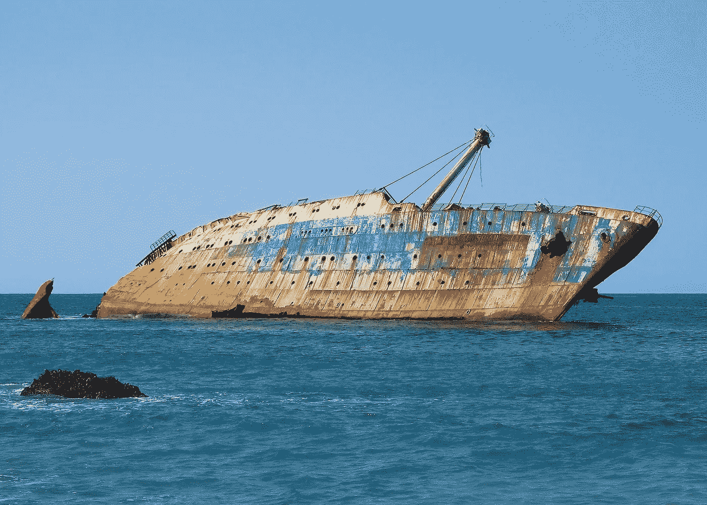

# 为什么 Kubernetes 不总是开发人员最好的朋友

> 原文：<https://betterprogramming.pub/why-kubernetes-isnt-always-a-developers-best-friend-3a8b407318f6>

## Kubernetes 阻抗不匹配

来自 [Pixabay](https://pixabay.com/?utm_source=link-attribution&utm_medium=referral&utm_campaign=image&utm_content=91013) 的[大卫马克](https://pixabay.com/users/12019-12019/?utm_source=link-attribution&utm_medium=referral&utm_campaign=image&utm_content=91013)的图片。

[Kubernetes](https://kubernetes.io/) 是一款令人惊叹的编排服务。它将确保您的所有服务都已启动，重新启动那些似乎正在失败的服务，并组织您的日志和诊断。它席卷了整个行业，并成为所有云提供商之间的共同纽带。如果你了解 Kubernetes，你可以相对容易地在 Azure 的 AKS、亚马逊的 EKS 和谷歌的 GKE 之间转换。

如果您是一名开发人员，它有希望使开发和生产部署如此相似，以至于以前只能在生产中发现的错误可以在开发周期的早期发现。它使完全自动化的 CI/CD 几乎近在咫尺，无需数英里的手写脚本。

唉，这不是所有人都能做的事情，当有选择的时候，Kubernetes 团队总是倾向于产品编排方面，而开发人员则被抛在后面。完全自动化的 CI/CD 仍然是一项艰巨的任务，每个开发商店仍然需要 DevOps 编写那些长达数英里的手写脚本。在本文中，我将尝试列举 Kubernetes 在开发环境中的不足之处。

# 1.码头工人

这应该会在每个需要处理它的人心中引起恐惧。Docker 不适合在自身内部运行，Kubernetes 编排 Docker 容器。因此，如果您的管道需要 Docker 来构建映像，并且您的管道在 Kubernetes 下运行，那么您需要在 Docker 内部运行 Docker，这让我一想到就头疼。

这个问题有两个解决方案。第一种是劫持外部主机的 Docker 套接字。这使得你的 Docker 容器运行在一个兄弟容器中，而不是一个子容器中。让我解释一下。Docker 分为两部分:命令行界面和 Docker 机器。这两者通过一个众所周知的套接字进行通信，因此当您键入一个 Docker 命令时，命令行程序会通过套接字向 Docker 机器发送一条消息，由 Docker 机器完成大部分工作。因此，如果您从容器内部发出 Docker 命令行指令，它会将消息发送到外部主机的 Docker 机器。这种解决方案的缺点是内部容器需要被授权访问外部主机的 Docker 套接字。

第二种解决方案是通过另一个程序模拟 Docker。有太多这样的非 Docker 仿真程序，如 [Buildah](https://buildah.io/) 或 [Kaniko](https://github.com/GoogleContainerTools/kaniko) 。但是 Docker 实际上处理了很多任务:构建映像、处理容器注册表和运行映像。前面提到的两个程序只处理容器注册的构建和推送。其他程序可用于更多地访问容器注册表。

因此，虽然有从构建过程中消除 Docker 的解决方案，但没有人像 Docker 那样做。

# 2.Kubernetes 描述符文件是静态的

Kubernetes 的人有意识地决定不允许外部影响描述符文件。没有环境变量，没有命令行变量。描述符文件中的内容就是正在运行的内容。您可以使用命令行来修改已经运行的服务，以受控方式更新映像版本或其他更改，但是这些更改不会反映在原始描述符文件中。

除了使用命令行以非常可控的方式更改描述(在生产中，您可能只想以非常可控的方式更改内容)，唯一的解决方法是使用模板。当然，这首先违背了静态描述符文件的目的。

舵图是模板化描述符文件的主要方式。它们实际上解决了许多其他问题，比如协调众多服务之间的变化。但是也很容易被掌舵图冲昏头脑，使你的部署变得复杂混乱，这是我们试图避免的。基本上，它们是 DevOps 团队的工作保障。

严格遵守静态描述符文件使得在开发和生产环境中很难使用相同的描述符。因此，我们的环境开始分化，你必须花时间和精力试图重新融合。所以“它在开发中有效，所以我们知道它在生产中也会有效”的梦想破灭了。

# 3.开发环境中的就绪性检查

一个开发人员最终合并了他们的代码，并出去喝了几杯来庆祝。然而，回到 Kubernetes，服务无法启动。所以 Kubernetes 顺从地重启它，服务再次失败。现在，该节点将使用其所有的 CPU 来重新启动一个中断的服务。当然，您可以编写一个小程序来取消部署在过去一小时内每分钟重启一次的服务，或者让您的脚本智能地部署新映像，以便退出并恢复上一个映像。但这只是增加了更多原本应该降低复杂性的脚本行。开发和生产需要不同的策略，这些差异增加了我们想要避免的分歧。

# 4.容器内外的不一致

有时，我们需要在本地运行一个程序，以便在提交之前测试代码。为了做到这一点，我们需要所有的外部依赖，这样程序就可以在不篡改数据库、消息队列或其他服务的情况下运行。使用在 Kubernetes 中运行的服务是很好的，但是当一些服务在集群内部运行时有细微的差异，或者没有合适的外部端口从集群外部访问时，就会出现问题。

我特别想到了可以有多个实例和领导者选举的服务。当您连接到一个实例时，它会返回所选领导者的 IP 地址。由于集群内部的网络与外部网络是不同的子网，因此 IP 地址不起作用。通常，需要进行非常复杂的配置，以便从集群内部和外部获得一致的访问——即使我们知道只有一个实例在集群内部运行。这不是 Kubernetes 本身的问题，但它仍然是在开发环境中利用容器编排的障碍。

# 5.图像标签被认为是不可变的

在 Docker 中，图像标签本质上是可变的。有些情况下你想改变它们，有些情况下你不想改变它们，但是你有选择权，Docker 会相应地采取行动。如果你的标签是语义版本，你可能永远不想改变它。它应该总是属于同一个图像。但是如果你的标签是一个抽象的条件，比如`stable`或者`test`，当一个图像在 CI/CD 管道中蜿蜒前进时，你可能想把它们去掉。一旦构建了一个新的图像，您可能想要从先前的图像中移除`test`标签，并将其移动到新的图像中。一旦一个新图像通过了一系列测试，你可能想要移动`stable`标签。然后，您的 CI/CD 管道知道在每个阶段和/或名称空间部署哪个映像。

问题是 Kubernetes 认为标签是不可变的。如果标记为`stable`的图像已经被拖到一个节点，它将永远不会检查图像是否被改变。这似乎是 Kubernetes 社区的一个长期争论。然而，Kubernetes 可能不会有任何变化——只有外部工具可以帮助您实现这一点。

# 结论

我仍然喜欢在开发环境中使用容器编排的想法，并帮助自动化 CI/CD 流程。使用 Kubernetes 来运行您正在测试的管道和服务有太多的好处。

但是，对于那些认为他们可以在不妥协或不复杂的情况下实现这一点的人来说，这是一个公平的警告:开发环境中的 Kubernetes 并不是一些人所认为的万灵药。