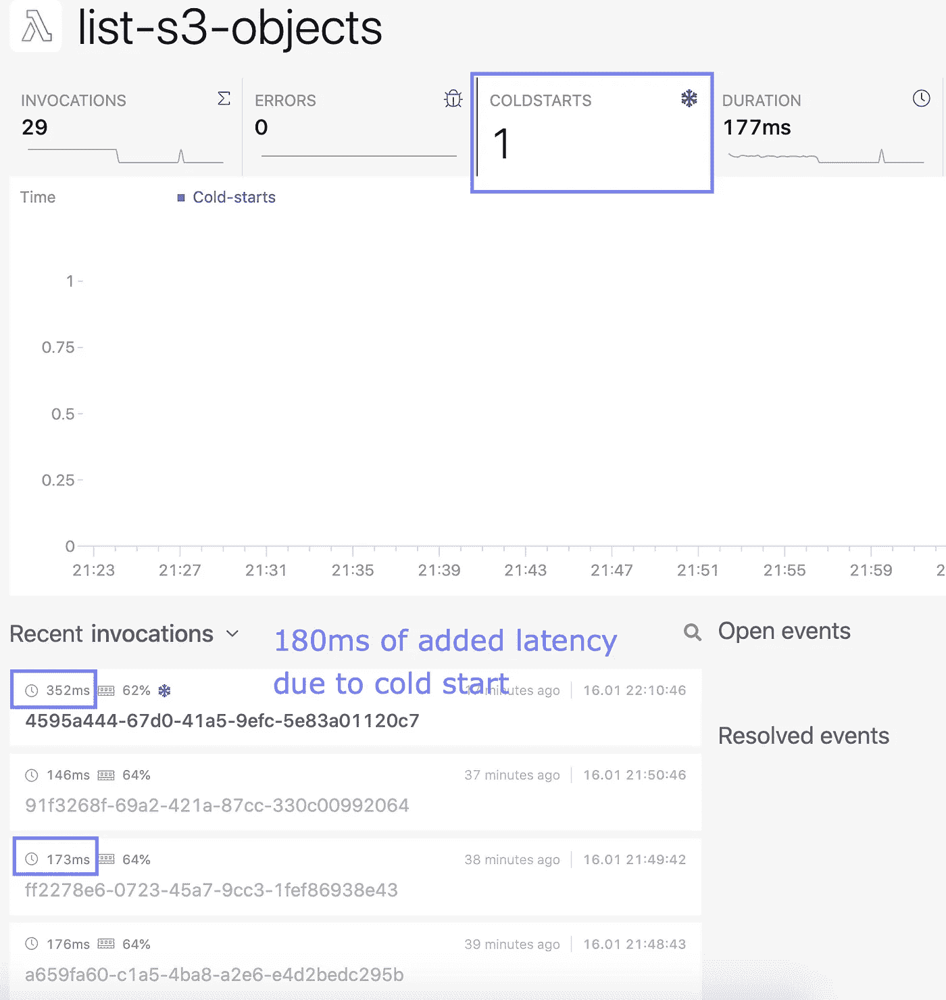
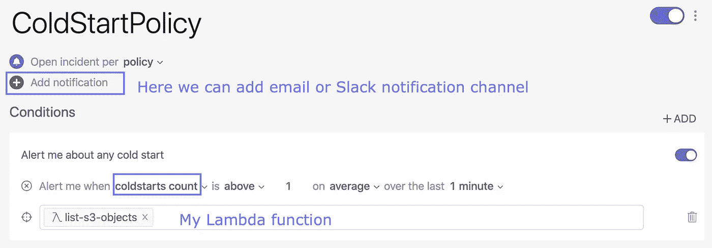

# 为什么许多工程师不理解无服务器

> 原文：<https://betterprogramming.pub/why-many-engineers-dont-understand-the-real-use-of-serverless-df2300766aa9>

## 他们从单一角度看待软件架构。这很危险

阿菲夫·库苏马在 [Unsplash](https://unsplash.com?utm_source=medium&utm_medium=referral) 上拍摄的照片

R 最近，我看了一个[视频](https://www.youtube.com/watch?v=AuMeockiuLs&t=4s)是由一个真正伟大的开发者和 YouTuber 制作的。它的标题是“无服务器没有意义。”即使我真的很喜欢这个视频，我也不确定作者关于无服务器的观点是否完全有效，我想在本文中讨论一下。

在引言中，作者开了一个玩笑:“这个世界上有两样东西我不明白——女生和无服务器。”

我不知道他和女孩的关系，但当谈到无服务器时，他是对的吗？让我们看看他的批评，并讨论潜在的反对论点。剧透:我认为，如果你知道何时以及如何使用它，无服务器确实是有意义的。

# 无服务器批判

在有点争议的 YouTube 视频中提到的主要论点是速度。更具体地说，从作者的角度来看，无服务器应用程序的主要缺点是(众所周知的)*冷启动* 问题——在底层云服务完成分配计算资源、提取代码或容器映像、安装额外的包以及配置环境之前，您的代码可能无法开始执行。

将执行速度放在首位的工程师给人的印象是，整个应用程序生命周期管理的最终成功标准是我们的代码能多快完成它需要执行的任务。

作为一名在 IT 部门工作过的人，我看到了与可维护性和利用技术快速可靠地提供业务价值的能力有关的实际问题，但我不确定这样的指标是否恰当地衡量了最重要的东西——价值实现时间、开发周期的速度、维护的容易程度、为我们的最终用户保持低成本、通过促进无缝 IT 运营来降低运营中断的风险，以及最后，将我们的大部分工程时间分配到正确解决实际业务问题上，而不是花费在配置和管理服务器上。

# 有些工程师缺什么？无服务器的真正优势

如果您关心执行速度，以至于偶尔 200 毫秒(根据 [AWS](https://youtu.be/EML6FKBdsNU?t=229) )的额外延迟在您的工作负载中是不可接受的，那么无服务器可能真的不适合您，这完全没问题。但是我们不应该说无服务器因为这种延迟而没有意义。每个人都需要自己决定在他们的用例中什么样的延迟是可接受的。

无服务器是一种极其经济高效的 IT 基础设施管理方式，对于没有数千美元用于闲置资源的 IT 部门以及全天候维护本地服务器的专业支持工程师团队来说，这种方式尤其有益。

## 无服务器的低成本可能会超过任何缺点

在我见过的大多数使用案例中，无服务器比自托管资源便宜几个数量级，如果只考虑实际计算成本，这已经是事实。如果您还考虑到无服务器显著减少了操作、扩展和维护基础架构所需的时间(总拥有成本—简而言之， [TCO](https://en.wikipedia.org/wiki/Total_cost_of_ownership#Computer_and_software_industries) )，那么您将实现真正的成本节约。事实是，维护基础设施的全职工程师团队比任何无服务器资源都要昂贵得多。

我并不是说对于每种使用情况，无服务器选项总是更便宜。如果您持续收到数以亿计的请求，如果您的工作负载非常稳定，并且如果您有足够多的工程师可以监控和扩展所有这些资源，那么您的自我管理基础架构可能会更好。

## 冷启动是配置和预算的问题

回到成本的问题上来，如今的冷启动问题在很大程度上取决于您愿意花多少钱以及您如何配置您的无服务器资源。

如果您愿意支付额外的费用，有许多方法可以减轻冷启动，例如利用预暖的实例(*供应并发*)或故意发出更多请求( [*假请求*](https://github.com/juanjoDiaz/serverless-plugin-warmup) )来确保您的环境保持温暖。通过使用像 [Dashbird](https://dashbird.io/) 这样的监控平台，您甚至可以获得关于您的功能中发生的任何冷启动的通知，从而帮助您优化您的无服务器资源。在下图中，您可以看到在 29 次调用中，我们可以观察到一次冷启动，这给总执行时间增加了大约 180 毫秒的延迟。

仪表板上的观察功能有助于识别和防止冷启动(图片由作者提供)

您可以为任何冷启动配置一个 Slack 或电子邮件警报，以了解冷启动发生的频率。

在 [Dashbird](https://dashbird.io/) 中设置冷启动警报(图片由作者提供)

## 改善 Lambda 函数延迟的技术

您可以通过适当利用*上下文重用*来减少无服务器功能的延迟。AWS 冻结并存储 Lambda 的执行上下文，即发生在`handler`函数之外的一切。如果在相同的 15 分钟内执行另一个功能，冻结的环境可以重新使用。这意味着，如果您指定耗时的操作，比如连接到 Lambda 处理程序之外的关系数据库，您将获得明显更好的性能。[这篇文章](https://medium.com/capital-one-tech/best-practices-for-aws-lambda-container-reuse-6ec45c74b67e)非常详细地解释了这个话题。

有很多精彩的文章讨论如何减轻甚至完全消除冷启动问题，比如[这个](https://dashbird.io/blog/can-we-solve-serverless-cold-starts/)和[这个](https://dashbird.io/blog/cold-starts-impact/)。Dashbird 开源了一个名为 [xlambda](https://github.com/dashbird/xlambda/) 的 Python 库，可以帮助你保持基于 Python 的 lambda 函数的热度。类似地，Jeremy Dale 为 JavaScript 开源了一个类似的 [Lambda warmer 包](https://github.com/jeremydaly/lambda-warmer)。最后，[无服务器框架](https://www.serverless.com/)还包括一个提供相同功能的[插件](https://www.npmjs.com/package/serverless-plugin-warmup)。

## 您的工作负载可接受的延迟是多少？

最后，如果您问自己对于您的用例来说什么样的延迟是可接受的，那将是最好的。当谈到冷启动引起的延迟时，我们通常争论的是毫秒。在我作为数据工程师(也构建后端 API)工作中遇到的所有用例中，日常业务中的延迟并不明显。

最后，AWS 的无服务器 Kubernetes 服务(也称为 Fargate 上的 EKS)等平台允许您在单个 Kubernetes 集群中混合无服务器和非无服务器数据层。这种混合使您能够在基于 EC2 的非无服务器数据平台上运行任务关键型低延迟工作负载，而其他工作负载(例如批处理)可以由无服务器数据平台提供服务，从而实现两全其美。你可以在本文中找到更多相关信息。

## 无服务器意味着“无操作”和可扩展性

由于云提供商负责 IT 运营，即配置和扩展计算集群、安装安全补丁和升级，以及处理硬件崩溃和内存问题，因此无服务器使您能够更快地为您的企业提供价值。这为您节省了大量时间，您可以利用这些时间更好地为最终客户服务。最后不就是最重要的吗？

无服务器背后的自动化解放了高技能工程师的时间，使他们可以专注于解决业务问题，而不是管理集群。它允许将 It 运营转移给 AWS 的 DevOps 专家，这些专家可能比这个星球上的任何其他公司都更了解如何管理计算。

## 极大受益于无服务器的使用案例

想象一下，你刚刚创办了一家初创企业。起初，您可能不需要大型资源集群，并且您可能只有一个开发人员。无服务器模式允许您从小规模开始，并随着您的初创企业的发展，以随用随付的成本模式自动扩展您的资源。

同样，另一个可以从无服务器中受益匪浅的群体是可能没有大型 it 部门的小型企业。也许只需要一个专业的 DevOps 工程师(而不是整个团队)就可以管理整个应用程序生命周期，这是无服务器的一个巨大优势。

如果您的工作负载是季节性的，无服务器也是一个很好的选择。例如，如果你有一个电子商务业务，你可能会在黑色星期五和圣诞节期间遇到季节性高峰。无服务器基础设施允许您根据这种情况调整计算。

此外，有些事件根本无法预测。想象一下，你一直在你的网上商店卖洗手液、消毒剂、口罩和类似的商品。然后全球疫情发生了，现在每个人都需要你的产品。无服务器基础架构可让您在任何情况下适应任何规模。

## 代码速度与开发周期的速度

除了代码执行速度，还要考虑开发速度。在许多情况下，无服务器微服务范式允许更快的开发周期，因为从设计上来说，它鼓励更小的单个组件，并允许您彼此独立地部署每个服务。

如果无服务器使您能够快速向利益相关者交付应用程序的第一个版本，并在开发周期中更快地迭代(同时降低成本)，那么由于偶尔冷启动而增加的几毫秒延迟似乎是一个很小的代价。

## 与其他云服务无缝集成

以 AWS 为例，每个无服务器服务都集成了用于日志记录的 CloudWatch、用于管理访问权限的 IAM、用于收集指标和[跟踪](https://en.wikipedia.org/wiki/Tracing_(software))的 X-Ray、用于跟踪审计跟踪的 CloudTrail 等等。除此之外，无服务器平台通常为您提供基本的构建模块来构建更大的、解耦的微服务架构，例如集成无服务器消息队列(SQS)、无服务器发布-订阅消息总线(SNS)、无服务器 NoSQL 数据存储(DynamoDB)和对象存储(S3)。

# YouTube 视频中没有考虑到无服务器的缺点

还有一些视频中没有提到的弊端，我想列举出来，给大家一个全图，不包任何糖衣。

尽管对于许多用例来说，无服务器在成本、可伸缩性和维护方面看起来像是天堂，但它并不是每个用例的灵丹妙药。

1.  您面临被供应商锁定的风险:云提供商让他们的服务变得如此方便易用和经济高效，以至于您有被他们的特定平台锁定的内在风险。
2.  当比较无服务器和自托管资源时，在某种程度上，您对计算资源的控制**更少**。例如，您不能通过 SSH 连接到底层计算实例来手动执行一些配置，而且您在实例类型方面也没有多少自由。例如，您不能在使用 GPU 的计算实例上运行您的无服务器函数或容器(目前)。
3.  如果您有一些特定的合规性要求，阻止您在云中的**共享租户**上处理数据，那么无服务器可能不适合您。
4.  尽管将您的 IT 基础架构拆分为独立的微服务有助于管理依赖性并加快发布周期，但它也带来了另一个挑战，即管理所有移动部件。虽然 Dashbird 等监控解决方案在很大程度上解决了这一特殊问题，但您需要了解其中的利弊。

# 无服务器批判的结论

总的来说，当我们想要以构建自托管、本地技术的相同方式使用无服务器或云服务等新模式时，往往会出现问题，这根本不是实现这一目标的最佳方式。在将工作负载迁移到云中时，如果遵循提升和转移原则，您将失去云服务的许多优势，甚至会误解其目的。没有放之四海而皆准的解决方案，因为我们不能期望任何技术适用于所有用例，是世界上最快的，并且成本接近于零而没有一些缺点(例如偶尔的冷启动)。

从我的角度来看，我们不应该只考虑一个方面而不研究其他关键方面，尤其是那些在各自技术的设计中起基础作用的方面，来谈论无服务器(或者坦率地说，谈论任何与 IT 相关的东西)。从这个意义上说，如果你知道何时以及如何使用它，无服务器确实是有意义的。

# 参考资料和其他资源

[1] Ben Awad — [“无服务器没有意义”](https://www.youtube.com/watch?v=AuMeockiuLs)

[2] AWS 文档关于 [Lambda 上下文重用](https://docs.aws.amazon.com/lambda/latest/dg/runtimes-context.html)

[3][Javascript 的无服务器插件预热](https://github.com/juanjoDiaz/serverless-plugin-warmup)和 [xlambda Python 包](https://github.com/dashbird/xlambda/)

[上的[4] AWS 文档提供了并发性](https://aws.amazon.com/blogs/aws/new-provisioned-concurrency-for-lambda-functions/)

[5] [AWS Lambda 引擎盖下——视频](https://youtu.be/xmacMfbrG28)

[6] [达什伯德关于冷启动的可能解决方案的博客](https://dashbird.io/blog/can-we-solve-serverless-cold-starts/)

[7] [Dashbird 关于冷启动对延迟影响的博客](https://dashbird.io/blog/cold-starts-impact/)