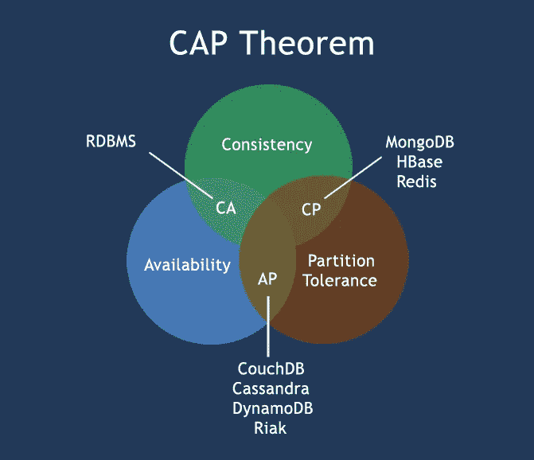

# 为什么 MemoryDB 不像 AWS 说的那样完美？

> 原文：<https://betterprogramming.pub/why-memorydb-is-not-everything-aws-makes-it-up-to-be-a8ab0e77e443>

## 让我们仔细看看 AWS 的最新服务

由 [Taras Chernus](https://unsplash.com/@chernus_tr?utm_source=unsplash&utm_medium=referral&utm_content=creditCopyText) 在 [Unsplash](https://unsplash.com/s/photos/lies?utm_source=unsplash&utm_medium=referral&utm_content=creditCopyText) 上拍摄的原始照片，由作者编辑

*【来自 AWS 的更新——2021 年 10 月 11 日】最近，AWS 直接联系我，向我提供了关于我在这篇文章中所做的一些声明的额外信息。感谢他们的帮助，我正在更新这篇文章的内容，以便对下面提出的问题和难题有更多的了解。虽然公开文档还不足以获得所有细节，但我们能够进一步了解这个新的内存数据库是如何工作的。*

AWS [最近宣布](https://aws.amazon.com/blogs/aws/introducing-amazon-memorydb-for-redis-a-redis-compatible-durable-in-memory-database-service/)推出他们的最新服务:一个内存数据库，一个兼容 Redis(因为让我们面对它，如果你说内存数据库，这些天每个人都会想到 Redis)并由他们管理的数据库。

简而言之，根据 AWS 的说法，使用 MemoryDB 应该就像获得一个更好的 Redis 版本一样，这意味着您将获得:

*   一个内存中的键值存储，能够接受所有经典的数据类型，比如字符串、集合、散列等等。
*   超快读取和极快写入时间。我们说的是基于微秒的读取和毫秒级的写入(个位数)。这主要是因为我们只使用了内存而不是磁盘。
*   需要时可轻松进行水平缩放。
*   API 与现有 Redis 代码 100%兼容，这意味着您可以毫无问题地从当前的 Redis 本地实例迁移到 MemoryDB。
*   一个内存中的、快速的、可靠的数据库，您可以将它用作所有应用程序的主要数据存储(实际上我们一会儿就会谈到这一点)。

除此之外，还有其他额外奖励，例如:

*   100%受管，因此任何软件修补、集群的自动扩展以及大数据相关问题的传统障碍都可以开箱即用地解决。
*   对 AWS 实例类型的支持一直到 [Graviton2](https://aws.amazon.com/ec2/graviton/?nc1=h_ls) 类型
*   与其他 AWS 服务的本地集成(正如人们所料)，如 SNS、CloudTrail、AWS VPC 等。

老实说，使用这个数据库似乎没有什么坏处，但是，您需要记住，与其他 NoSQL 数据库一样，并不是每个应用程序都适合它。虽然他们确实处理了许多不同的用例，尤其是声称 I/O 延迟如此之低的用例，但并不是每个用例都为此做好了准备。

话虽如此，作为其公告的一部分，AWS 试图向所有开发人员推销托管 Redis 集群的想法，但走得有点远。他们声称这个数据库是完美的(因为缺少另一个词)，所以让我们仔细看看 MemoryDB 是什么，不是什么，然后我会让你决定亚马逊是否过度销售了他们的产品。

# 那是什么？

正如我已经提到的，MemoryDB 是一个内存中的、托管的、100%兼容 Redis 的数据库。

如果您以前使用过 Redis，这应该足以让您了解它需要什么，但是如果您没有使用过，让我们仔细看看。

## 微秒级读/写

该数据库支持内存存储，再加上过于简化的数据模型(或缺乏这种模型),因此对其执行的每个读取操作都可以在微秒内完成，每个写入操作都可以在个位数毫秒内完成。

众所周知，数据库与数据交互的延迟只是活动请求的延迟的一部分。这可能是由于性能不佳的代码、糟糕的互联网连接或大量数据传输造成的延迟。因此，如果您能够最小化访问数据对请求的影响，那将是一个巨大的胜利。

这就是为什么与其他更传统的方法相比，Redis 在快速数据访问方面要优越得多，例如使用 SQL 数据库，它除了立即将数据保存到磁盘之外，还需要检查定义的数据模型周围的数据一致性。

Redis(以及 MemoryDB)快速而简单——完美的组合。

## 简化数据模型

作为键值存储是访问和写入数据如此之快的原因之一。背后没有数据模型。从开发人员的角度来看，我们处理 Redis 就好像它是一个 hashmap 或一个远程位置的对象文字。

如果你正在开发一个电子商务应用程序，这可能看起来是一个糟糕的保存数据的方式，因为像任何技术一样，不是所有的东西都可以在所有的情况下使用。

Redis(以及类似系统)的完美用例是需要偶尔更新但经常读取的数据缓存。或者可能用作分布式服务的外部内存，作为一个整体，共享配置位或 id，然后可以用于在其他地方查找数据。

只要您不试图将另一个更复杂的数据模型的用例强加到 Redis 中，您将从中获得最大收益。

## 与 AWS 服务的其余部分完全集成

如果在我所说的一切之上，您提供了与 AWS 服务产品的其余部分的本机集成，那么您将拥有一个无与伦比的组合。

使用 CloudWatch 来扩展集群，或者通过 SNS 来监控和保护集群，这是 Redis 的本地实例所不具备的。

这只是一个开始，就像其他一切工作一样，越多的人开始使用 MemoryDB，就会有越多的集成被发布。因此，如果您仍然缺少一个重要的集成，无法冒险使用 MemoryDB，请注意，因为您很快就会获得更新！

这就是说，我们正在处理一个定义和实现都非常好的托管 Redis 实例。我们可以用它做任何我们想做的事情。任何东西，也就是说，在管理世界的范围内。这意味着我们不能运行一些特定的命令，主要是那些与添加或更新配置相关的命令，这些命令会影响托管集群的功能。所以像`cluster`、`configure`、`shutdown`、[这样的命令，其他的](https://docs.aws.amazon.com/memorydb/latest/devguide/restrictedcommands.html)是不可能的。

也就是说，让我们仔细看看这个神奇的数据库不是什么，以及为什么 AWS 在最初的发布声明中走得有点远。

# 它不是什么

AWS 推出了 MemoryDB，这是可以理解的，老实说，他们没有重新发明轮子，他们只是在已经很棒的东西上添加了更多令人敬畏的东西。MemoryDB 背后的大部分惊人声明来自 Redis，而不是用这个版本实际构建新的东西。

然而，他们确实在经典的基础上做了一些改进。其中之一就是持久性模型。

如您所知，Redis 是一个内存数据库，但是为了使它更健壮，并且实际上成为软件开发人员可以使用和信任的东西，他们有一种方法来持久存储数据，仅仅是为了那些奇怪的情况，当所有东西都到了您知道的地方并且实例需要重新启动时。当这种情况发生时，如果可以避免，你就不想重新开始。

这有什么不好？什么都没有，什么都没有。

然而，AWS 在发布时提出了一个非常独特的主张，引起了许多人的注意:

> “MemoryDB 可以安全地作为应用程序的主数据库，因为它提供了数据持久性、微秒级读取和一位数毫秒级写入延迟。”

现在让我们仔细分析一下:作为应用程序的主数据库意味着其他一切都是围绕它构建的。您相信该数据库会不惜一切代价保护您的数据安全。这也意味着，特别是对于基于云的服务，要具有高可用性、容错性，并且在我们的情况下，要具有数据一致性。这是不可能的。

如果你以前没听说过，有一个定理叫做 CAP 定理，它是这样表述的:

分布式数据存储不能提供以下两种以上的功能:

*   **数据一致性**:意味着集群中的每个节点将始终拥有相同的信息。
*   **高可用性**:换句话说，集群永远不会宕机，无论如何都可以到达。
*   **分区容忍度**:如果网络出现问题，集群被分区，系统仍会正常工作(这不包括数据一致的情况)。

以下是取自互联网的定理的图示:

图片来自互联网

注意 Redis 是如何被标记为分区容忍和一致的(数据方面)，尽管实际上它是*最终一致的*。这可以在某些 Sentinel 模式配置中实现。

它的集群模式非常具有弹性和自组织性，[如果你对这类东西感兴趣，你应该多读一些关于它的文章。](https://redis.io/topics/cluster-tutorial)

然而，Redis 的可用性不高，因此 AWS 决定让它如此。向他们致敬，但正如定理所说，“你不能鱼与熊掌兼得，伙计；总得有所让步。”

我们的问题从这里开始。

Redis 在所有节点之间没有很强的数据一致性，AWS Redis 的高可用版本(MemoryDB)并没有改变这一点。最终一致的模型这本身并不是一个坏模型，但这意味着当发生分区时，在所有节点之间进行数据复制时会有轻微的延迟。当涉及到副本以及它们如何获取数据时，这一点非常重要。

*【来自 AWS 的更新—2021 年 10 月 11 日】*看起来 MemoryDB 为主节点实现了强一致性模型，并为副本实现了最终一致性模型。这实际上意味着，当一切都正常工作时，您的整个集群将非常一致。这可能是写操作需要一位数毫秒才能完成的原因，它们需要确保数据在返回之前复制到集群的其余部分。

为了使 MemoryDB 高度可用，他们将副本分布在多个 AZ(可用性区域)，这意味着如果发生灾难性的网络中断，导致世界上的一部分没有互联网，您的 MemoryDB 仍然可以通过其他 AZ 访问。那是一个非常可靠的解决方案。

问题是，因为中断会留下一组不连接的分区，每个分区都必须选择一个新的控制器，当它们重新连接时(当中断解决时)，较大分区的控制器将保留为控制器，其余的将作为代理排队。因此可能会丢失停机期间对子集群所做的更改(这是 Redis 的[默认复制行为)。](https://redis.io/topics/replication)

*【来自 AWS 的更新—2021 年 10 月 11 日】*根据收到的最新细节，虽然这可能是 Redis 的默认行为，但 MemoryDB 并非如此。相反，虽然这些分区仍然能够访问多 AZ 事务日志，但一切都将继续工作，但当一个分区无法访问日志时，该分区将停止任何前进，这意味着它将不再工作。消除了丢失数据的可能性，但结果可能会损失一点高可用性。这是一种权衡。

这对于主数据存储解决方案来说是可以接受的吗？对此我不能说“是”。可以吗？

对于主数据库，我(希望你也是)会期待一个更健壮的解决方案，要么如此，要么停止声称它可以这样使用。如果我正在构建一个需要跨大量节点处理关键用户信息的系统，比如银行账户交易、医疗分析结果或信用卡信息，会发生什么情况？这太重要了，不能留在最终一致的数据存储上。

# 我们还不能用 MemoryDB 做什么？

我不得不挑出 MemoryDB 的主要问题是它的耐用性模型，但不是因为它不好或什么，而是因为 AWS 试图将其隐藏在地毯下，并声称它缺乏满足所有业务需求的完美数据存储。

然而，这种说法也可能被缺乏经验的开发人员误解为摆脱 SQL 数据库的机会，这将是一个巨大的错误。甚至更复杂的 NoSQL 替代品，比如 Elastic，在某些情况下也是 MemoryDB 的绝佳替代品。

在很多用例中，无论您如何努力，键值存储都不会是正确的。所以让我们仔细看看其中的一些。

## 需要一个关系模型

当您的业务需要您的数据以某种方式相互关联并组合在一起时，您不能依赖键值存储来实现这一点。

当然，您可能可以伪造其中的许多内容，但是您必须围绕完整性检查(比如确保您引用了实际存在的外键)、数据约束(比如唯一性、可空性等)以及其他使您在处理复杂数据集时更加轻松的内容进行编码。

虽然有时这看起来像是一个开销，但是拥有一个模式可以是一个救命稻草，通过查看 er 图(实体关系图)就可以理解数据拼图的每个部分是如何组合在一起的。

对于键值存储，您不能可靠地做到这一点，因为没有模式可循，也没有要设置的约束。这也是一些好处，不要误解我的意思。这只是将它用于正确的用例的问题。

## 如果你需要搜索你的数据怎么办？

MemoryDB 依赖 Redis 的命令来进行数据相关的操作。Redis 不擅长的事情之一是对数据执行复杂的搜索查询。

您能够进行类似搜索的唯一方法之一是通过`keys`命令，该命令允许您使用一种模式来搜索键(请注意，这里我们甚至没有讨论通过值进行搜索)。具有讽刺意味的是，Redis 不建议在具有大型数据集的生产环境中使用这个命令，因为它会导致性能问题。

该命令最初仅用于调试目的，因此不适合在日常操作中使用。

实际上，Redis 不允许像经典 SQL 查询那样的搜索操作，甚至不允许像 ElasticSearch 这样的其他 NoSQL 解决方案。因此，如果这是您的用例，请忘记 MemoryDB。

## 查询您的数据

一旦你知道你需要什么样的记录，MemoryDB 和 Redis 在获取数据方面是很棒的。知道您需要哪个特定记录和知道匹配您想要的记录的模式之间有很大的区别。

换句话说，一件事是知道您需要 ID 为 3 的用户，另一件非常不同的事是知道您需要姓名以“F”开头并且出生于 1983 年的所有用户。

MemoryDB 对于第一个用例来说可能很棒，但是它并没有考虑到第二个用例。你应该考虑到这一点。

在按照大量不同且日益复杂的模式查询数据时，有很多其他的选择(SQL 和 NoSQL)是完美的。

内存中的键值存储并不意味着这样，尤其是像 MemoryDB 这样不能用额外模块修改或扩展的存储。

因此，如果您认为可能需要对数据做类似的事情，请不要认为 MemoryDB 是主数据库的最佳选择。

# 结论

Redis 可能是我最喜欢的 NoSQL 数据库，现在在 AWS 上拥有一个托管版本打开了许多美妙的机会。然而，人们应该始终尝试为每项工作使用正确的工具，坚持使用一种技术来处理所有事情是错误的，在这种情况下，围绕数据，但老实说，这可以应用于我们行业的所有事情。

许多开发人员倾向于过度专注于单一的技术堆栈，并将其推向极限，因为他们拒绝为他们的特定用例寻找更好的替代方案。

如果你是这样的人，请记住，虽然 MemoryDB 在各个方面听起来都很棒，但当涉及到某些非常合理的数据集时，它并不满足要求。因此，如果丢失数据对您的企业来说不是一个选项，那么 MemoryDB 是否可以作为您的主数据库的答案是一个合理的“不”。如果你想阅读更多关于 Redis 和 Redis for Windows 的文章，请点击此链接。

*【来自 AWS 的更新—2021 年 10 月 11 日】*基于从 AWS 收到的最新更新，我认为我们可以更新本文的结论。截至今天，我们有信息告诉我们，这个新版本的 Redis 是为了使我们不会丢失任何数据而构建的，这太棒了。也就是说，这都要归功于一个我们知之甚少的特性:多 az 事务日志。到目前为止，我们还不知道它是如何工作的，也不知道它的任何特征。我们所知道的只是我们可以从它的名字中推测出来的东西。转移的频率是多少？它的局限性是什么？安全方面呢，它如何在 AZ 之间传输数据时保持我们的数据秘密？这么多问题，这么少文件。所以让我再问你一次:考虑到你并不真正了解它的关键特性的细节和潜在的安全隐患，你会选择它作为你的主数据库吗？