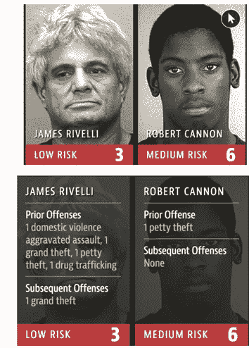
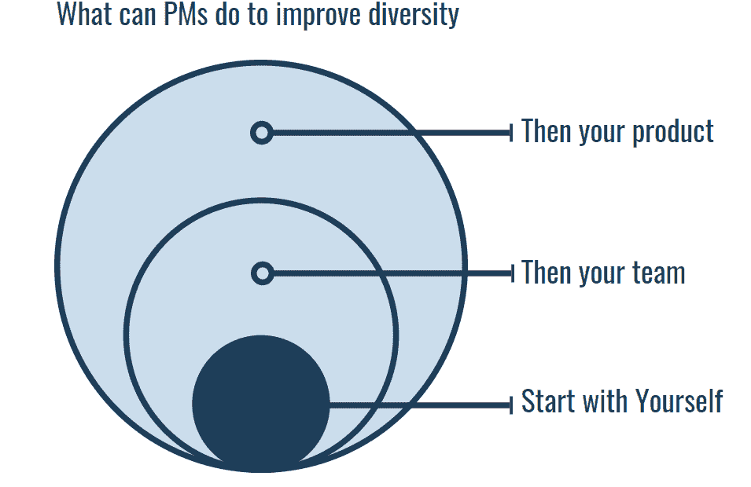

# 包容性设计和为什么产品经理应该关注

> 原文：<https://betterprogramming.pub/why-should-product-managers-care-about-inclusive-design-45bd13b7411a>

## 项目经理如何提高多样性

[粘土银行](https://unsplash.com/@claybanks?utm_source=medium&utm_medium=referral)在 [Unsplash](https://unsplash.com?utm_source=medium&utm_medium=referral) 拍摄的照片

多元化和包容性是科技领域的热门话题，大量研究表明，这不仅是正确的事情，也是一个良好的商业决策。麦肯锡 2015 年的一份[报告](http://www.mckinsey.com/business-functions/organization/our-insights/why-diversity-matters)发现，管理层中民族和种族多元化的公司，其财务回报高于行业平均水平的可能性高出 35%，性别多元化的公司，其回报高于行业平均水平的可能性高出 15%。

当公司缺乏多样性或没有创造包容性的环境时，这往往会在他们的产品中表现出来。他们可能会错过大群用户，就像苹果在 2014 年推出的“全面”健康跟踪应用中所做的那样，该应用未能跟踪女性的月经。或者他们可以关闭用户的服务，就像达美乐比萨连锁店的不可访问的网站，他们因为这个网站被起诉。在某些情况下，他们的产品最终放大了偏见。Snapchat 的[“美颜”滤镜](https://www.huffingtonpost.co.uk/2017/01/25/snapchat-filters-are-harming-black-womens-self-image_a_21658358/)就是一个很好的例子，它应用了白色特征(例如，更浅的皮肤、更窄的鼻子等等..)到人的图片，暗示白色是美的标准。

当谈到人工智能(AI)时，由于缺乏多样性，一系列问题正在浮出水面。以 Compass 中这个发人深省的例子为例，Compass 是美国法院用来评估被告重新犯罪的可能性的案件管理和决策支持工具。该软件根据罪犯对 137 个调查问题的回答来估计可能性。

图片来源:ProPublica 的“[机器偏差](https://www.propublica.org/article/machine-bias-risk-assessments-in-criminal-sentencing)

ProPublica 的一项调查发现，黑人罪犯被贴上高风险标签但实际上没有再犯的可能性几乎是白人罪犯的两倍。Compass 对白人罪犯也产生了相反的结果:与黑人罪犯相比，他们更有可能被贴上风险较低的标签，尽管他们的犯罪历史显示再次犯罪的可能性更高。

这里发生了什么？

输入有偏差，所以结果有偏差。在设计调查或开发过程中没有考虑多样性，导致了种族主义制度。

# 作为产品经理我们能做什么？

没有人想创造有偏见的产品或错过他们的大部分观众。但是，当我们在流程中不考虑多样性时，这种情况很可能会发生。产品经理可以做的事情很少，以减轻偏见。

图片来源:Aseel Hamarneh

## **首先，从你自己开始，承认你有偏见**

我们没有人开始歧视，但我们都在一个充满偏见的社会中长大，所以不管我们喜欢与否，一些偏见已经内化了。这被称为*无意识偏见*，它是由我们的经历和对媒体的接触不由自主地形成的，在许多情况下，它违背了我们有意识地持有的信念和价值观。因为我们没有意识到我们无意识的信念，它们有时最终会驱动我们的行为。研究表明，我们关于人的大多数决定都受到我们偏见的严重影响，我们对他人的评估并不像我们想象的那样客观。

想出你在工作中最信任/钦佩的五个人。在你的名单上，在每个人的旁边加上他们的性别、种族、民族背景、英语作为第一语言或附加语言、大致的年龄组、性取向，以及他们是健全的还是有残疾的。

检查你的列表。它有多多样化？如果不是，为什么？怎么你最崇拜的人都差不多？会不会是偏见？*(练习改编自 Include-Empower.com**的* [*信任圈练习)*](https://cultureplusconsulting.com/2018/08/16/a-ha-activities-for-unconscious-bias-training/)

当我们认识到自己的偏见时，一个常见的反应是评判自己。但那没有帮助。更有效的方法是暂停判断，保留精力承认偏见并打破偏见。挑战你的假设，问这样的问题:如果我的同事是男的，我会打断他吗？如果他们是不同的种族，我会支持他们的晋升吗？

还是那句话，不要评判你的答案。关键是要留意这些想法，不要让它们驱动你的行动。如果你假装它们不存在，你更有可能对它们采取行动。

## 第二，看看你身边的团队

它们的差异有多大？很可能不是。所以，下次你参与招聘时，要优先考虑多元化。拥有一个多样化的团队意味着多样化的观点和更具创造性的解决方案。有很多关于消除招聘过程中的偏见和提高多样性的研究。你可以做一些事情来写包容性广告，接触不同的网络，消除面试中的偏见。这里有一篇来自 HBR 的好文章让你开始。

## 第三，解决产品中的偏见

1.  检查您的默认用户:如果您有意考虑不同的用户，您的优先级可能会有所不同。例如，如果谷歌地图探索了他们的[女性用户或那些行动受限的](https://www.ft.com/content/fecb0c38-c0dc-11e8-8d55-54197280d3f7)用户的需求，那么也许安全路线或无台阶访问的路线会被尽早解决。
2.  在开发过程中包含不同的声音:考虑产品决策以及它们是如何做出的。列出房间里代表的声音，确保这是一个安全的环境，每个人都可以发表意见(也就是创造[心理安全](https://hbr.org/2017/08/high-performing-teams-need-psychological-safety-heres-how-to-create-it))。如果你在团队中缺少不同的声音，寻找其他方法来包含多样性，比如共同设计会议。
3.  当你的团队想出解决方案时，花时间检查这些想法的意外后果。检查您是否对某些群体产生了负面影响，并尽早寻找降低风险的方法。这些后果的一个可怕例子来自施虐的伴侣，他们将智能家居设备武器化，并用它们来监控和恐吓他们的伴侣。

我整理了这张表，总结了您在产品开发过程的不同阶段可以提出的问题:

图片来源:Aseel Hamarneh

讨论多样性可能会让人不舒服，因为它挑战了我们对自己的认知。但作为项目经理，我们的职责之一是为我们的团队提供一个安全的空间来讨论具有挑战性的话题，并思考这些话题对我们的工作意味着什么。

# 额外资源

*   在[项目隐性](https://implicit.harvard.edu/implicit/)测试你的偏见。哈佛大学实施的匿名隐性联想测验
*   [思考，快与慢](https://en.wikipedia.org/wiki/Thinking,_Fast_and_Slow)丹尼尔·卡内曼著:
*   莎拉·沃希特·波特彻的《T2》从技术上讲是错误的
*   [看不见的女人:在一个为男人设计的世界里揭露数据偏见](https://www.forbes.com/sites/grrlscientist/2019/10/22/invisible-women-exposing-data-bias-in-a-world-designed-for-men/#17eef5893989)作者 Caroline Criado Perez
*   关于[包容性设计中心的资源和框架](http://centreforinclusivedesign.org/)
*   谷歌[项目亚里士多德](https://rework.withgoogle.com/print/guides/5721312655835136/)
*   [人道技术中心](https://humanetech.com/designguide/)