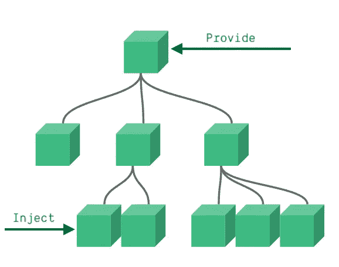

# 为什么 Vue 3 不需要 Vuex

> 原文：<https://betterprogramming.pub/why-you-might-not-need-vuex-with-vue-3-61ad09e62334>

## Vue 3 中的反应引入了构建应用程序的新方法

作者照片。

Vuex 是一个非常棒的状态管理库。它很简单，并且与 [Vue](https://vuejs.org/) 集成得很好。为什么会有人离开 Vuex？原因可能是即将发布的 Vue 3 暴露了底层的反应系统，并引入了构建应用程序的新方法。新的反应性系统非常强大，可以用于集中的状态管理。

# 需要共享状态吗？

在某些情况下，多个组件之间的数据流变得非常困难，以至于您需要集中的状态管理。这些情况包括:

*   使用相同数据的多个组件。
*   具有数据访问的多个根。
*   组件的深度嵌套。

如果以上情况都不成立，那么就很容易确定自己是否需要。你不知道。

但是如果你有这样的情况呢？最直接的答案是使用 Vuex。这是一个久经考验的解决方案，做得相当不错。

但是，如果您不想添加另一个依赖项或者发现设置过于复杂，该怎么办呢？与 Composition API 一起，新的 Vue 3 版本可以用其内置的方法解决这些问题。

# 新的解决方案

共享状态必须符合两个标准:

*   反应性:当状态改变时，使用它们的组件也应该更新。
*   可用性:可以在任何组件中访问状态。

# 反应

Vue 3 通过多种功能暴露其反应系统。您可以用`reactive`函数创建一个反应变量(另一个选择是`ref`函数):

从`reactive`函数返回的对象是一个能够跟踪其属性变化的`Proxy`对象。在组件的模板中使用时，每当反应值发生变化时，组件都会重新呈现自身:

# 有效性

上面的例子对于单个组件来说是极好的，但是其他组件不能访问状态。为了克服这一点，您可以使用`provide`和`inject`方法使任何值在 Vue 3 应用程序中可用:

当您将一个`Symbol`作为键和值传递给`provide`方法时，该值将通过`inject`方法对任何子组件可用。关键是在提供和检索值时使用相同的`Symbol`名称。

作者照片。

这样，如果您在最上面的组件上提供值，它将在所有组件中可用。或者，您也可以在主应用程序实例上调用`provide`:

# 使其坚固耐用

上面的解决方案是可行的，但是有一个缺点:你不知道谁修改了什么。状态可以直接改变，没有限制。

您可以通过用`readonly`函数包装它来保护您的状态。它将传递的变量包含在一个`Proxy`对象中，防止任何修改(当您尝试修改时会发出警告)。突变可以由访问可写存储器的独立函数来处理。

外界只能访问只读状态，只有导出的函数可以修改可写状态。

通过保护状态免受不必要的修改，新的解决方案相对接近 Vuex。

# 摘要

通过使用 Vue 3 的反应系统和依赖注入机制，我们已经从本地状态转变为集中式状态管理，可以在较小的应用程序中取代 Vuex。

我们有一个状态对象，它是只读的，可以对模板中的变化做出反应。状态只能通过特定方法修改，如 Vuex 中的动作/突变。您可以用`computed`函数定义额外的 getters。

Vuex 有更多像模块处理这样的特性，但是有时候我们不需要。

如果你想探索 Vue 3 并尝试这种状态管理方法，看看[我的 Vue 3 游乐场](https://github.com/blacksonic/vue-3-playground)。