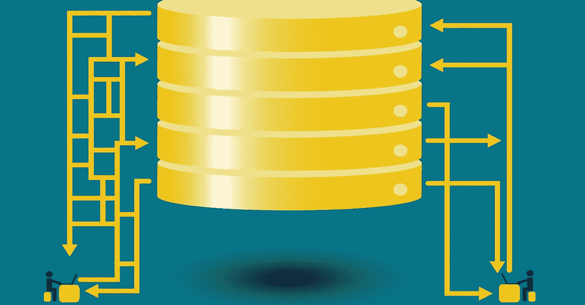

# 为什么你不应该发明一种新的查询语言

> 原文：<https://betterprogramming.pub/why-you-probably-shouldnt-invent-a-new-query-language-8073370f462c>

## ORM 并不总是有用的。找出原因以及你能做些什么



图片来源:作者

> *“比数据孤岛更糟糕的是什么？发明自己的查询语言的数据孤岛。”——埃里克·伯恩哈德松*

在他臭名昭著且被广泛讨论的名为“[我不想学你的垃圾查询语言](https://erikbern.com/2018/08/30/i-dont-want-to-learn-your-garbage-query-language.html)”，[埃里克·伯恩哈德松](https://erikbern.com/)的博客文章中，表达了许多其他数据工程师和分析师强烈关注的问题，即他“真的不喜欢发明自己的查询语言的软件”，他“只是想要回他的 SQL”。

这个相当简短但充满激情的咆哮总结了几乎普遍的经验，即需要自己语言的技术通常会产生一套全新的、不同的复杂性。

在过去的十年中，不同类型的数据库呈爆炸式增长(看看我上一篇文章中[NoSQL 数据库类型的数量就知道了)，专业化程度的提高迫使数据工程师和分析师学习更多的新编程语言。](https://arctype.com/blog/newsql/)

它们都有自己的语法和特殊的古怪之处，虽然 ORM 有时会有所帮助，但它们通常会让事情变得更加困难。

也就是说，新的查询语言通常是必要的(就像 NoSQL 数据库的情况)。这就引出了一个问题，那就是我们如何判断一门新语言实际上增加的价值是否大于它带来的问题。要回答这个问题，我们需要深入了解是什么导致了所有这些冲突。

# 为什么查询语言这么多？

有许多查询语言——如此之多，以至于即使是最全面的列表[也遗漏了许多重要的参与者。我甚至不想尝试收集这样的列表，因为似乎每分钟都有新的列表添加进来。所以我们来看看是什么原因造成的。](https://github.com/AnanthaRajuC/List-of-programming-language-lists/blob/master/Query%20language.md)

简而言之，有这么多不同的查询语言，因为有这么多不同的东西要查询。此外，数据通常必须存储在各种模型中，具有不同种类的模式以及物理和逻辑模式之间不同程度的分离。例如，存储在关系数据库中的数据与存储在 JSON 文件中的数据需要不同的技术和语法。

早期的分层或网络数据库查询语言看起来与关系查询语言非常不同。在数据库的早期，人们必须显式地导航记录之间的路径。这也解释了为什么过去十年由于 NoSQL 带来的新挑战而特别富有成果。

即使在关系数据库中，不同的供应商也希望通过他们自己的 SQL 方言(T-SQL、PostgreSQL 等)提供特殊的特性和功能。).

所有这些加起来很快，回想起来，我们最终不可避免地会有无数种选择来存储和查询数据。总的来说，这实际上是一件很好的事情，因为这样，通过竞争可以不断提高。

然而，由于太多不同的查询语言而导致开发缓慢，因此发明了对象关系映射器(ORM)。但是，正如我们将要看到的，它们也常常使事情变得更加复杂。

# 为什么 ORM 并不总是有用

让我们首先深入了解一下什么是 ORM，以及为什么您可能想要使用它们。

对象关系映射是计算机科学中经常使用的一个过程，通过面向对象编程语言在不兼容的[类型系统](https://en.wikipedia.org/wiki/Type_system)之间转换数据。目标是创建一个数据库对象的抽象数据库层，然后可以使用您选择的编程语言对其进行查询。

简而言之，它允许您使用自己选择的语言而不是数据库的查询语言与数据库进行交互。这可以通过一个使用 SQL 的快速示例得到最好的解释:

`SELECT * FROM users WHERE name = 'Jane Doe';`

对象关系映射的思想是使用您喜欢的编程语言的面向对象范例编写类似上面的查询以及更复杂的查询。这就是 ORM 的用武之地。ORM 库在不同的编程语言中实现了这种技术。例如，使用一个 JavaScript ORM，上面的查询看起来像这样:

```
var orm = require('generic-orm-library');var user = orm("users").where({ name: 'Jane Doe' });
```

当然，使用 ORM 可以带来很多好处:

*   **没有 SQL** :如果你已经阅读了[我关于学习 SQL](https://arctype.com/blog/reimagining-the-sql-curriculum/) 的博客文章，但是仍然不相信你应该学习 SQL，那么 ORMs 允许你使用你选择的编程语言。
*   没有方言:ORM 抽象了数据库系统，例如，从 MySQL 转换到 PostgreSQL 要容易得多。
*   **额外特性**:一些 ORM 具有高级特性，比如对事务、连接池、迁移、种子和流的支持，这些特性在某些情况下很有用。
*   性能:如果你真的不擅长 SQL，那么对于某些查询，ORM 会比你表现得更好。

正如您可能已经从本节的标题中推断出的那样，也有许多缺点:

*   **性能:**如果你是 SQL 高手，你可以自己编写更高性能的查询。
*   **学习**:ORM 不像普通的查询语言那样工作，所以如果那是你所习惯的，学习如何使用它们是有开销的。
*   **太多**:当你仅仅考虑[有多少](https://en.wikipedia.org/wiki/List_of_object%E2%80%93relational_mapping_software)种不同的 ORM 并且每种都有自己的学习过程时，学习问题只会变得更糟。
*   **配置**:ORM 的初始配置可能需要很长时间，而且很痛苦。
*   **黑盒**:ORM 提供的抽象层可能会阻碍真正的查询问题或数据库问题的解决。

总而言之，ORM 声称的好处是它们通过增加一个抽象层减少了开发时间，但是它经常产生更大的麻烦。不使用 SQL，您现在必须在一些 ORM 文档中来回滚动，以确定如何编写最基本的查询。调试也可能是一个问题，因为正如 Erik 所说，有时 ORM 会将一个查询“转换成使用全表扫描连接 17 个表的怪物”，最终会得到“臃肿的高级数据类，而不是易于理解的元组或字典，这些元组或字典包含的数据是一种简单的哑格式，很容易进行内省。”

所以 ORM 是有用的，但不一定能解决根本问题:已经有太多的查询语言了。那么能做些什么呢？我们是否应该听从 Erik 的建议，将“发明新的查询语言暂停 30 年”？

# 什么时候应该发明一种新的查询语言？

虽然 Erik 呼吁暂停肯定更像是一个玩笑，而不是一个严肃的解决方案(我认为)，但它确实表达了一种情绪，即我们需要停止如此快速地添加如此多的查询语言。

当然，我们知道其中许多是处理新的数据类别、新的数据存储方式或太多新数据所必需的，但是我们如何知道哪些是必需的，哪些不是呢？

这就是为什么我为那些想加入查询语言生态系统的新开发人员建议一些简单的指导性问题和规则:

## 我的语言只是另一种方言吗？

这一点似乎太明显了，但是即使像 Oracle 和 Microsoft 这样的大型组织也不能完全遵循这一规则，从而导致了 T-SQL 和 PL/SQL 这样的方言。

在这一点上，几乎每个数据库都有自己定义存储过程、函数、触发器的方式，其差异甚至比查询和数据定义更明显。

例如，Sybase 和 SQL Server 的脚本语言称为 T-SQL。严格来说，SQL Server 是数据库，T-SQL 是语言，但在提到代码时，这两者经常互换使用。

MySQL 的脚本语言与 T-SQL 截然不同，这可以从[参考](https://dev.mysql.com/doc/refman/5.7/en/language-structure.html)手册的文档中看出。您可能会遇到的第一个主要区别是`IF`只允许在编程块中使用。第二个将是定界符，然后是单词`go`，并且差异从那里倍增。

所以请不要再创造另一种 SQL 方言。这并不意味着我们不应该迭代和改进 SQL，但是不要尝试做一些没有人要求的不必要的事情，因为没有人会费心去学习它。

## 我的语言能解决任何新问题吗？

这条规则与第一条非常相似，只是适用范围更广。有许多数据库和数据类型是标准 SQL 无法完成的。图形数据库就是一个很好的例子，因为在这种情况下，存储和语言都是专门设计来做关系数据库不能做的事情的。

这并不意味着您应该将已经非常流行的 Cypher 等成熟的图形查询语言加入到列表中。它由 Neo4j 创建，用于他们自己的图形数据库，并最终开源为一个名为 [openCypher](https://www.opencypher.org/) 的独立项目，允许任何数据库实现相同的语言。它非常直观，使用 ASCII 字符来制作形状，以便进行简洁而富有表现力的查询。

`MATCH (d:Database)-[:USES]->(Cypher)-[:QUERIES]->(:Model:Graph)`

另一种广泛使用的图查询语言是 SPARQL，它看起来像 SQL，由 W3C 创建，用于查询 RDF 图模型。它不像其他两种语言那样常见，但由于主-谓-宾数据模型，它具有独特的特征。它甚至可以用于具有按照 RDF 结构建模的表的 SQL 数据库。一些图形数据库也支持自己的语言，如 ArangoDB、DGraph、TigerGraph 等。

目前最常见的图形查询语言是 [Gremlin](http://tinkerpop.apache.org/gremlin.html) ，它是 [Apache TinkePop](http://tinkerpop.apache.org/) 图形计算框架的一部分。它编写简单，易于学习，并被许多图形数据库甚至可以模拟图形查询的非图形数据库广泛支持。另一方面，对于长查询来说，它可能有些冗长，但是对于 OLTP 和分析工作来说，它通常工作得很好。

`g.V().has("lang","gremlin").out("supported_by").values("db_name")`

也就是说，国际标准图形查询语言的时机已经成熟。包括 Neo4j、TigerGraph 在内的行业厂商都把这个叫出来了，我肯定是同意的。随着图形继续被广泛采用，我们肯定已经达到了这个行业的临界点，在这一点上，添加另一种语言可能弊大于利。

## 我的语言好用吗？

如果你已经做到了这一步，并且你的语言解决了一个前无古人的新颖用例，那么你可能真的有理由开发自己的查询语言——这就是为什么最后一个问题关注于你应该如何去做。

问问自己“别人要多久才能学会我的新语言？”如果你的答案是“几个星期”，那么你应该开始花大量时间尽可能地简化你的语法。

这不仅仅意味着创建教程和文档，它们应该是不言自明的。相反，这意味着你必须认真努力提供过程和抽象，让新手学会你的语言并在几个小时内解决你的主要用例，如果不是几分钟的话。

如果你认为你做不到，你的语言可能还没有准备好。

# 结论

SQL 是当今最普遍的编程语言之一，但无数其他语言也值得认可。这些语言通常与解决关系数据库无法解决的用例的特定技术联系在一起。

然而，这导致了查询语言的过度生产，由于陡峭的学习曲线，这大大减慢了开发时间。ORMs 的引入是为了解决这个问题，但最终却让事情变得更加复杂。

这就是为什么聪明的开发人员应该小心不要在混合中引入另一种查询语言。为了指导这个决定，我列出了他们应该问自己的一些关键问题，以便更好地了解现有的生态圈、用例以及简单性。

也就是说，没有什么比使用优秀的旧 SQL 更好的了。