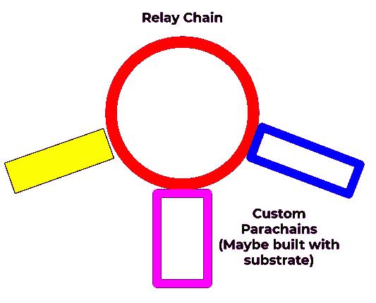
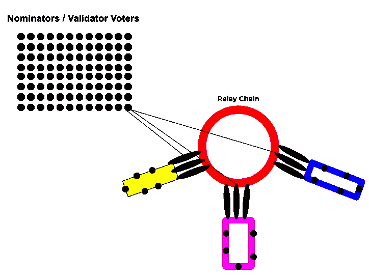
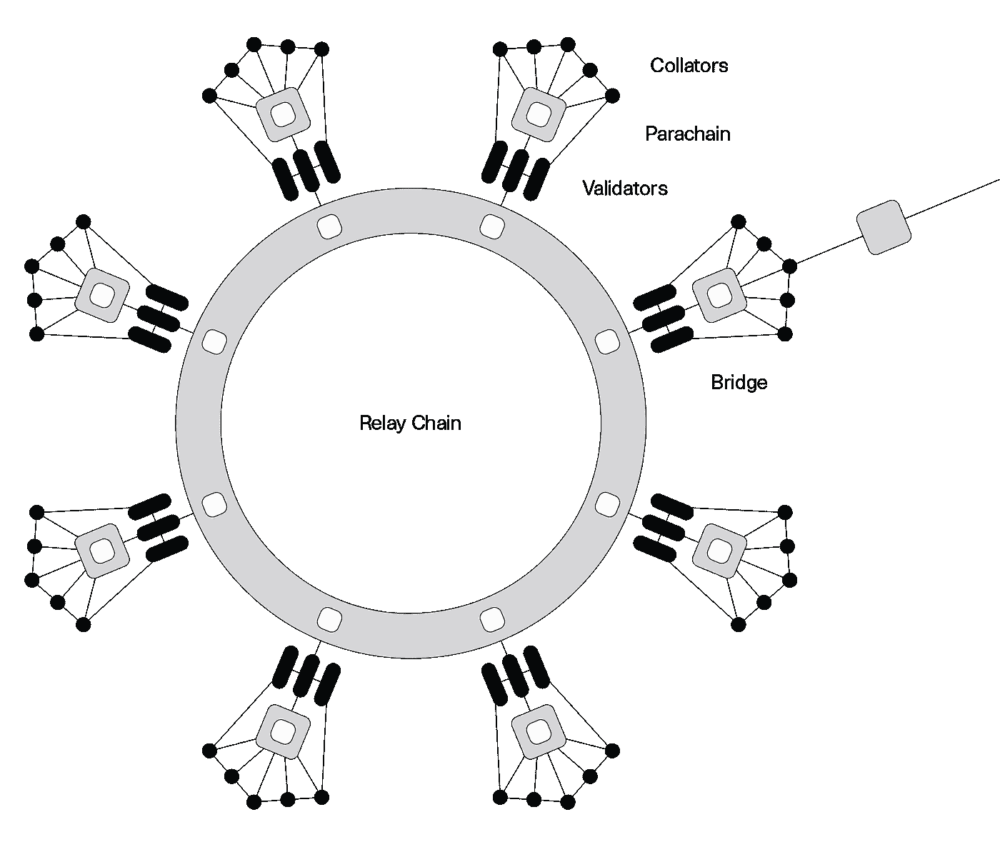

# 为什么您应该在波尔卡多特上构建

> 原文：<https://betterprogramming.pub/why-you-should-build-on-polkadot-be111e2ec6c4>

## 什么是波尔卡多？它解决什么问题？一切波尔卡多特。

图片来源:作者

随着每一项新技术的出现，它们都声称是“XYZ 的下一代”，很难知道什么才是 XYZ 的下一代。在这种情况下，那个 XYZ 就是区块链，那个技术就是[波尔卡多特](https://polkadot.network/)。

随着如此多的区块链被宣传说“他们是最好的，等等”，看他们解决的问题是很重要的——这是使用任何工具的唯一理由。不理解问题，就无法理解工具。

有了这么多可以构建的区块链和平台，你会问“为什么我要用区块链 X 来构建？”同样，你应该问“我们为什么要使用 Python？还是 mongoDB？还是 JavaScript？”

这就是区块链。它们是技术。

现在让我们看看 Polkadot 带来了什么，以及为什么您应该在它的基础上进行构建。

# 介绍

当我谈论区块链技术时，我的目的是谈论它可能产生的影响。这就是区块链所做的——解决问题。我以前写过关于[的文章，区块链解决了](https://101blockchains.com/problems-blockchain-solve/)的问题，在这里我就不赘述了。相反，我们将进入波尔卡多特解决的区块链的具体问题，以及它是如何解决的。即:

*   速度和可扩展性
*   区块链专业化和互操作性
*   可升级性和治理

现在他们每个人都有两个类别——这是故意的，你很快就会明白为什么。

下面简单解释一下什么是波尔卡多特:

> 在织物上重复形成规则图案的许多大圆点中的一个。

我的喜剧应该被符号化并出售，因为它比 BTC 更值钱。但是更严肃地说，Polkadot 实际上是这个系统的一个恰当的名字。

更好的简单解释应该是:

> 波尔卡多特是区块链的区块链。解决可伸缩性、速度，并允许更复杂和精密的可验证治理。

强调“区块链区块链”部分。

# 速度和可扩展性

## 当前的问题

许多区块链很慢，可能会堵塞。例如，BTC 每秒只能处理 7 笔交易，而信用卡每秒可以处理 24000 笔。以太坊 1.0 在(非常粗略地)15 TPS 的水平上也好不到哪里去，这可能会导致大量的燃气峰值成本。当$UNI 上线时，每个人都在争先恐后地获取空投物资，汽油成本上升到 800 gwei。这种低 TPS 和高气费使得它们很难大规模采用。

## 解决方案

波尔卡多特是一只[异种区块链](https://medium.com/quarkchain-official/how-heterogeneous-sharding-empowers-enterprise-e1ca05131009#:~:text=In%20contrast%2C%20heterogenous%20sharding%20allows,while%20the%20other%20uses%20POS.)。你会经常听到这句话。用简单的英语来说，它的意思是“不同区块链的区块链”。中间是所有其他区块链连接的主链——这被称为“[中继链](https://wiki.polkadot.network/docs/en/learn-architecture#relay-chain)”。[副链](https://wiki.polkadot.network/docs/en/learn-architecture#parachainsbuild-deploy-parachains)与中继链相连。副链不一定是区块链，尽管为了简单起见，我们将忽略它。

波尔卡多特最简单的图解

最终，这个简单的图表使它变得如此可扩展和快速。使用多个区块链/仿链/碎片，您可以并行处理事务，而不是同步处理。这允许更高的吞吐量，并允许系统更好地扩展。任何时候你想变得更大，你可以添加另一个链。或者(在未来的 Polkadot 2.0 中)您可以在中继链中添加一个中继链(称为嵌套中继链)并拥有一个区块链区块链的区块链。这些副链被高度激励留在平台上，因为他们得到了所有这些区块链的集合证券。

希望你能明白。现在，你为什么要建立在波尔卡多特之上呢？第一个原因是:在 Polkadot 上构建意味着你有一个快速可伸缩的区块链。

# 区块链专业化和互操作性

## 当前的问题

每个人都在谈论“[黑仔联邦理工学院](https://decrypt.co/27605/next-generation-ethereum-killer-near-raises-21-6-million)”或“ [BTC 黑仔](https://medium.com/@marwolwarl/ampl-the-btc-killer-that-really-really-really-looks-like-a-ponzi-but-isnt-30dd4c75c5cc)”——认为世界将归结为“一个区块链统治所有人”。ETH 和 BTC 最大化主义者谈论另一枚硬币如何(此处插入淫秽)。也许他们需要放松一下，吃点波尔卡多颜色的药丸。

这些区块链中的每一个都被设计成不同的，但是它们不能互相说话，因为区块链被设计成是独立的(到目前为止)。这就是[互操作性](https://www.finextra.com/blogposting/18972/blockchain-and-interoperability-key-to-mass-adoption#:~:text=The%20vision%20of%20interoperable%20enterprise,integrating%20apps%20and%20making%20it)或者跨链通信的问题。由于区块链无法沟通，我们无法在 ETH 网络上出售 BTC，或将 BTC 加入 ETH 智能合约。我们已经看到了像 [WBTC](https://news.bitcoin.com/ethereums-wrapped-bitcoin-set-to-eclipse-lightning-network-capacity/#:~:text=Wrapped%20Bitcoin%20Contract%20Captures%20558%20BTC&text=Essentially%20WBTC%20is%20an%20ERC20,liquidity%20into%20the%20crypto%20ecosystem.) 这样的项目和其他第二层解决方案，但它们没有区块链本身所具有的安全性，以及您必须为其构建定制系统的每一项新功能。

## 解决方案

波尔卡多特认为每个区块链人都有擅长的地方。波尔卡多特是幼儿园老师，他说所有的孩子都有自己独特的地方。除了“孩子”是巨大的区块链。BTC 擅长做数字黄金，ETH 擅长智能合约，Avalanche 擅长金融，等等。正如我们所看到的，越来越多的区块链在其他方面表现出色，每种类型都有自己的经济和服务。

波尔卡多特的思维模式是，没有一个区块链能统治他们所有人，他们之间的交流很容易，而且是内置的，因为他们都是相互联系的。所以这解决了互操作性。

波尔卡多特甚至采取了*额外的*步骤，为建设区块链提供了一个框架。这就是所谓的[衬底](https://www.substrate.io/)——它是建造区块链的“铁轨上的红宝石”。您可以在短短一个小时内安装并运行您自己定制的区块链。Substrate 可轻松确保新链条的所有部件都能轻松连接。它们还使它们易于构建，因为你可以从一个功能框(称为托盘)中选择，几乎像乐高积木一样，只需添加你喜欢的托盘，然后*瞧*，一个定制的区块链。

互操作性和专业化

他们还可以通过令牌桥连接到任何其他区块链，因为该网络旨在像以太坊和比特币一样带来区块链。是的，Polkadot 已经规划了对以太坊和比特币的支持！现在，你为什么要建立在波尔卡多特之上呢？构建在 Polkadot 上并不意味着你放弃你的平台，构建在 Polkadot 上意味着你允许平台组合。你也可以让你自己的区块链更快。

# 可升级性和治理

## 当前的问题

升级区块链很难。当链上出现严重问题时，决定如何继续也很困难。

我们已经看到了这一点，BTC [区块大小争议](https://en.bitcoin.it/wiki/Block_size_limit_controversy#:~:text=Originally%2C%20Bitcoin's%20block%20size%20was,was%20forgotten%20until%202013%20March.)已经衍生出了不止一个 BTC 分叉，甚至 [ETH 硬分叉](https://qz.com/730004/everything-you-need-to-know-about-the-ethereum-hard-fork/)。这两种方式都很难驾驭如何管理区块链发展计划的下一阶段。如果硬性规定是内在的，那么选择改变需要什么是很困难的。此外，当必须做出其中一项更改时，通常会迫使工程师和节点操作员做一些工作，以便保持对平台当前版本的了解。这种分叉业务很难。更新核心软件而不破坏他们在链上创造的一切是困难的。

如果一个新的补丁出来了，你最好更新你的节点，留下来，或者分叉。但是如果不是这样呢？

## 解决方案

波尔卡多特用两件事解决了这个问题:

*   解释清楚的投票和管理系统。
*   管理系统的代码是系统的一部分。

当 Polkadot 代码基于他们的投票系统更新时(我们很快就会看到)，代码是区块链本身的一部分——所以不需要发生硬分叉。波尔卡多特网络自我阅读，以便知道如何运行自己。因此，要对核心代码进行更新，您只需像部署智能合同一样推送一个事务，或者向某人汇款(在彻底投票之后)。这样你永远不用硬分叉，节点不用更新，你只要一直走就可以了。这使得升级软件更加容易。

让我们来谈谈治理是如何运作的，但请记住:通过投票，这一切都可以改变。波尔卡多特之所以如此具有革命性，部分原因在于它能够改变自身，无论是作为一项技术还是作为一个政治实体。我不会太关注第二部分，但这是需要记住的。

现在，你为什么要建立在波尔卡多特之上呢？现在，您有了一个政府的分散式框架，并且无需分叉即可轻松升级。

# 这一切是如何运作的

## 共识；一致

当一些事情在链上发生时，我们需要一种方法让所有节点达成一致——这就是共识协议。波尔卡多特网络是一个[提名的利益证明](https://medium.com/web3foundation/how-nominated-proof-of-stake-will-work-in-polkadot-377d70c6bd43)(非营利组织)与混合[宝贝/爷爷](https://wiki.polkadot.network/docs/en/learn-consensus#what-is-grandpababe)的共识。这是什么意思？嗯，那是一些数学的东西。基本上，它的利害关系的证明，以及区块链如何被选择到它的“最终”状态是相当聪明的。

无论如何，正如我所说的，这是提名的利害关系证明(我很快就会谈到提名的部分)。在像 ETH 1 或 BTC 这样的区块链，要获得下一个区块，你必须“开采”它们(被称为工作证明(PoW))。这是当区块链节点解决一个困难的数学问题，以验证交易是好的，但这是一个解决数学问题的比赛。利害关系的证据区块链没有。

取而代之的是，Polkadot 节点标记点 token。利益相关者被称为“验证者”(提名者也是利益相关者，但我们稍后会得到他们)，他们做两件事:

*   验证副链的状态转移证明。
*   基于那些状态转换证明的有效性产生中继块。

验证器是在伪随机时刻选择的，基于它们标了多少点。当他们诚实地报告了指定的副链的状态转换时，他们会得到 DOT 奖励。当其他节点检查一个节点报告的内容时(称为证明者)，如果他们不诚实地回答，他们会被砍掉一些他们标上的点。Fisherman 也可以报告错误的验证器。Fisherman 可以是整理器、验证器或其他任何东西。

过渡状态由“[整理器](https://wiki.polkadot.network/docs/en/learn-collator)给它们。排序器只是将数据发送给验证器的 parachain 的特殊节点。值得注意的是，验证器不仅仅是将每个事务都转储到 Polkadot 中继链上，而是状态转换证明。中继链本质上对副链中发生的事情一无所知，它们所知道的只是它们当前的状态是否有效。

Polkadot 中的验证器和校对器

验证器是中继链的一部分，而*不是副链的*部分。验证器被伪随机地打乱，所以它们永远不会被附加到一个区块链上。

提名者投票给验证者

# 管理

因此，投票决定谁来验证区块链。然后是投票决定如何升级波尔卡多特系统。波尔卡多特有三个政府部门:

*   全民投票提案
*   理事会
*   技术委员会

## 全民投票提案

还记得我说过 Polkadot 通过读取自身来更新自身吗？Polkadot 有一个名为`set_code`的函数可以重写它的代码。是否调用这个函数是基于一个公投是否通过。全民公决只是提议的系统升级。任何人都可以提交公投。您可以在此查看更多关于这些[是如何提出的。](https://wiki.polkadot.network/docs/en/learn-governance#proposing-a-referendum)

当提案通过与其相关的特定[投票指标](https://wiki.polkadot.network/docs/en/learn-governance#tallying)时，提案就通过了。取决于谁提议，公投决定了需要多少用户通过。您可以看到下面的表格，其中显示了提议公投的`Entity`和定义需要多少用户投票才能通过公投的`Metric`。

图片来自 polkadot.network

## 理事会

由 13-25 名成员组成的小型委员会负责:

*   举行公民投票和紧急公民投票
*   取消公投
*   任命技术委员会
*   在公民投票中更有分量

理事会选举由同一个 [Phragmén 选举](https://wiki.polkadot.network/docs/en/learn-phragmen)流程处理，该流程根据提名从可用的人才库中选择验证者。这是所有政府中任期最短的，仅持续一天。紧急公投优先投票。

## 技术委员会

技术委员会就像一个迷你议会，但他们也可以进行紧急公投。他们由成功实现或指定 Polkadot/Kusama 运行时或 Polkadot 主机的团队组成。

这是他们为这个系统使用的一个更好的图像:

图片来自 Polkadot.network

# 波尔卡多特上的建筑

首先送走草间弥生`!=`波尔卡多特

如果你不知道`!=`是什么意思，这部分可能不适合你！

草间弥生是波尔卡多特的一种前期生产形式——链条上的钱是真实的。这是一个开始快速构建东西的好地方。你可以在那里建造你自己的区块链，并用 substrate 连接到草间弥生网络。你也可以看看像 [Moonbeam](https://moonbeam.network/) 这样的项目，它们允许你编写智能联系人，并通过 remix 部署它们。

# 团队

这篇文章涉及的内容很多，我会尽最大努力让它简洁明了。最后一个值得兴奋的原因是，这支球队充满了超级巨星！

它由[加文·伍德](https://en.wikipedia.org/wiki/Gavin_Wood)(以太坊的前首席技术官和联合创始人)、罗伯特·哈伯迈尔(泰尔研究员)和彼得·查班(Web3 技术总监)共同创立。

现在，最后一点是我第一次遇到的一点术语——这里涉及到一些组织。

# 重要术语/组

*   Web3 基金会——该基金会旨在培养区块链走向世界。Polkadot 是他们的旗舰应用。
*   奇偶校验——由 Gavin(在 Polkadot 之前)创建，奇偶校验被委托来构建 Polkadot。
*   波尔卡多特——像以太坊一样，这是区块链的区块链
*   草间弥生——波尔卡多特的预生产(但仍然是真钱)版本
*   西方——波尔卡多特和草间弥生的试验网

就是这样！

如果你在这里学到了什么，请告诉我！如果你想查看[波尔卡多特文档](https://wiki.polkadot.network/)来建造你自己的区块链，试试吧！