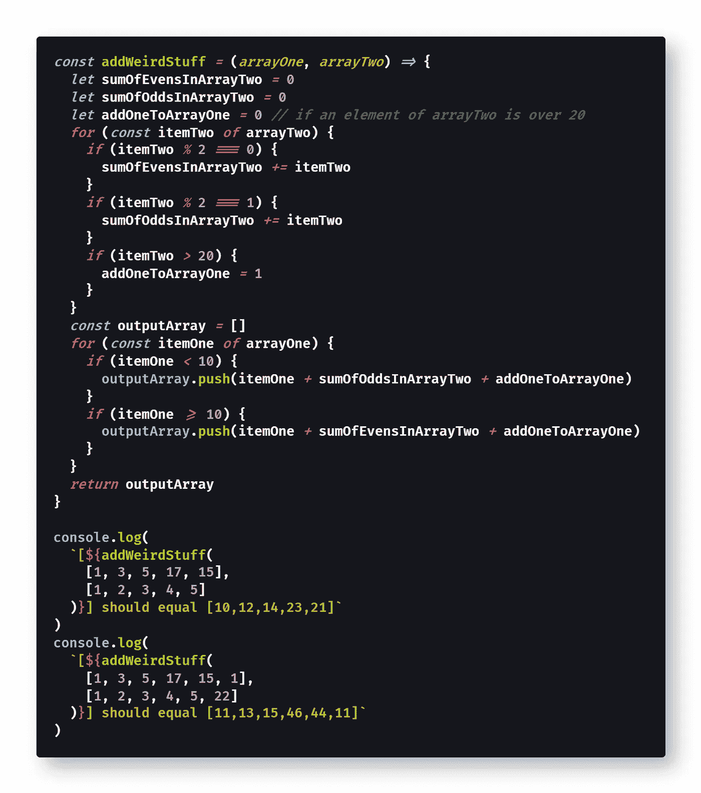
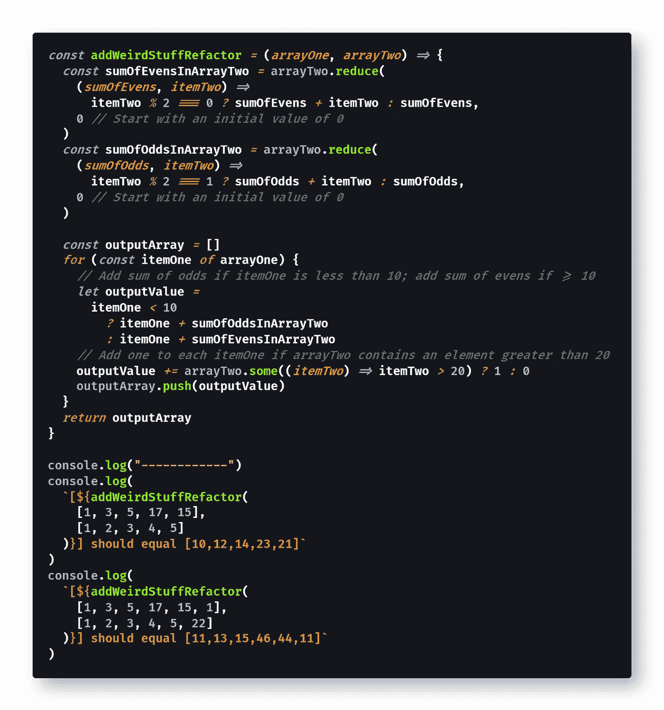
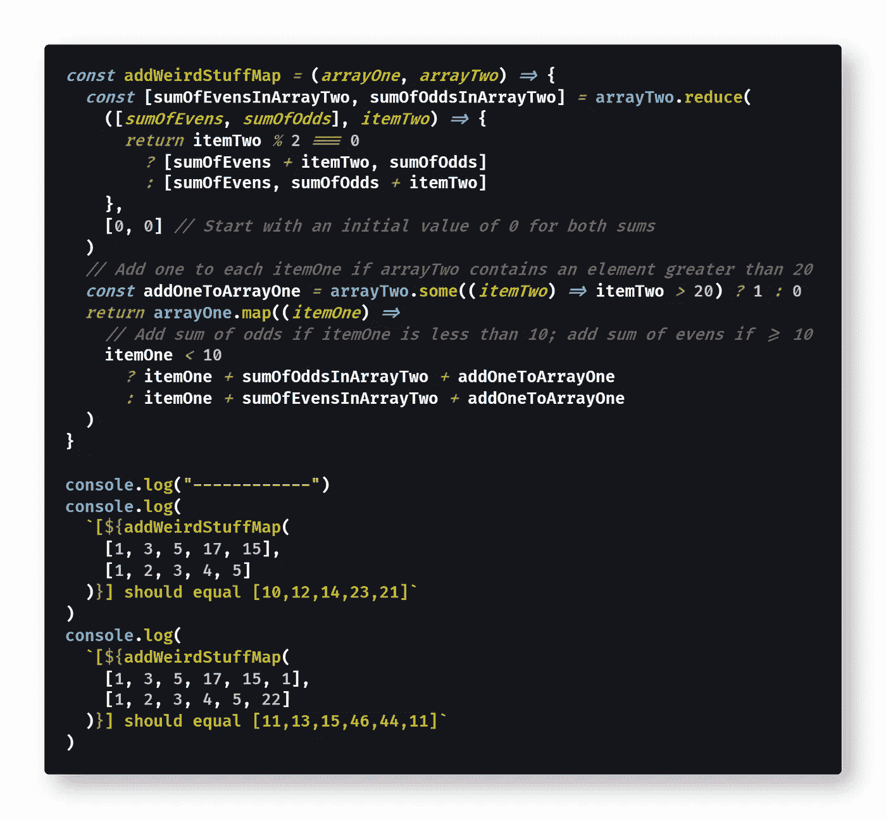

# 为什么你应该使你的代码尽可能简单

> 原文：<https://betterprogramming.pub/why-you-should-make-your-code-as-simple-as-possible-3b35e89f137>

## 当你第一次写代码时，如果你试着让你的代码简单，甚至是重复的，你会写得更快

西蒙·伯杰在 [Unsplash](https://unsplash.com/wallpapers/design/simple?utm_source=unsplash&utm_medium=referral&utm_content=creditCopyText) 上的照片

编程很像写作——你应该以解决问题的“[糟糕的初稿](https://medium.com/@jeffgoins/dont-waste-your-words-how-to-write-a-first-draft-that-is-crappy-but-usable-c5dbf977f5a5)开始，然后立即编辑两三次，然后继续下一个问题。

工程师嘲笑被比作微不足道的“作家”——但是谁写了你今天早些时候使用的文档呢？而你不是“写代码吗？”

软件开发人员有机会从事最具创造性的工程工作。毕竟，与土木工程师造桥相比，软件工程师在开发应用程序时可以做出更多的决定。

在一个创造性的职业中工作意味着你可以从那些永远不会执行的作家那里学到很多东西。写作建议中最好的一条是解决写作瓶颈的典型建议。

让我给你介绍一下“糟糕的初稿”——因为它会让你成为比以前更快的编码者。

# “糟糕的初稿”方法

“糟糕的初稿”是如此的普遍，以至于你可能在英语课上听说过，即使你从来没有进入过网络博客提供写作瓶颈建议的兔子洞。

“糟糕的初稿”是指你只需要完成初稿，即使它非常糟糕——因为任何初稿都比一张白纸好。

编辑自己的作品比从头开始写容易，所以你需要尝试写点什么(任何东西！)，就是现在。让代码工作就行了。

换句话说，你是愿意在今天午餐前写出 100 行糟糕的代码(有效)还是 0 行完美的代码？

当然，在一天结束的时候，你可能仍然会得到 50 行完美的代码。但是写一份“糟糕的初稿”有一个心理优势:你会觉得更成功，压力更小。

您将编写代码，并从中获得乐趣！什么能打败它？

# 我如何接近初稿

我更倾向于认为我应该以一份“简单的初稿”开始，因为一份“糟糕的初稿”似乎对我的能力有负面的评价。

你想成为一个写“糟糕代码”的“糟糕程序员”，因为你看到了一个关于写“糟糕初稿”的提示吗？

不，你想成为一名“成功的程序员”，写出“伟大的代码”，因为你遵循了这个关于从“简单的初稿”开始的提示

如果您曾经复制了一个代码样本，然后根据自己的需要进行了调整，那么您实际上已经完成了“简单的初稿”

当使用一个代码示例时，您不可避免地要做一些改动，但关键是首先让它工作，然后立即对它进行改进。

您可以使用“简单的初稿”的概念来完成任何编程任务——无论您是编码新手还是已经是专家。

# 为什么“简单的初稿”有效

当你写出有效的代码时，你会感到成功，这会让你有更好的心态。简单的代码第一次更有可能成功。

另外，简单的代码易于编写，可以节省您的时间。是的，这可能感觉重复，你大脑中聪明的部分会乞求你用更少的代码行获得更好的微性能的“更好”的解决方案。

**忽略它。**

诀窍是当你有这种感觉时，啜饮一杯饮料，然后继续追求简单。一旦代码工作了，你就要马上重构它——一旦你有了一个工作副本，你就可以想多聪明就有多聪明。但是在你到达那里之前，尽可能保持事情简单。

写作教练[八月桦树](https://medium.com/u/714cd5b71c2d?source=post_page-----3b35e89f137--------------------------------)把这叫做“[越级写作](https://medium.com/@augustbirch/why-writing-crappy-first-drafts-is-terrible-advice-fa5d7f53cdd):“把整件事写出来，然后马上编辑。你交替写作和编辑。

然而，这就是编程不同于编写的地方:开发人员知道第一稿何时“足够好”,因为代码执行成功。当你的代码工作时，这是你立即编辑你的“简单初稿”的提示，在你继续之前润色几次。

对于任何刚刚学习编码的人来说，这种方法提高了两个关键技能:编写有效的代码，以及在不破坏现有代码的情况下改进现有代码。

# 代码示例

我最近通过 LinkedIn 指导一名初级工程师，他正在努力应对一个过于复杂的编码挑战。虽然一旦你有了真正的项目，这样的编码挑战就变得不那么有用了，但是它们是如何编写“简单初稿”的一个很好的例子

由于问题很复杂，他试图写出一个复杂的解决方案。让我们来看看挑战:

> “写一个函数`addWeirdStuff`，将`arrayTwo`中所有奇数的和加到`arrayOne`中 10 以下的每个元素上。
> 
> 同样，`addWeirdStuff`也应该把`arrayTwo`中所有偶数的和加到`arrayOne`中那些 10 或更大的元素上。
> 
> 奖励:如果`arrayTwo`中的任何一个元素大于 20，`arrayOne`中的每个元素加 1。"

注意，就像在现实生活中一样，他得到了不完整的指令:函数`addWeirdStuff`应该返回一个新的数组，该数组包含来自`arrayOne`的项，后跟来自`arrayTwo`的项。

他最初试图用一个单独的`[for](https://developer.mozilla.org/en-US/docs/Web/JavaScript/Reference/Statements/for)`循环来解决这个问题，这让他自己陷入了失败。这是一项复杂的认知任务，肯定会挑战你的工作记忆，而他对此毫无进展。

这个人之前曾联系我寻求帮助，解决另一个编码难题，他不小心把 return 语句放到了一个复杂的`[for](https://developer.mozilla.org/en-US/docs/Web/JavaScript/Reference/Statements/for)`循环体中。他还没有准备好编写简洁的代码。

我告诉他，他需要使用两个独立的`[for](https://developer.mozilla.org/en-US/docs/Web/JavaScript/Reference/Statements/for)`循环，为了简单起见，他应该使用`[for…of](https://developer.mozilla.org/en-US/docs/Web/JavaScript/Reference/Statements/for...of)`循环。以下是 JavaScript 代码，包括他被给予的检查代码是否工作的测试:

[查看原始代码](https://gist.github.com/djD-REK/9c0ac6c85465c28c8e1d800436c89cf0)作为 GitHub 要点

很丑，性能也很差，但是很管用！它的可读性非常好，尤其是对于一个正在为基本概念苦苦挣扎的新手来说。

下一步是润色这个“简单的初稿”

# 是时候重构了

重构，不管你喜不喜欢，对作家来说更像是编辑过程。在编程和其他类型的写作中，当你自己写完文本时，编辑会更容易，尤其是当你马上完成时。

起初使用简单的语言以降低文本的复杂性，然后立即编辑。它适用于所有类型的写作，包括编码。

从上面我们的“简单初稿”开始，我重构为以下内容:

[查看原始代码](https://gist.github.com/djD-REK/a6c16202a8d2a441f1f750f883853476)作为 GitHub 要诀

这仍然是一个具有挑战性的问题，有很多其他的方法来解决它，但是这次修订感觉像是朝着正确的方向迈出了一步。

在这个版本的初稿中，我添加了[缩减模式](https://reedbarger.com/what-is-a-reducer-in-javascript/)，因为我更喜欢在我的代码中使用[函数式编程](https://medium.com/javascript-in-plain-english/what-are-javascript-programming-paradigms-3ef0f576dfdb)技术。

记住:“完美是好的敌人。”这只是你的初稿，还可以再修改！这就是跨越过程。

我也将可读性放在性能之上，因为我现在在循环的每次迭代中调用`[.some()](https://developer.mozilla.org/en-US/docs/Web/JavaScript/Reference/Global_Objects/Array/some)`。对于运行时来说，这是一个循环中的循环。对于小数组来说，这没什么大不了的，但它可能不会让你在谷歌找到工作。在我下一次编辑这个初稿时，重构也是微不足道的。

在我决定完成我的“简单初稿”之前，我又做了一轮修改来添加`[.map()](https://developer.mozilla.org/en-US/docs/Web/JavaScript/Reference/Global_Objects/Array/map)`方法

[查看原始代码](https://gist.github.com/djD-REK/b93a5480e648778fd27284980e937f6b)作为 GitHub 要点

这是一份“完美的初稿”我把两个`[for…of](https://developer.mozilla.org/en-US/docs/Web/JavaScript/Reference/Statements/for...of)`循环改成了一个`[.reduce()](https://developer.mozilla.org/en-US/docs/Web/JavaScript/Reference/Global_Objects/Array/reduce)`、一个`[.some()](https://developer.mozilla.org/en-US/docs/Web/JavaScript/Reference/Global_Objects/Array/some)`和一个`[.map()](https://developer.mozilla.org/en-US/docs/Web/JavaScript/Reference/Global_Objects/Array/map)`。我更喜欢这种风格的编码，但是老实说，我的第一稿没有任何“错误”——它工作正常，不是吗？

现在，这将是一个伟大的时间来切换任务，并计划明天再次审查这个特定的代码。

# 实数编码的应用

在我们的实际工作中，我们经常会收到令人困惑的指令和期限压力，尤其是在使用新的 API 时。每个程序员有时都想知道，“为什么这段代码不像它应该的那样工作？”

对于我指导的学生来说，他从无法将问题概念化到轻松解决，因为他从简单的`[for…of](https://developer.mozilla.org/en-US/docs/Web/JavaScript/Reference/Statements/for...of)`循环开始。他没有感到挑战和失败，而是感到成功和有成就，这都归功于“简单的初稿”。

如果你更有经验，而且第一次写`[.reduce()](https://developer.mozilla.org/en-US/docs/Web/JavaScript/Reference/Global_Objects/Array/reduce)`感觉很自然，那就去写吧！但是如果你需要查找语法，看看你能不能不用它，然后再重构它。在编码中，你总是可以在以后编辑。

类似地，如果你正在使用 JavaScript，你可能会想回去添加[类型检查](https://medium.com/javascript-in-plain-english/the-best-way-to-type-check-in-vanilla-js-55197b4f45ec)。对于编码挑战来说，这是不必要的，但这是第二天要考虑添加的内容。

“简单初稿”编码方法的另一个现实遗留问题是，您将频繁地进行 [git 提交](https://www.git-tower.com/learn/git/commands/git-commit):至少，您应该在跨越过程中提交初稿的每个版本。当你完成初稿的时候，你可能已经提交了三到四个工作版本。

如果您以后在处理代码时发现了 bug，您会很高兴有提交，因为您将在存储库中有一些解决方案需要审查。

另外，提交*对我来说感觉*非常高效，尤其是当我作为远程团队的一员工作时。又是积极心理学。

# 测试呢？

根据您对测试的个人偏好，在编写代码之前编写测试完全没问题。只要遵循相同的方法:尽可能编写最简单的测试，然后在它们工作后立即重构它们。

或者，像大多数程序员一样，你可能更喜欢在你有了一段工作代码之后进行测试——这完全没问题。在编写代码并重构一两次之后，编写一些简单的测试，然后重构它们。

我所知道的编写代码的最快方法就是完全按照下面的方法去做:

1.  编写简单的代码
2.  编写简单的测试
3.  使用简单的测试重构简单的代码
4.  重构简单测试

就我个人而言，我发现专注于“糟糕的初稿”(或者我喜欢说的“简单的初稿”)会让我更有可能首先编写测试，因为我不担心编写完美的测试。

你甚至可以考虑将测试作为你的工作的“第二稿”,并将这项任务推迟到明天。做任何对你、你的项目和你的组织有用的事情——只是不要忘记测试。

# 结论

无论你是代码新手、初级工程师还是专家，如果你不注重完美，你将会更快地写出更多的代码。从“简单的初稿”开始，一旦成功，立即编辑你的代码。

从一个专业地使用 10 种编程语言并在去年写了 100，000 字关于 JavaScript 的技术作家那里可以看出，这个写作技巧对开发者和作者一样有效。

我对所有水平的程序员的真正建议是，你的初稿应该是重复的，甚至感觉像是“黑客”首先忘记[的编码原则](https://medium.com/dailyjs/principles-to-code-by-3c516ad61fcc)，比如“干”(不要重复自己)，坚持最基本的编码规则:

**《吻》(保持简单，笨蛋！)**

一旦代码运行起来，你就能让它变得漂亮，但是如果你不得不花上几个小时调试——甚至在你让那段代码运行一次之前，你的一整天都会被浪费掉。相信我，我也经历过！

而且，如果你只是在学习一门新的编程语言、开发工具或代码库，那么这个建议是必须的，而不是可选的。

编码快乐！

德里克·奥斯汀博士是《职业编程:如何在 6 个月内成为一名成功的 6 位数程序员 》一书的作者，该书现已在亚马逊上架。