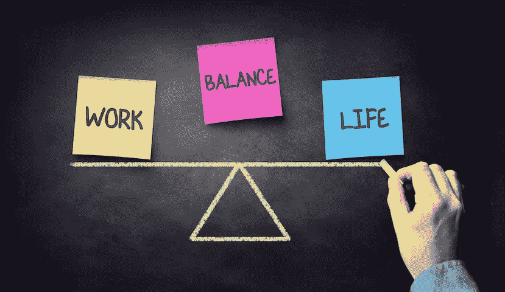

# 为什么你应该停止寻找工作与生活的平衡

> 原文：<https://betterprogramming.pub/why-you-should-stop-looking-for-work-life-balance-4ce3076cabf9>

## 做出更好的决定来提高你的生活质量

在 [iStockPhoto](https://www.istockphoto.com/) 上由[布里亚纳杰克森](https://www.istockphoto.com/portfolio/BrianAJackson)拍摄的照片

当你初入职场时，工作与生活平衡这个词肯定会被听到不止几次。许多人认为工作生活平衡是工作和个人生活之间的平衡。考虑到这一点，大多数人努力在工作和生活之间找到一个相对较好的平衡，并且经常在工作过度、压力过大的战斗中处于劣势，很少有时间留给自己和自己的兴趣。

从理论上讲，工作与生活的平衡不是一种“一刀切”的方法。相反，应该鼓励人们以更现实的方式全面提高生活质量。

我很小的时候就没有考虑过工作与生活的平衡，直到我从事的一个项目在工作了近一年后被重新安排了优先次序。我记得加班，经常在办公室工作到深夜。工作开始消耗我的日日夜夜，在项目的压力下，我的人际关系和个人生活开始出现许多问题。最终，管理团队注意到这个项目的经济效益并不像他们一开始估计的那么大，并决定不值得继续下去。

那时候，我觉得自己有点被学长出卖了。在我所有的努力和妥协之后，我的牺牲没有得到任何回报。许多年后，我从自己的经历中吸取了惨痛的教训，在着手任何新项目时，我首先考虑的事情之一就是让工作与生活的平衡成为现在和未来的决定性因素。

在疫情期间，工作与生活平衡的概念得到了更多的认可，因为我们许多人开始在家工作，工作之外的生活和工作与生活不知何故混合在一起。对于不受任何特定工作时间限制的软件工程师来说尤其如此，他们基本上可以在工作时间之外从事他们的项目。开始的时候，看起来很刺激。有许多额外的好处，例如节省了大量的时间和交通费用，为工作做准备，等等。然而，在家工作一段时间后，一些人注意到工作生活和个人生活之间的界限变得模糊了。

# 工作与生活的平衡很复杂

理论上，工作与生活的平衡看起来就像一个简单的公式:你工作八小时，其余时间是你的私人时间。然而，实际上工作与生活的平衡并不是这样的。你有没有检查过上下班路上花了多少时间，一个完整的工作日，杂务，差事，家庭时间，爱好，放松，睡眠？你会发现一天中没有足够的时间来分散在每个方面。

你还会发现，许多人仍然很难愉快地找到构成工作与生活平衡的活动之间的界限。实际上，有些人对这种分离付出了太多的努力。这种分离甚至可能表明，工作是生活中不快乐的部分，是必须的，应该与生活中令人愉快的部分或你在空闲时间做的事情分开。

我相信，试图将两者分开来达到工作生活平衡，其实可以让你失去背后的实际逻辑，那就是**生活满意度**。工作是生活的一部分，对许多人来说，他们所做的工作是他们一直计划和梦想的。把工作和生活分开没有意义。相反，我们应该寻找包括工作在内的生活满足感。我个人认为，重点应该是最后什么让你开心。

作为一名软件工程师，我有时会在我从事的项目中找到乐趣，即使加班也会让我感到快乐。工作感觉不像工作，而是像一些有趣和令人兴奋的事情，给我带来快乐。然而，有时候工作充满挑战和压力。这侵占了我的个人时间，我会发现自己会担心工作，无法完全沉浸在当下，而不是享受与朋友和家人在一起的时光。如果这种情况发生得太频繁，会导致家庭问题，或者对工作和家庭生活都感到不满足。在这种情况下，生活满意度很低，你可能会普遍怨恨自己的生活，或者觉得自己两边都找不到突破口。

所以，回想起来，如何实现工作与生活的平衡并没有什么神奇的公式。试图找到将工作和家庭生活分开的方法通常会导致很多压力和不切实际的期望。工作生活和家庭生活总是以某种形式或方式交织在一起。然而，有一些不成文的规则可以帮助我们做出更好的决定，创造更好的生活质量。

# 1.“现在努力工作是为了以后享受生活”是一个神话

我们很多人可能都看过最近一集的《美国达人》,西蒙在精彩表演《没关系》后给了夜莺一个金蜂鸣器一个关键的时刻是当她引用“你不能等到生活不再艰难才决定快乐。”

考虑到这一点，享受当下是一种技能，就像其他技能一样，你需要学习和练习。如果你延迟活在当下，即使当“预期时间”到来时，你可能不知道如何充分利用它，并可能失去你实际上可以享受的黄金岁月。为了避免这种情况，试着找到教你如何完全拥抱当下的方法。

# 2.练习时间管理

当你面临完成任务的时间限制或截止日期时，你可以开始练习更好的时间管理和优先化你的任务。这不仅能帮助你在不需要额外时间的情况下完成工作，而且你也可以在自己的私人时间里运用同样的方法。请注意，时间管理不是在纸上写下许多任务，并期望它们在短时间内全部完成。

如果你没有设定现实的或可实现的目标和期望，当你跟不上时，就会导致失望。以明智的方式计划你的工作，在把时间和精力投入到项目的“实质”之前，先完成较小的任务。还有，试着把你的目标按优先顺序排列，如果你没有达到目标，不要惩罚自己。

聪明计划的一个结果是，当事情提前或按时完成时，你会感到更轻松，这会让你有更多的满足感，因为你为自己腾出了额外的时间。

# 3.加班对你职业生涯的影响没有你想象的那么大

从短期来看，加班可能会给你的职业生涯带来一点点推动，甚至是升职，但从长远来看，它可能会有负面影响。持续的加班会导致牺牲健康、个人成长和时间等等。仅仅因为让你的上司高兴而加班并不总是最好的方法。

如果你在身体上和精神上都没有达到最佳状态，你的工作成果会受到影响，质量也会下降。如果你养成了加班的习惯，你甚至可能为了你认为下班后拥有的“额外时间”而拖延。在你的职业生涯中，我很肯定你见过同事加班，但完成的工作比别人少。

然而，并不是所有的加班都是不好的。事实上，如果你正在享受一个项目或取得巨大进展，这可以产生积极的影响，并有助于生活满意度。这种场合可以提升你在许多领域的技能，对你的职业生涯有益。

此外，你可能会遇到“关键时刻”，如果事情变得紧急或有问题需要立即纠正，就不可避免地需要做额外的工作。大多数情况下，这些实例只是项目中的小插曲，需要及时采取行动来解决。然而，如果你经历了一个稳定的高压时期，也许是自我强加的“紧要关头”，或者你的公司有一些资源或管理问题，正确的做法是找到根本原因，为了所有员工的利益，与管理层沟通你的问题。

# 结论:管理你的期望和你愿意付出多少

说到底，生活满意度在于现实和期望的差距。合理的期望通常会带来更高的满意度。这是边界设置的一种形式。只要你承认你愿意付出多少时间和努力，同时期待一个合理的结果，你就在正确的轨道上。不要让工作消耗你或让你的个人生活影响你的工作，拥抱你生活的所有元素，并将它们融合成一个有效的、有益的系统，给生活的各个领域带来满足感。