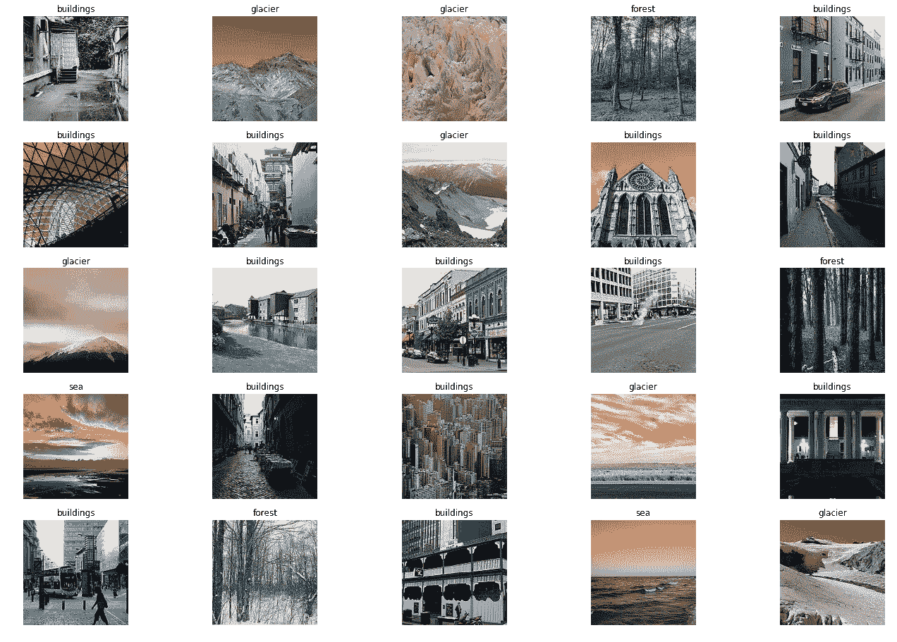
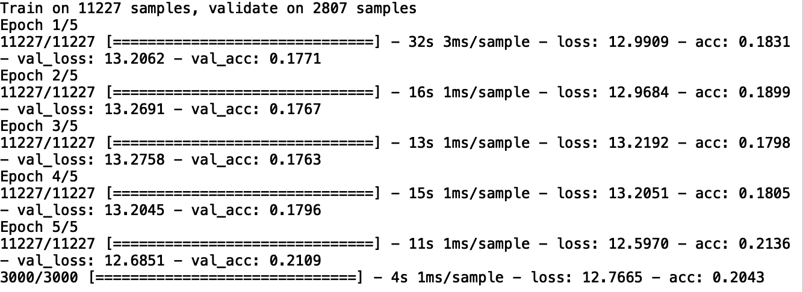
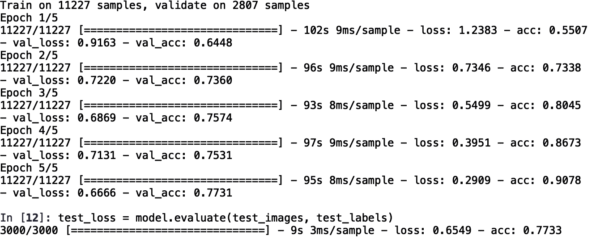

# 为什么您应该在下一个神经网络中使用卷积—使用张量流

> 原文：<https://betterprogramming.pub/why-you-should-use-convolutions-in-your-next-neural-net-using-tensorflow-37d347544454>

## 显著提高性能

卡伦·艾姆斯利在 [Unsplash](https://unsplash.com/search/photos/mountains?utm_source=unsplash&utm_medium=referral&utm_content=creditCopyText) 上的照片

神经网络是图像分类问题的一种常见解决方案。通常，他们会通过获取大量影像数据集、展平影像、将影像传递到完全连接的图层，然后传递到输出图层来获得预测值。这篇文章不会触及神经网络的许多基础知识，所以如果你是新手，我建议你先阅读[这篇](https://medium.com/@eth6re/beginners-guide-to-building-neural-networks-in-tensorflow-dab7a09b941d)。

理解本文所需的一些基础知识是，图像是一个值的矩阵(通常有三层，值的范围从 0 到 255)，并且与大多数数据科学一样，对线性代数有一个合理的理解。

在这篇文章中，我们将看到一个模型，该模型可用于对 [Kaggle](https://www.kaggle.com/) 上的[英特尔图像分类](https://www.kaggle.com/puneet6060/intel-image-classification)数据集中的图像进行分类。该数据包含大约 25k 张大小为 150x150 的图像，分布在 6 个类别中。

数据集中的一些图像

在 [TensorFlow](https://www.tensorflow.org/) 中，没有隐藏层的典型神经网络可能看起来像这样:

有无隐层神经网络的比较。来源:[https://towards data science . com/multi-layer-neural-networks-with-sigmoid-function-deep-learning-for-rookies-2-BF 464 f 09 EB 7 f](https://towardsdatascience.com/multi-layer-neural-networks-with-sigmoid-function-deep-learning-for-rookies-2-bf464f09eb7f)

这是一个简单的神经网络，它将图像展平为一维数组，使用 128 个输入函数来帮助用 ReLu 激活函数对图像进行分类，然后输出 6 个输出，每个输出对应图像可能属于的一个潜在类别。

对于这个更复杂的问题，该模型表现相当差，在测试集上的准确率仅为 20%。我们可以做得更好！

简单神经网络分类的训练和测试结果

# 什么是卷积

卷积是神经网络架构之前的一组层。卷积层用于帮助计算机确定在简单地将图像展平为其像素值时可能会丢失的特征。卷积层通常分为两个部分，卷积和池。

首先，卷积使用应用于图像的滤波器，以便突出在图像分类中被认为重要的某些特征。这些过滤器可以突出简单的特征，如垂直线或水平线，使计算机更明显地看到它在看什么。

**左:**一座建筑物的图像**右:**应用了水平线卷积的同一图像。来源:http://aishack.in/tutorials/image-convolution-examples/

考虑卷积时，需要考虑层的三个主要特征。

首先是**内核大小**。这是您将应用于图像的滤镜的尺寸。改变内核的大小取决于你在看什么样的图像。如果你在看一个更大的图像，你通常会想要一个更大的内核，因为特征通常会更大。如果你正在看一个较小的图像，一个较小的内核会更好，因为你不想错过图像中的关键特征。

接下来我们有**填充**，这是一个相当简单的概念，在图像的侧面添加额外的像素，这样我们就可以将卷积应用到所有原始像素上。

最后，我们有滤波器的**步距**。顾名思义，这是滤镜每次应用时移动的像素数。步幅越大，图像尺寸越小，训练时间越短，但在某些情况下可能会降低性能。通常在卷积之后应用诸如 ReLu 的非线性函数，以确保所有像素都具有正值。

经过卷积层，我们有一个**池层**。汇集层从卷积中提取图像(它仍然是一个图像，因为它是一个 2-d 值矩阵),然后对一部分像素应用函数。池化图层的典型示例使用最小值、最大值和平均值等函数来生成新的池化图像。

合并的好处是大大减少了进入下一层的图像的大小(或者是另一个卷积，或者是完全连接的层之前的展平层)。

对于这个数据集，训练集中有超过 14000 幅图像，对于这样的问题来说，这是一个合理的大小-更复杂的问题可以使用数百万幅图像。用于该问题的神经网络的架构使用两个卷积，因此使用大小为 2 的两个池层，因此图像的维度在到达主神经网络之前被减半两次。这意味着，就处理时间而言，我们有效地训练了不到 1000 张图像——这显然是一个巨大的好处。

MaxPool 如何工作的可视化表示。*来源:*[*【http://cs231n.github.io/convolutional-networks/#pool】*](http://cs231n.github.io/convolutional-networks/#pool)

# 何时使用更多的卷积，以及应该使用多少个卷积

一般来说，使用的卷积层数越多越好。但是，训练时间是有取舍的。随着卷积层数的增加，您正在寻找的图像的细节也在增加。

例如，第一层可能只找到图像中的垂直边缘，第二层添加水平边缘，然后第三层添加某种类型的曲线。每一层都为传送给计算机的图像增加了更多的细节，但是需要进行更多的计算。随着图像数量的增加，由于每次都在寻找更具体的细节，因此分类的准确度会降低。

# 何时使用卷积神经网络

CNN 被设计成将图像数据映射到输出变量。它们被证明是如此有效，以至于它们是任何类型的涉及图像数据作为输入的预测问题的首选方法。使用 CNN 的好处是他们能够开发一个二维图像的内部表示。这允许模型学习数据中的位置和比例不变结构，这在处理不能通过简单地拼合图像来理解的图像时是重要的。通常，我们希望将 CNN 用于图像数据、分类预测问题或回归预测问题。更一般地说，CNN 可以很好地处理具有空间关系数据。

# 与常规神经网络相比，这些可以提供哪些改进

CNN 的主要好处是，通过过滤图像中的重要特征来减少图像中的“噪声”,使计算机能够对图像做出更好的预测，因为它只关注重要的特征。此外，CNN 中的池层大大减小了计算机正在查看的图像的大小，因此大大加快了训练时间。池化还可以增强某些功能，例如取最大值，我们可以进一步突出图像的边缘，同时减小图像的大小，并仍然保持图像的主要思想。

因此，如果我们采用原始的简单神经网络，并在模型中添加一些卷积层和池层，我们可能会得到如下结果:

CNN 的图表。来源:[https://cdn-images-1 . medium . com/max/1600/1 * zkxkk 1 TFA 0r 5d _ wbp tuy 4 a . png](https://cdn-images-1.medium.com/max/1600/1*zkxkk1tfa0r5D_wbptUy4A.png)

现在，我们已经在神经网络之上添加了两个卷积层。第一种方法获取图像并应用大小为 3 的 32 个不同的过滤器，然后使用大小为 2 的 MaxPooling 来压缩图像。对于较小的图像再次重复这一过程，然后传递到展平层，并如前所述进行分类。

我们现在获得了超过 90%的训练准确率和 77%的验证准确率，以及在 3000 幅图像的测试集上的 77%的准确率。

卷积神经网络分类的训练和测试结果

这是对我们原始神经网络的重大改进，并且仍然需要相当短的时间来训练超过 10，000 张图像。

# 从这里去哪里

通过引入更多的卷积层来增加传递给图像的细节，可以对该模型进行进一步的改进。运行该模型的时间相当短，因此增加层数应该不会对潜在的精度提高造成太大的时间损失。

另一个提高模型性能的潜在方法是使用**数据增强**。数据扩充涉及转换图像(例如水平翻转)以本质上创建计算机可以从中学习更多的不同图像。这种技术已经被证明是受欢迎的，并且通常可以提高性能，尤其是当一个类中的图像数量很小时。

由于训练和测试准确性的差异，探索防止过拟合(如辍学)的方法可能是值得的。**丢弃**指的是每个训练阶段，此时单个节点或者以概率 1-p 从网络中丢弃，或者以概率 p 保留，从而留下简化的网络——到被丢弃节点的输入和输出边也被移除。

# 结论

我们已经看到，向神经网络添加卷积层可以通过减少图像中的噪声并使图像更容易被计算机解释来显著提高神经网络的性能。池允许我们突出显示某些特征，并减少图像的大小，从而加快训练时间。

# 资源

*   点击此处了解 tensorflow 中的神经网络简介[https://medium . com/@ eth 6 re/初学者指南-构建 Tensor Flow 中的神经网络-dab7a09b941d](https://medium.com/@eth6re/beginners-guide-to-building-neural-networks-in-tensorflow-dab7a09b941d)
*   本项目中使用的数据[https://www . ka ggle . com/puneet 6060/Intel-image-class ification](https://www.kaggle.com/puneet6060/intel-image-classification)
*   你可以在 https://github.com/TomAllport/Intel-cnn 找到模型