# 为什么您的微服务架构需要聚合

> 原文：<https://betterprogramming.pub/why-your-microservices-architecture-needs-aggregates-342b16dd9b6d>

## 什么是聚合，从长远来看，它们如何帮助你？


照片由[亚历克斯·布洛克](https://unsplash.com/@alexblock?utm_source=medium&utm_medium=referral)在 [Unsplash](https://unsplash.com?utm_source=medium&utm_medium=referral) 上拍摄

微服务就是将我们的东西组织成谨慎的、定义明确的单元。

虽然我们的传统单片通常意味着组织中的每个工程师都在应用程序的每个部分工作，并且每个业务实体都与每个其他实体紧密耦合，但微服务允许我们朝着不同的方向前进。

工程团队应该专注于他们自己的业务领域。并且业务实体应该只与同一域中的其他实体耦合。

然而，划定这些界限说起来容易做起来难。因此，新的模式出现了，旧的模式被重新发现。例如，[有界上下文](https://martinfowler.com/bliki/BoundedContext.html)是最近流行的模式，它指导我们在高层次上组织我们的工程团队和业务领域。

同样地，[聚合](https://martinfowler.com/bliki/DDD_Aggregate.html)模式可以帮助我们在更低的层次上组织数据。这种模式最初被定义为对相关实体的变更进行事务性分组的一种方式。

它还为我们提供了一个打破单一数据模式的蓝图，本质上是将高度内聚的实体组合成一个单一的原子单元。

它的好处远不止这些。

有趣的是，聚合模式似乎不像其他分布式软件设计模式那样广为人知、被广泛讨论或普遍实现。但是我发现这是构建微服务的基础。

预先使用聚合进行设计有助于我们避免各种事情，例如实体之间的意外依赖或泄漏引用，这些通常会在我们尝试扩展时困扰我们。

首先，我们来看看什么是聚合。

# 聚集

Aggregate 是 Eric Evans 在他的著作[*Domain-Driven Design*](https://domainlanguage.com/ddd/)中推广的一种设计模式，这本书虽然没有明确讨论微服务架构或分布式系统，但已经成为这些主题的指南。

聚合定义了一个自包含的实体分组，它被视为单个原子单元。任何实体的变化都被认为是整个集合的变化。每个集合都由以下内容组成:

*   一个界限。这是集合中的实体和非集合中的实体之间的清晰划分。
*   许多实体。实体是组中包含的业务对象。
*   一根。每个聚合都向外部世界公开它的一个实体。聚合外部的对象只能引用聚合根；它们不能直接寻址聚合中的任何其他实体。

下图描述了这些:

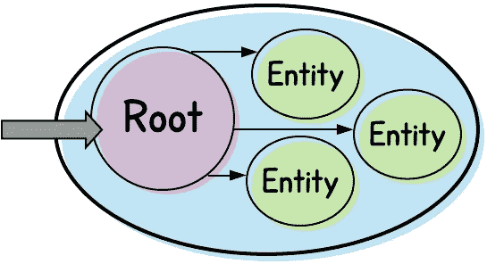

粗椭圆表示集料周围的边界。聚合内部是聚合根(由紫色圆圈表示)以及附加实体(由绿色圆圈表示)。

根是唯一可以从聚合外部直接访问的实体。因此，只有根可以引用聚合中的其他实体。

## 聚集根

在某种程度上，根是集合对外界的代表。因此，在确定哪个实体应该是根时，我们需要选择最合格的实体。

幸运的是，选择通常是显而易见的。许多集合都有一个明确的主实体，其上附有许多支持实体。

让我们修改上面的通用示例，以展示一个特定的(尽管是简化的)示例:一个*用户*聚合:


我们的“用户”总量

请注意，我们的聚合和它的根实体都被称为“用户”。我们的用户实体可能由名字和姓氏、性别和出生日期等属性组成，可能还有一个国家标识符(社会安全号或社会保险号)，以及少量其他标量字段。

这里描述的其他实体代表了一个`User`和它的联系信息之间的一对多关系:`Email`(地址)`Phone`(号码)`Address`。

除了上面的简单描述，我们的集合中还可能有其他实体(例如，代表用户偏好的实体)。

显然，`User`实体将作为我们集合的根。除了相同的名字，`User`实体包含了用户的核心信息。

此外，它是所有其他实体的集合体。比方说，如果移除一个`Phone`，那么集合本身仍然存在。

从这个意义上说，`Phone`本身在`User`的上下文之外是没有意义的。相比之下，如果`User`实体被移除，那么聚合的其余部分——包括所有相关的`Phone`—将变得毫无意义，成为在我们的微服务架构中漫无目的漂浮的孤儿。

那么，`User`实体是*集合中唯一一个可直接外部寻址的实体*。以 ReST 路径为例，这意味着我们可以提供这样的路径:

```
/users/{user-identifier}
```

但绝不会像这样:

```
/users/phones/{phone-identifier}
```

其他聚合可以存储对`User`的引用。例如，我们的`Order`聚合可以存储发起每个`Order`的`User`的标识符。为此，每个`User`必须分配一个[全球或通用唯一标识符](https://en.wikipedia.org/wiki/Universally_unique_identifier)。

## 价值对象

相比之下，其他实体只需要有*本地*标识符；也就是说，聚合可以通过标识符来消除其自身实体的歧义。例如，一个`User`的`Phone`可能被简单地标识为`1`、`2`和`3`。

这是因为，`Phone`在聚合本身之外没有任何意义。没有其他聚合会简单地要求`Phone` `2`。但是，它可能会检索用户`b4664e12–2b5b-47c8-b349–41e81848758f`的`Phone` `2`。

然而，即使这样，也应该在有限的范围内发生；其他聚合不应永久保留对用户电话号码的引用。

回到我们的 ReST 示例，我们可以认为这样引用电话号码是可以接受的:

```
/users/{user-identifier}/phones/{phone-identifier}
```

然而，这些支持实体中的许多将是[值对象](https://martinfowler.com/bliki/ValueObject.html)；也就是说，对象的标识基于它们的值，而不是任何引用。

考虑一下`Email`。我们可能决定给每个电子邮件地址分配一个数字 ID，但是实际上，`me@myaddress.com`本身可以被认为是实体的身份。如果该字符串发生变化，那么它将成为一个全新的电子邮件地址。

这同样适用于`Phone` s(构成电话号码标识的无格式数字)。对于(mailing) `Address` es 也可能是这样，尽管这可能会变得有点棘手，因为同一地址可以有多种写法(例如，34n . Main ST . vs . 34 North Main Street)。

实际上，要将一个`Address`作为一个值对象，我们需要用地址组件的某种规范化形式来表示它的身份。

因此，再一次回到我们的 ReST 例子，我们可以为我们的联系信息实体完全免除 id，并且简单地作为一个组访问它们，像这样:

```
/users/{user-identifier}/phones
```

注意，这里没有通用的答案。这完全取决于我们计划如何对待我们的实体。

## 聚集、事务边界和不变量

前面，我们提到过，聚合被视为一个原子单位。对任何包含的一个或多个实体的改变被认为是对作为整体的集合的改变。

因此，聚合定义了*事务边界*，对所包含的实体的任何更改都基于该边界执行。

这是什么意思呢？通常，我们建立规则来管理当我们修改一个实体时必须发生的事情。在许多情况下，如果我们以某种方式修改一个类型的实体，那么另一个实体也必须被修改。

或者，给定实体的修改可能仅在特定情况下被允许。

我们称这样的规则为不变量。任何不变量必须只存在于聚合的上下文中。如果对实体 X 的更改需要对实体 Y 进行更改，那么实体 X 和实体 Y 必须都包含在同一个聚合中。

同样，如果基于实体 Y 和 Z 的计算，对实体 X 的编辑可能被拒绝，那么所有三个实体必须包含在同一个聚合中。

或者，更准确地说，如果一个不变量分布在多个聚合上，那么我们不能保证这个不变量能够被一致地执行(事实上，我们几乎可以保证相反的情况)。

让我们用我们的`User`聚合例子来说明这一点。让我们假设我们允许我们的用户表明他们的单一的，首选的通信方法。这可能是特定的电子邮件地址、电话号码，甚至是邮寄地址。

因此，我们将“最佳联系人”布尔字段附加到三种联系人信息实体类型中的每一种。如果用户将一个电子邮件地址指定为他们的最佳联系人，然后将他们的最佳联系人更改为他们的一个电话号码，那么必须发生两件事:

*   电子邮件地址'`best-contact`字段必须设置为`false`。
*   电话号码的`best-contact`字段必须设置为`true`。

显然，`Email`和`Phone`实体都必须属于`User`集合。如果它们都属于单独的集合，则“更新最佳联系人”动作不能在单个事务中执行；相反，需要进行两次单独的调用，一次调用一个聚合。

注意，在使用术语“事务”时，我不一定指数据库事务。在许多情况下，对实体的更改是在数据库中执行的。但是它们也可以在存储器中或者通过任何其他机制来完成。

重要的一点是，所有需要的更改都发生在对聚合的一次调用中。因此，这里隐含的意思是，我们相应地定义我们的 API。

在我们的例子中，我们不想要求调用者显式更新最佳联系人字段；下面的 ReST 路径将是一个坏主意:

```
PUT /users/{user-identifier}/phones/{id}/isBestContact // boolean passed in the body
```

相反，我们希望提供如下内容:

```
PUT /users/{user-identifier}/bestContact // ID passed in the body
```

以这种方式，我们可以认为聚合和不变量代表了高内聚的概念:倾向于一起变化的元素应该被组合在一起。

# 如何定义聚合

正确定义我们的聚合有助于我们打破遗留的数据模型，其中主要实体之间的边界是灰色的(最好的情况)或不存在的(最坏的情况)。它帮助我们将需要协同改变的实体组合在一起。

但是…我们如何定义我们的总量呢？有几种方法可供选择，但它们都遵循以下基本流程:

## 从识别系统中的主要实体开始

第一点需要商业知识和常识的结合。我们首先确定作为业务领域基础部分的高层实体。

很可能，电话号码不是我们系统中的关键实体，但是用户(或者我们组织称呼他们的任何东西)是。其他例子(取决于我们的业务)可能是:

*   命令
*   产品(最有可能的是，我们的组织会定义代表我们提供的产品的实体，如汽车、书籍、音轨、水壶等。)
*   分类账
*   库存

如果我们发现自己很难确定一个给定的实体是否足够“高级”来代表一个集合，我们可能会问自己，这个实体是否保证一个全局身份。

我们是否希望全局区分该实体的给定实例和所有其他实例，甚至是那些具有相同值的实例？还是我们只关心实体的价值观？

一旦我们确定了系统中的关键实体，我们就确定了聚合的根实体的可能候选对象。然后，我们想要识别——对于每个根实体——与根实体密切相关的其他实体。

在此过程中，我们应该牢记以下几点:

*   没有根实体，其他实体通常是没有意义的对象。
*   此外，其他实体通常是值对象(如上所述)
*   当我们识别属于聚合的实体时，我们应该寻找不变量——控制不同实体交互的规则。我们应该努力把一个不变量所涉及的所有实体归入同一个集合。

一些聚集看起来很明显，并且会自然形成(我们的`User`例子就是一个典型的例子)。)其他人可能没有这么简单。

让我们以两个候选项为例:`Orders`和`Order Item` s. `Order` s 将代表客户在线购买的全部商品。一个`Order`将由`Order Item`组成，作为`Order`的一部分，每个代表一个特定的产品购买。

毫无疑问，我们希望将`Order` s 视为集合。我们希望跟踪任何已经放置的给定的`Order`，并在任何时候查询它以检查它的组件。

但是一个`Order Item`呢？我们应该认为一个`Order Item`是它自己的集合吗？根据我们的设计，一个`Order Item`可能将许多其他实体组合在一起。也有可能其他聚集想要存储`Order Item`的引用。

相反，一个`Order`可能有与其`Order Item`相关的不变量。也许每次添加一个`Order Item`都需要重新计算订单的总价。

或者可能必须对购买的物品的数量或种类进行限制。这表明`Order`应该是包含`OrderItem`的集合。

没有神奇的答案。这取决于我们的业务。在我们确定我们的聚合根之前，我们通常会经历几次迭代，处理各种用例。

# **为什么蕴？**

我们深入了解了什么是聚合，并探索了识别聚合的方法。显然，设计我们的聚合需要一些前期工作。那么，为什么我们首先要关心呢？

当在领域驱动设计中定义模式时，Evans 几乎只关注作为不变量的事务执行机制的聚合。

但是这种模式——我们用一个外部可访问的引用来标识实体的原子集合——在我们的微服务架构的许多其他方面变得有用。

除了提供不变量的实施之外，聚合还帮助我们避免由以下情况引起的后续问题:

*   实体之间不必要的依赖关系。
*   泄漏的对象引用。
*   数据组缺乏清晰的边界。

让我们来看看这些问题的一些例子，以及总量会有什么帮助。

## 微服务和数据模式设计

让我们来看看一个典型的整体数据库。通常，多年来，我们已经开发了一个大型数据库模式，其中充满了外键引用。

从任意一个表开始，跟踪该表的所有 FK 引用，我们可能会发现自己遍历了整个模式。

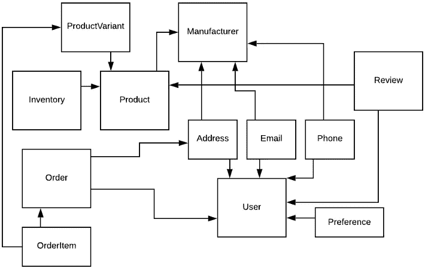

一个小但非常完整的数据库模式

即使有一个完整的代码库，这也不太对劲。

例如，当进行数据库调用以检索一个`Order`时，应该返回多少数据？当然还有状态、ID 和订购日期等`Order`细节。

但是我们应该归还所有的`Order`物品吗？物品的起运地址和目的地地址？代表订单方和接收方的`User`对象呢？如果是这样，那些`User`会带来多少数据？

当我们转向微服务时，我们将打破我们的整体数据模式，就像我们打破我们的整体代码库一样。这可能是我们开始时面临的最困难的任务。

幸运的是，从聚合的角度思考为我们设计数据微服务及其相关的数据库模式提供了蓝图和可靠的指南。

聚合模式告诉我们去识别，而不是武断地画线，并争论哪些对象“感觉”属于一起:

*   我们的根实体。
*   将附加到我们的根实体的值对象。
*   保持相关实体间数据一致性所需的不变量。

虽然仍然需要工作，并且经常需要多次迭代，来确定我们的集合，但是我们会有一盏指路明灯来指引我们。一旦我们形成了集合，我们就可以更加自信地认为我们做对了。

## 分片

大多数数据库可以处理巨大的流量。但是即使是最高性能的数据库也只能处理这么多。当我们的数据量超过了数据库的承受能力时，我们有几个选择。

一个常见的选项是[分片](https://www.digitalocean.com/community/tutorials/understanding-database-sharding)，它描述了一种水平扩展数据库的方式。当分割我们的数据库时，我们有效地创建了我们的模式的多个副本，并在这些副本之间划分我们的数据。

例如，如果我们创建四个碎片，那么每个碎片将存储大约四分之一的数据。各个分片的模式应该是相同的——每个分片都由相同的表、外键和其他约束等组成。

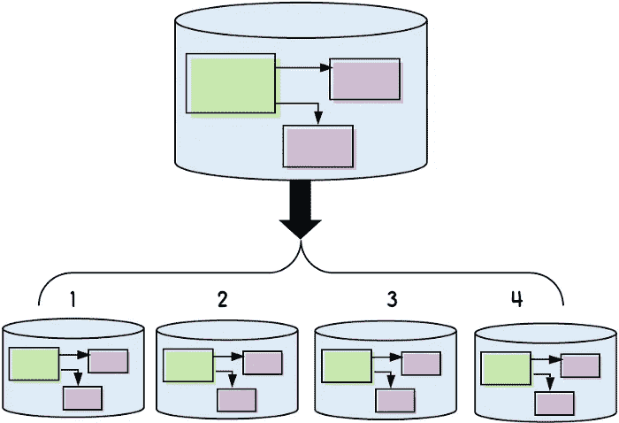

使用分片，我们通过将一个大的模式分割成多个较小的、相同的模式来进行水平扩展

有效切分的关键是*切分键*。实际上，分片键是一个公共标识符，它通过哈希或模数函数来确定它属于哪个分片。

例如，如果我们试图更新一个用户，我们可以获取该用户的 ID，对其进行哈希处理，并将其修改为 4(假设有 4 个碎片),以确定在哪个碎片中可以找到该用户。

现在，如果我们想象一个典型的整体数据库模式，这似乎是一个不可能的任务。

为什么？嗯，在我们的整体模式中，我们可能会有许多外键关系。例如，我们可能有一个从`ORDER`表到`USER`表的外键(代表下订单的用户)。

现在，我们可能能够容易地确定在哪里找到 ID 为`12345`的给定`USER`记录(12345 % 4 = 1，因此`USER`记录将在碎片 1 中找到)。

但是如果那个`USER`记录的外键由 ID 为`6543`的`ORDER`记录持有呢？6543 % 4 = 3，这样就可以在碎片 3 中找到`ORDER`记录。考虑到外键关系，这是不可能实现的。

虽然这是一个来自单一数据库的明显例子，但我们也可以很容易地用微服务的数据模式将自己逼入困境。

假设我们已经创建了一个`User`服务，其中一个`User`实体与 0 相关联，这与我们之前的例子非常相似..n 电子邮件地址、邮寄地址和电话号码。

基础数据模式将如下所示:

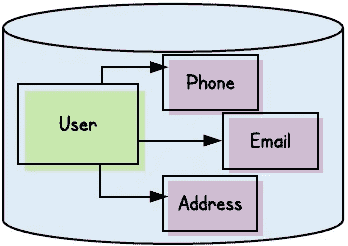

现在，让我们假设我们在构建这个微服务时已经避开了聚合的概念。相反，我们提供了允许直接访问所有实体的端点，如下所示:

```
GET /users/{user-id}
GET /users/phones/{phone-id}
GET /users/emails/{email-id}
GET /users/emails/{email-id}
```

一年后，我们的用户数量激增，我们决定进行碎片化。但在这一点上，我们可以吗？

下面的例子显示了我们的四个`USER`碎片，以及一个 ID 为`12345` (12345 % 4 =碎片 1)的样本`USER`记录和 ID 为`235` (235 % 4 =碎片 3)的相关`PHONE_NUMBER`记录。


那是…行不通的

我们遇到了与单一数据模式相同的问题。

当然，如果我们恰当地定义了我们的用户集合，我们就会确保每个请求都通过根实体。因此，根实体的 ID 决定了每个实体(包括电话号码)的归属。

在上面的例子中，与用户 ID `12345`相关联的所有实体——电子邮件地址、邮寄地址、电话号码和根实体本身——都将存储在 Shard 1 中。

## 信息传递

让我们稍微绕一下，提一下[有界语境](https://medium.com/datadriveninvestor/if-youre-building-microservices-you-need-to-understand-what-a-bounded-context-is-30cbe51d5085)。这是领域驱动设计的另一个非常有用的模式。

除此之外，它帮助我们理解——而不是一堆同步 API 调用——我们的微服务架构应该利用消息传递。

每当一个有界上下文中发生一个事件，该事件将被发布到一个事件总线，如 [Kafka](https://kafka.apache.org/) ，供另一个有界上下文中的服务使用。

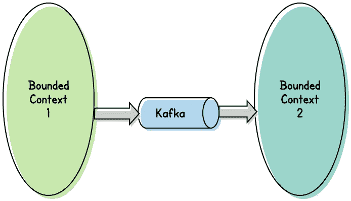

现在，问题通常会出现:“消息应该包含什么？”比如说一个`User`加一个电话号码。一旦更改被提交到其数据存储中，我们希望将编辑作为消息发布。

但是我们到底应该发表什么呢？通常，我们希望发布修改后数据的新状态。因此，我们可以简单地公布新的电话号码:

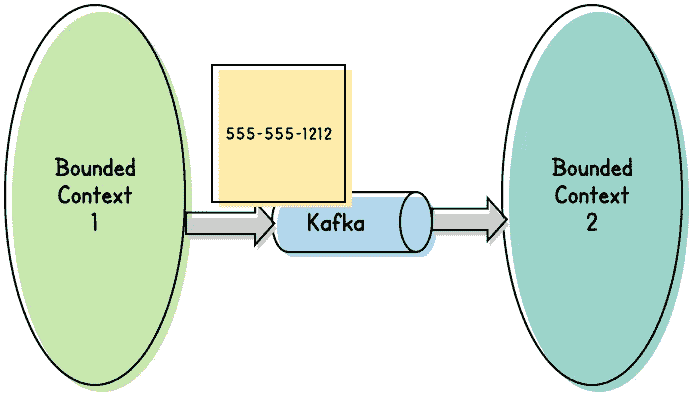

这可能就足够了。不幸的是，很难说消息的消费者可能需要什么额外的信息。例如，一些消费者可能需要知道新电话号码是否也是`User`的主要电话号码。

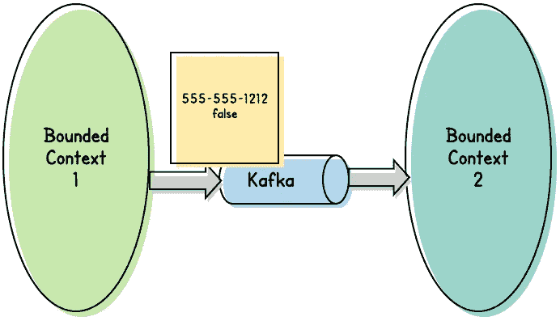

但是，如果主标志为*假* …并且消费者仍然需要知道哪个电话号码是主号码，该怎么办？

嗯。也许我们应该把所有的电话号码都发给*。但是……如果另一个消费者需要通知`User`更改已被处理，并且需要通过电子邮件通知呢？也许我们也应该发送所有`User`的电子邮件地址？*

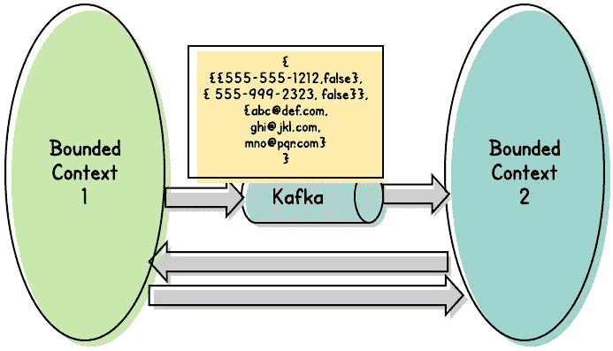

很明显，这个过程可能永远不会结束……而且我们可能永远也做不好。

一些团队尝试的另一种方法是简单地在消息中发送被修改实体的 ID。任何消费者可以(不，*必须*)回叫事件发布者以获得事件的细节。

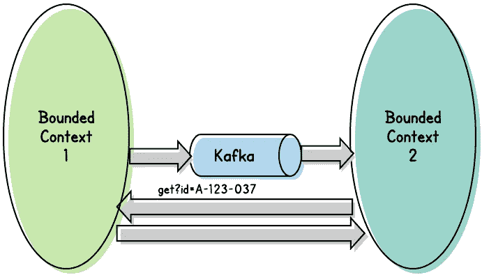

这种方法有两个不幸的问题:

*   这将不时导致检索到错误的数据。假设实体 123 被修改，并且相应的消息被发布。然后再次修改相同的实体。此后，消费者消费第一事件并请求实体 123。消费者永远不会接受第一次修改。现在，这可能无关紧要；可能消费者只关心实体的最新版本。但是作为事件的生产者，我们不知道我们的消费者——现在的和未来的——是否需要跟踪个人的变化。
*   更糟糕的是，它把我们良好解耦的事件驱动架构又变成了一个紧耦合的系统，因为跨有界上下文的同步调用而陷入困境。

那么我们应该传递什么样的信息呢？

事实证明，如果我们接受了总量，那么我们就有了明确的答案。每当聚合发生变化时，该聚合都应该作为消息传递。

我们知道这一点，因为集合体是一个原子单位。骨料任何部分的任何变化都意味着骨料作为一个整体已被修改。

当然，如何在消息中表示该集合取决于我们的组织。它可能是一个简单的 JSON 结构，也可能用一个 [Avro](https://avro.apache.org/) 模式来表示。

聚合的数据可以加密，也可以不加密。但是不管数据格式如何，从集合的角度来思考和设计会产生类似这样的问题。

***消息传递和排序***
当我们在微服务之间传递消息时，排序往往很重要。也就是说，下游消费者需要按照发生的顺序处理变更。例如，如果用户快速连续地将他们的名字从“Smith”更改为“Jones ”,并且这些更改被发布为 Kafka 消息，我们会期望所有消费者首先处理“Smith”更改，然后处理“Jones”更改……而不是相反。

从表面上看，这似乎不是一个问题。毕竟卡夫卡的话题都是以先进先出的方式运作的吧？如果消息 1 在消息 2 之前发布到一个主题，那么该主题的所有消费者应该首先看到消息 1，对吗？嗯，不一定。为了可伸缩性，Kafka(和其他事件总线)进一步将它们的主题分成*分区*。


在这里，我们描绘了一个名为“订单”的主题，分为三个分区。注意，当生产者发布消息时，每条消息都可以在三个分区中的任何一个上结束。

这对可伸缩性有什么帮助？实际上，一个消费者可以被部署为多个实例，每个实例监听自己的分区。在上图的例子中,“Orders”主题的消费者实际上可以部署三个*实例，这三个实例将在各自的分区上并发处理消息——从而将消息消耗速度提高了大约三倍。*

除了…现在消息可以无序处理。幸运的是，Kafka 给了我们一个*分区键*的概念，它控制着生产者将给定的消息发布到哪个分区。我们简单地配置我们的生产者来告诉卡夫卡给定消息的密钥是什么；Kafka 将根据分区数量有效地散列和修改密钥。这保证了具有相同分区键的任何消息都将被发布到相同的分区。

这与总量有什么关系？简单。如果我们生成的消息代表对整个聚合的更改，那么我们可以简单地使用聚合的 ID 作为分区键。这将确保属于给定聚合的消息总是发布到同一个分区，因此最终将按顺序使用。

## 贮藏

缓存是另一个主题，如果没有定义良好的有界数据结构，它会变得难以处理。

大多数缓存像大型散列表一样运行；它们允许我们将某个数据块与单个标识符相关联，并在以后传递该标识符来检索该数据块。

如果我们没有围绕聚合来设计数据，就很难确定我们想要缓存什么类型的数据。想象一个经常被查询但很少被修改的系统。

在这个系统中，我们可能希望将查询结果缓存在栈中更高的位置，以减少对数据库的访问。好吧。但是我们应该缓存什么呢？

我们可以简单地缓存每个查询的结果。回到我们的用户示例，这意味着我们可以缓存以下内容的结果:

*   搜索某个用户。
*   搜索某个电话号码。
*   搜索电子邮件地址的集合。
*   搜索给定用户的婚姻状况。

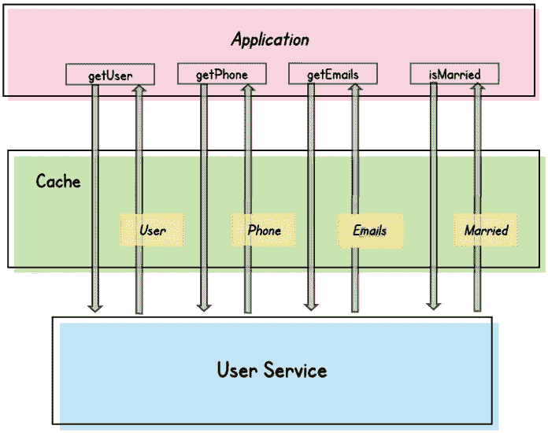

请注意，我们可能会复制数据。我们缓存一个用户对象，但是我们也缓存单个联系信息和联系信息组，以及来自用户对象的单个字段。

当然，这在所需的内存量方面会有影响。当涉及到缓存失效时，它还有更严重的后果。

假设一个缓存的电话号码的属性发生了变化——在我们之前的例子中，假设“最佳联系人”标志从*假*变为*真*。因此，我们使缓存的电话号码无效。

但是我们还需要使缓存的用户对象无效吗？那么另一条联系信息呢？这条信息对应的“最佳联系方式”从*真*变为*假*？

如果我们使用总量，我们不需要担心这些问题。对于聚合，我们只有一个可能的缓存键:聚合根的 GUID。

当我们检索聚合时，我们缓存它。当聚集的任何属性改变时，我们使整个聚集无效。

问题解决了。

## 服务授权

在我之前的公司迁移到微服务的过程中，我领导了一个团队，负责实施服务到服务的数据级授权。

换句话说，我们已经解决了“允许服务 A 访问服务 B 吗？”我们需要解决“允许服务 A 向服务 B 请求实体 123 吗？”

这意味着我们需要知道当前的用户代理(例如，发起请求的客户)。没问题；这就是像[jwt](https://jwt.io/)这样的东西的用途。在进行服务对服务调用时，我们可以在令牌中传递用户的 ID。

我们还需要知道用户代理是否被允许查看任何特定的实体。在我们的案例中，潜在实体的数量是巨大的。

此外，用户可能正在查看他们自己的文档，或者他们可能被另一个用户授予了访问他们的文档的权限(例如，通过授予第三方代理权)。

我们的目标是提供一个通用的、可插拔的解决方案。我们还希望避免重复同步调用单独的服务来确定给定的用户是否有权访问给定的实体。

出于这个原因，我们决定确定允许给定用户访问的项目——在启动期间访问一次——并在用户的令牌中包含这些项目的 id。

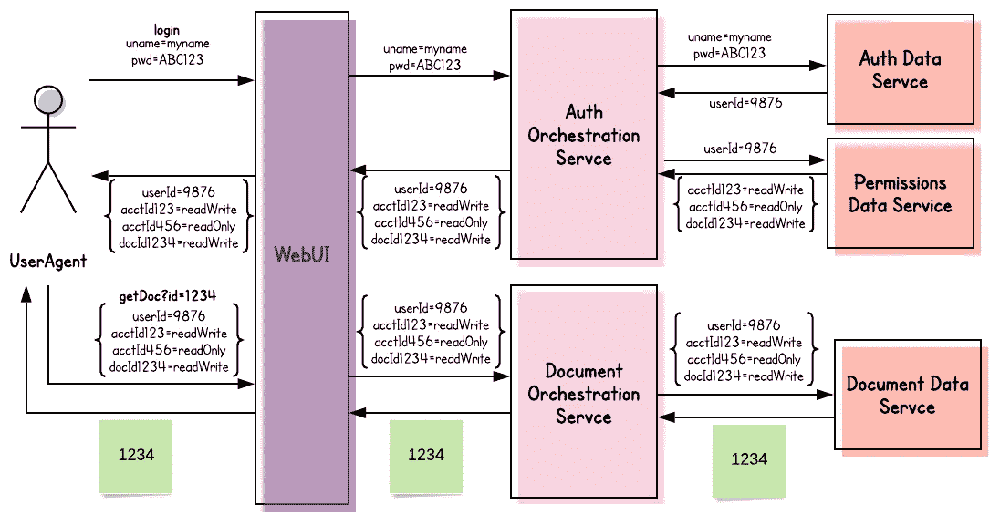

如果我们没有围绕聚合设计微服务，这是不可行的。潜在实体的清单可能会令人望而却步。

然而，因为我们已经预先投资使用聚合，我们已经约束自己使用聚合的根的 ID 来查找任何实体。

因此，我们只需要跟踪用户代理被授权访问的集合。这份清单很可行。

## 跟踪更改

我们可能会发现自己的任务是跟踪数据的变化。过去，我们通过实现由低级数据库活动触发的[变更数据捕获(CDC)](https://en.wikipedia.org/wiki/Change_data_capture) 系统来记录数据变更。

最近，组织倾向于捕获业务实体的变化，而不是数据库中列的变化。

因此，我们面临一个问题:“快照中应该有什么数据，我们以后将如何使用它？”

正如您现在可能已经想到的，如果我们已经围绕总量设计了数据，那么回答这些问题将会很简单。每当对任何实体进行更改时，我们都会记录其集合的新版本。这不仅简单；也更准确。

回想一下，聚合的最初目的是在事务上强制实施不变量。因此，聚合的每个快照将代表任何此类事务的结果。

稍后检索更改也变得更加简单。如果我们想查看用户联系信息的历史，我们就不需要担心收集多个 CDC 表的变化。

相反，我们直接进入聚合表。同样，不同的变化变得微不足道；我们只是将一个版本的集合与另一个进行比较。

## 无数其他人

这是围绕集合设计我们的实体帮助我们解决的挑战的非详尽列表。毫无疑问，我们中的一些人会找到其他人(尝试实现没有聚集的[命令查询责任分离(CQRS)](https://martinfowler.com/bliki/CQRS.html) 模式！)

当我们思考它时，它是有意义的。应用聚合模式迫使我们以系统的方式预先考虑哪些实体属于同一个实体。

最终，我们将把自己约束在定义明确的、原子分组的实体中，只有一个访问点。我们不会因为实体之间的偶然依赖而结束，也不会因为各种泄漏的引用而阻止我们实现扩展解决方案。

# 参考

*   [DDD _ 聚合](https://martinfowler.com/bliki/DDD_Aggregate.html)
*   [了解数据库分片](https://www.digitalocean.com/community/tutorials/understanding-database-sharding)
*   [价值对象](https://martinfowler.com/bliki/ValueObject.html)
*   [卡夫卡消费者](https://www.oreilly.com/library/view/kafka-the-definitive/9781491936153/ch04.html)

觉得这个故事有用？想多读点？只需[在此订阅](https://dt-23597.medium.com/subscribe)即可将我的最新故事直接发送到您的收件箱。

你也可以支持我和我的写作——并获得无限数量的故事——通过今天[成为媒体会员](https://dt-23597.medium.com/membership)。