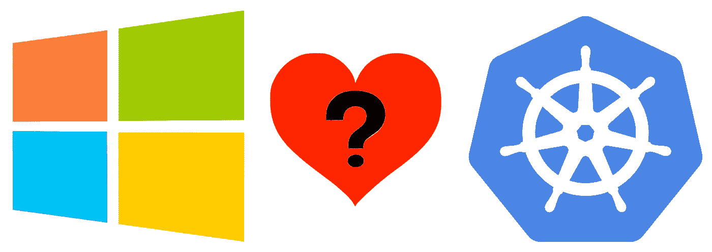

# Kubernetes 上的 Windows 容器

> 原文：<https://betterprogramming.pub/windows-containers-on-kubernetes-643c2356622a>

## 这项技术已经准备好迎接黄金时代了吗？



打开预览 Azure Kubernetes 服务(AKS)群集上的 Windows 服务器容器。它如何与长期以来基于 Linux 的容器替代方案相匹配？

虽然还在预览阶段， [Azure Kubernetes 服务](https://azure.microsoft.com/en-us/services/kubernetes-service/) (AKS) [最近宣布了对 Windows 服务器容器的](https://azure.microsoft.com/en-us/blog/announcing-the-preview-of-windows-server-containers-support-in-azure-kubernetes-service/)支持。

您可以部署 ASP.NET 应用程序，运行 [PowerShell](https://docs.microsoft.com/en-us/powershell/scripting/overview) 或 Linux 子系统脚本，并支持自动扩展以满足客户需求。我已经使用这项服务大约一个月了，这些是我的主要收获。

# Windows 容器既慢又笨重

基于容器的开发有很多好处，比如一致的环境、隔离和随处可跑的心态。

当在 Kubernetes 上使用基于 Linux 的容器时，它通常具有轻量级的优势，足以扩展并快速满足流量需求。甚至关于 Windows 容器的*页面也提到了这些好处:*

> “容器提供了一个轻量级的隔离环境，使应用程序更容易开发、部署和管理。容器可以快速启动和停止，非常适合需要快速适应不断变化的需求的应用。”

我来自基于 Linux 的容器世界，对图像的巨大尺寸和扩展新的 Kubernetes 节点以及部署更多的 pod 所花费的时间感到惊讶。

默认的`ltsc2019`图像超过 850 兆字节，所以我不知道我们是否已经准备好使用这个轻量级的短语，但其他一切听起来都是真的。

Windows 容器还需要比其对手更多的资源，这使得成本更高，如果您将 Azure⁴上的`Standard_DS2_v2`与`Standard_DS3_v2`(windows 节点池所需的最小大小)进行比较，至少是前者的两倍。

我在使用 Windows 容器时只使用过`Standard_DS3_v2`节点，所以对此要有所保留，但是我注意到在与运行的 pods 交互时有很高的延迟和减速。

例如，在调试系统时，我经常运行这样的命令:

```
$ kubectl exec -it [pod-name] /bin/bash
```

在 Windows 上，这变成:

```
$ kubectl exec -it [pod-name] powershell.exe
Windows PowerShell                                                                                                                                                                                      
Copyright (C) Microsoft Corporation. All rights reserved.                                                                                                                                               

PS C:\>
```

从这里运行命令，比如下载文件或安装可执行文件，可能会花一些时间，尽管在我的 Mac 上跳到 Windows 容器中感觉很棒。对于像我这样通常逃避任何 Windows 开发工作的开发人员来说，这无疑是一个巨大的进步。

将这一功能与最新的 Windows Subsystem for Linux (WSL)结合起来，您就拥有了一个跨操作系统的共享工具链。

我现在通过 Kubernetes 在 Windows 上使用一个之前测试过的 bash 脚本，只需很少的努力。这种支持进一步降低了对跨平台支持感兴趣的开发人员的门槛。

# 做好每一件事是一门艺术

虽然 Windows 容器既有 Windows 服务器核心映像，也有 Nanoserver 基础映像，但据我所知，AKS 只支持 Windows 服务器核心映像。这是因为:

> Windows Server 容器和底层主机共享一个内核，容器的基本映像操作系统版本必须与主机的版本相匹配⁵

如果你没有得到这个权利，期待看到`The operating system of the container does not match the operating system of the host.`

我经常看到这种情况。我使用 Azure Pipelines⁶从自定义 dockerfile 文件构建容器映像。然后，我需要让我的基本映像 Windows 版本与 Azure Pipeline VM 版本相匹配。

接下来，我将容器图像与 Kubernetes 节点进行匹配。我无法通过 Azure docs 找到确切的 Windows 版本，运行`kubectl get nodes -o wide`你会得到类似这样的结果:

```
NAME            OS-IMAGE                         KERNEL-VERSION
linux-node      Ubuntu 16.04.6 LTS               4.15.0-1061-azure
windows-node    Windows Server 2019 Datacenter   10.0.17763.737
```

它被转换成一个 Docker 基础映像`mcr.microsoft.com/windows/servercore:ltsc2019`和 Azure 虚拟机映像`vmImage: ‘windows-2019’`。

希望最终能够更容易地匹配和配置这些选项，并最终在 AKS 上运行 Nanoserver 基础映像。

# AKS 未准备好生产流量

我目前使用 AKS 来运行生产计算作业，这些作业是异步的，不会直接影响客户。我认为现在这是一个很好的、安全的用例。

我不认为它已经为生产网络流量或任何同步做好准备的原因是，我在实际的集群中遇到了很多问题。以下是一些例子:

*   由于容器停留在`ContainerCreating`状态，节点意外地变得不可用。
*   删除的作业不会清理相关的 pod(Kubernetes API 破损)。
*   通过 UI 取消设置节点自动缩放选项是不可能的，这会导致一些手动缩放的复杂性。

我期望像 Kubernetes API 破损这样的问题可以通过 Azure 支持快速解决，但是如果不支付额外的费用，我不能直接升级这个问题。

我相信可以通过 GitHub 提交这样的问题，但是在预览版中他们不允许反馈和错误，这看起来很疯狂。

# 参考

1.  [宣布 Azure Kubernetes 服务中 Windows 服务器容器支持的预览版。](https://azure.microsoft.com/en-us/blog/announcing-the-preview-of-windows-server-containers-support-in-azure-kubernetes-service/)
2.  [谷歌云—容器](https://cloud.google.com/containers/)
3.  [Windows 容器](https://docs.microsoft.com/en-us/virtualization/windowscontainers/about/)
4.  【https://azureprice.net/ 
5.  [容器版本兼容性](https://docs.microsoft.com/en-us/virtualization/windowscontainers/deploy-containers/version-compatibility)
6.  [天蓝色——管道](https://azure.microsoft.com/en-us/services/devops/pipelines/)