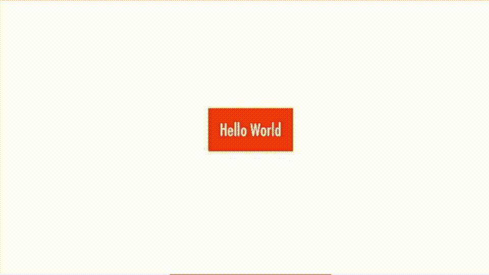

# 在 SwiftUI 中使用联合发布者

> 原文：<https://betterprogramming.pub/working-with-combine-publishers-in-swiftui-cb85257807e3>

## 在 SwiftUI 中使用 Just、Sequence、Record 和 Future



作者 GIF。

发行商是 Combine 框架的命脉，他们有十几个甚至更多。在本文中，我想通过使用一些主要的发行商来尝试改变“Hello World”问候语的背景色。

我不认为这是完成任务的正确或最好的方法。这更像是理解这些出版商如何工作以及你如何让他们为你工作的一个练习。

# 序文

使用发布者最困难的一个方面是，如果不小心，您可能会终止流——特别是使用 SwiftUI 作为端点。相反，无法终止它有时也同样具有挑战性。请继续读下去。

# 任务

我给自己设定了一个任务，改变经典的“Hello World”问候语的背景颜色。我想改变背景四次:在不超过 12 秒的短时间内，变成红色、蓝色、绿色，最后变成橙色。我用了四个不同的出版商。他们中的一些人比其他人更适合这项工作。我还发现自己在 most 中使用 SwiftUI `Subject`(第五元素和发布者)。

# 将来的

`future`发布器的基本语法如下所示。作为发布者，您实际上是在使用它预加载值。在口语中许下承诺。下面显示的代码延迟两秒钟将红色传递给发布者:

```
let future1 = Future<Color, Never> { promise1 in
  DispatchQueue.main.asyncAfter(deadline: .now() + 2) {
    promise1(.success(Color.red))
  }
}
```

在四家出版商中，使用`future`实现挑战是最困难的。真正的变化是，每次我重新加载视图时，`future`都会重置自己，这就是为什么我在使用它之后引入了一个布尔值来屏蔽发布者。

# 仅仅

`just`发布者的基本语法如下所示。作为一个发布者，我遇到的主要问题是它会在完成时自行终止。这就是为什么我最终不得不创建另外四个(`subject`)出版商。再加上`future`，看起来真的不是解决这个挑战的好选择。

# 顺序

`sequence`发布器的基本语法如下所示。作为发布者，您实际上又一次预加载了值——这次强调的是它们的顺序。与前两者斗争之后，就容易多了。

让它工作的主要变化是试图让它慢下来。我通过再次使用第二个发布者(`subject`)解决了这个问题，我用一个计算好的延迟调用了一个`DispatchQueue`。我确实试图直接拖延它，但没有成功。

# 记录

`record`发布器的基本语法如下所示。与前面提到的两个发布者一样，您实际上预先加载了值。

这个解决方案是找到有效语法的最简单的方法。事实上，它看起来非常适合这个挑战，尽管使用`sequence`效果也很好。

我希望这篇文章对你的工作和我的工作一样有用。保持冷静，继续编码。