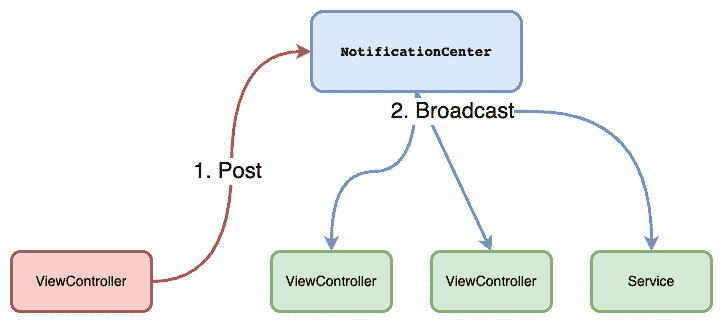

# 在 iOS 中使用 NotificationCenter

> 原文：<https://betterprogramming.pub/working-with-notificationcenter-in-ios-4724c00ce5d9>

## 如何在 iOS 中广播消息而不影响 Bob

照片由[宝拉·海斯](https://unsplash.com/@phayes007?utm_source=medium&utm_medium=referral)在 [Unsplash](https://unsplash.com?utm_source=medium&utm_medium=referral) 上拍摄

在 iOS 世界中，组件之间的通信有多种方式。你可以通过常用的构造函数、segue、委托模式传递参数，或者选择`NotificationCenter.`

所有这些方法都有一个 [1 对 1 的关系](https://en.wikipedia.org/wiki/One-to-one_(data_model))除了`NotificationCenter`，它是[对多](https://en.wikipedia.org/wiki/One-to-many_(data_model))。如果使用得当，`NotificationCenter`是在类和结构之间进行交流的一个非常好的工具。

本文将解释如何:

*   观察操作系统发布的简单通知
*   观察我们创建自定义通知
*   观察包含一些数据的自定义通知
*   如何避免潜在的问题和崩溃

# 基础

在高层次上，它是在广播信息。侦听器/观察者可以接收这些消息，并执行一些操作或处理它们，如果它们携带一些信息的话。

想象一下，当你订阅接收一些报纸时，例子来自[更好的编程](https://medium.com/better-programming)。

你的🐶狗🐾会看报纸的信箱，是观察者的角色。

当*更好的编程*发出报纸，那就是帖子部分。然后你会从邮差那里收到邮箱里的报纸。

但是你的邻居、朋友也可以订阅并接收它。

如果你留下你的地址，假设鲍勃搬进来。如果你不取消订阅，一份新的报纸还是会送到。这是删除观察者的部分，你必须从邮递员将要访问的列表中删除自己。

鲍勃是一个非技术性的人，他想了解一切。鲍勃可能不理解报纸的内容，这会让他发疯的。这是后面将要解释的可能崩溃的部分。

通知中心的基本流程

上图表示两个`ViewControllers`和`Service`(绿色)订阅并观察消息`NotificationCenter`，该消息可以从另一个`ViewController`(红色)发布。

当 Post 发生时，通知中心向观察者广播消息

万一发现 NSNotificationCenter 这个名字，不要搞混了。它实际上是相同的，只是苹果将其重命名，并在从 obj-c 切换到 swift 时做了一些小的修改。呼叫和功能基本相同，略有变化。

正如我们之前提到的，有两种类型的通知，用户创建的**自定义通知**和**操作系统提供的通知**。

# 自定义通知

下面的代码表示观察者部分。如您所见，每个通知都有一个将被调用的名称**和方法**。名字应该是 **uniq** 。能够确定消息是否为您发布的是**标识符**。****

**可以看到 **"@objc"** 作为方法前缀。这意味着在引擎盖下，我们正在使用一些 Objective-c 魔法。这样做的目的只是为了能够通过 NotificationCenter 识别该方法。**

**接下来是我们**如何广播/张贴**通知。它也可以用`userInfo`参数发送数据。它可以包含`[AnyHashable: Any]?`数据。这意味着我们可以通过任何事情。**

# **不要让鲍勃发疯**

**最后但同样重要的是移除观察者。如果你还记得的话，如果鲍勃收到一条他不理解的信息，他会发疯的。**

**如果我们不移除观察者，内存地址仍然会接收一些信息，这可能会导致*奇怪的行为*甚至*崩溃*这是很难调试的。**

**移除所有观察者**

**您可以仅通过名称删除观察者。**

**按名称删除观察者**

**详细代码在此环节 [**代码示例**](https://gist.github.com/skyspirit86/e1a13022c6b77633d915b9b9c337ec5f) 。**

# ****操作系统提供的通知****

**操作系统提供的通知类似于`UIApplication.didBecomeActiveNotification`的`AppDelegates` `applicationDidBecomeActive(_:)`方法或者`SceneDelegate`的`sceneDidBecomeActive(_:)`方法，唯一的例外是现在你可以观察任何类或结构的变化。**

**自定义通知和提供操作系统的区别在于，提供的操作系统是由操作系统发布的，而自定义通知是由我们发布的。**

**有用的通知有: **`UIResponder.keyboardWillShowNotification`
`UIResponder.keyboardWillHideNotification`
`UIApplication.didBecomeActiveNotification`
`NSManagedObjectContextDidSave` `postsFrameChangedNotifications`等。****

****说出它的名字，大概通知是存在的。以下是来自苹果的完整列表。****

 ****[## Apple 开发者文档

### 编辑描述

developer.apple.com](https://developer.apple.com/documentation/foundation/nsnotification/name)**** 

****正如你所看到的，他们中的许多人都有类似`UIResponder`、`UIApplication`等前缀。这意味着它们属于某些**模块**。****

# ****例子****

****如果我们用链接[中的代码运行应用程序，代码示例](https://gist.github.com/skyspirit86/e1a13022c6b77633d915b9b9c337ec5f)。马上下一个日志就会弹出。这是一些`Service`观察应用程序生命周期变化的方式。****

****在这种情况下，我们已经创建了一个`Service`的属性，它调用代码来附加和监听`didBecomeActiveNotification`，当应用程序启动时，通知的附加方法立即被调用。****

********

****点击提供的示例按钮，我们可以看到`NotificationCenter`帖子实际上是**一对多**。所有观察员都会收到通知。您还可以看到，我们还随通知发送了一些数据。接收器可以处理接收数据，但这不是必需的。它可以只监听事件，就像示例中的`AppDelegate`监听**点击。******

********

****一对多关系****

## ****发布数据:****

****如何发布带有通知的数据****

## ****接收并解析数据:****

****如何接收和解析数据****

## ****技巧****

****如果您希望能够很好地对您的自定义通知进行分组，下面的代码就是解决方案。如果您想向 Obj-c 公开通知，它还有一个选项。****

****通知的延期。名字****

****如果你在**遗留代码**中工作，这里是**目标-c** 对应物。****

****Obj-c 示例****

# ****总结****

*   ****当您需要向多个类发送消息时，通知是广播消息的好方法。****
*   ****如果您还需要在一节课中收听多个通知，这是一个很好的方法。****
*   ****当我们需要监听一些操作系统指定的变化时。****
*   ****不要忘记移除观察者。****

****如果你到了这一步，感谢你的阅读。你应该得到一杯咖啡☕️.🙂如果你喜欢的内容，请👏，分享，还有[跟着](https://varga-zolt.medium.com/)，对我来说就是 a 的意思。如果您有一些建议或问题，请随时发表评论。****

******想要连接？你可以在 [LinkedIn](https://www.linkedin.com/in/varga-zolt/) 、 [Twitter](https://twitter.com/skyspirit86) 或[https://skyspiritlabs.com/](https://skyspiritlabs.com/)与我联系。还有更多文章和教程。******