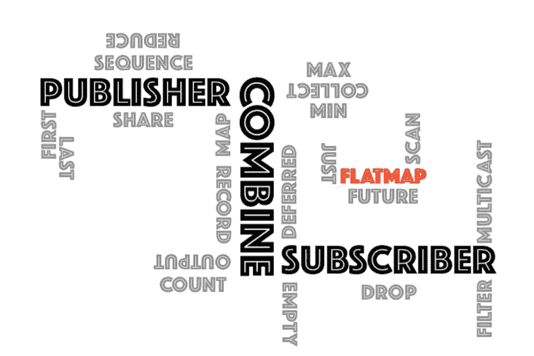

# 在 iOS 中使用平面图合并运算符

> 原文：<https://betterprogramming.pub/working-with-the-flatmap-combine-operator-in-ios-1267b6cf37ca>

## 揭开这个狡猾的运营商构建反应式 iOS 应用的神秘面纱

作者照片。

如果你看了托尼·帕克的[介绍联合收割机 WWDC 2019 演讲](https://developer.apple.com/videos/play/wwdc2019/722/)，你可能会认为使用联合收割机是在公园散步。他将新的 Combine 框架定义为一个统一的、声明性的 API，用于随时间处理值。这个框架只有三个主要部分:发布者、订阅者和运营商。听托尼说，这一切听起来很简单。而且平心而论苹果，大部分都是。

但是有一个操作符不是那么容易让人理解的:操作符`flatMap`。

它与其他应用程序的不同之处在于，大多数应用程序(如果不是全部的话)从发布者那里接收数据，然后将数据传递出去。然而，`flatMap`操作符从一个发布者接收数据，并将一个发布者传递出去。这是我们在苹果的朋友选择在联合收割机上的第二次 [WWDC 2019 演讲](https://developer.apple.com/videos/play/wwdc2019/721/)中出现的运营商。我怀疑他们也认为这可能会令人困惑。

考虑到这一点，我想我应该在 Combine 中提供一些`flatMap`的工作示例。先说超级简单的。

# 将字符数组转换为字符串

我有一个字母数组，我称之为`foo`。我将通过我在 SwiftUI 演示应用程序中称为`flatMapPublisher`的出版商发送它。工作代码如下:

当发布者通过`flatMap`发送数据时，它获取集合中的每个字母并重新发布。在同一个管道中，`sink`操作符收集数据，将其打印出来，并添加到`mojo`文本标签中。最终结果如下——一个简单的字符串，包含了`foo`数组中的字母:

# 展平数组的数组

在我的第二个例子中，我想进一步扩展这个想法。我定义了第二个发布者，它是一个或多个集合。然后，我将它发送给`flatMap`，展平集合，并将其传递给我刚刚定义的第一个出版商。我再次包含了完整的代码，以便您可以看到完整的图片:

和第一个例子一样，`flatMap`重新发布数组中的每个数组，打印出来，然后发送给我们的第一个发布者。当它处理完所有的值后，它将找到的值添加到`mojo2`数组中，最终看起来像这样:`[“A”, “1”, “B”, “A”, “C”, “C”, “D”]`。这个字符串也被传递给我们刚刚提到的更新`mojo`文本标签的第一个发布者。

*注:它没有试图简化或改变数据。它只是在处理它的时候把它变平。*

# 将字符串数组拆分成字符

在我的第三个例子中，我走了另一条路，发送了一个单独的`[character by character]`字符串。这次，`flatMap`把它打散，然后重新组合。当然，你最终会得到几乎相同的结果:

*注意:在发送到* `*flatMap*` *之前，我需要做一个额外的转换。我需要这样做，因为没有* `*Character*` *类型的发布者。于是我用* `*.map*` *运算符把它投成了一个* `*String*` *。运行这个字符串，我得到一个由值组成的*`*mojo3*`*(*`*[“A”, “B”, “C”, “D”, “E”, “F”]*`*)***，当然，还有一个看起来相同的* `*mojo*` *字符串* *作为我发送的字符串。**

**

*我希望我成功地揭开了`flatMap`的神秘面纱，足以让你能够开始创作自己的作品。感谢阅读。*

*保持冷静，继续编码。*