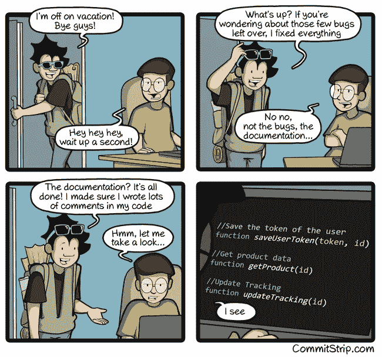

# 编写代码时，就像今天是你在公司的最后一天一样

> 原文：<https://betterprogramming.pub/write-code-as-if-today-were-your-last-working-day-in-a-company-499806099e5a>

## 如果今天是你在当前公司的最后一个工作日，你会写什么样的代码？

[Md Mahdi](https://unsplash.com/@mahdi17?utm_source=medium&utm_medium=referral) 在 [Unsplash](https://unsplash.com?utm_source=medium&utm_medium=referral) 上的照片

在软件开发生命周期中，一组工程师在一个复杂系统的不同部分工作。没有人知道架构和实现的每一个细节。

当有人决定离开项目或公司时，另一个人或团队的其他成员必须接手。一个月的通知期是知识转移的时间。然而，如果工程师已经在公司工作了几年，那么几乎不可能将这些年的知识压缩到几次知识传授中。

作为一个负责任的软件工程师，你想在离开后给队友留下好印象。你要确保他们可以无缝地接管你一直在做的事情。为了实现这一点，你应该把每一天都当作是你的最后一个工作日。

实际上，你不应该在最后一个工作日工作。你要归还你的 IT 设备，和你亲密的同事一一告别。这个故事中“最后一个工作日”的概念是基于这样一个假设:你需要在最后一个工作日写代码！

当我写这篇文章的时候，我正在一个月的通知期内工作，然后会换一份新的工作。我想分享你在日常编码中应该遵循的 7 个技巧，这样你的代码就可以随时提交了。这不仅对你的实际交接有用，而且在你不得不紧急请假时也有用。

> 如果今天是我生命中的最后一天，我会做今天要做的事情吗？
> 
> —史蒂夫·乔布斯

# 1.编写自我记录的代码

**自文档化**代码遵循命名约定和结构化编程约定，这些约定使得在没有预先特定知识的情况下能够使用系统( [Wiki](https://en.wikipedia.org/wiki/Self-documenting_code) )。

通俗地说，就是写出不会让其他开发者看了尖叫“WTF”的代码。主要目的是使代码易于阅读和理解，而不必求助于其他辅助文档来源，如代码注释。

当没有人关注代码变更时，辅助文档很快就会过时或无效。然而，这并不意味着自文档化代码可以完全取代二级文档。如果代码不能明确解释您的意图，辅助文档应该是第二种选择。

> 任何傻瓜都能写出计算机能理解的代码。优秀的程序员编写人类能够理解的代码。
> 
> —马丁·福勒

有许多编写自文档化代码的技巧，但是我想根据我的经验，把重点放在三个最重要的技巧上:

## 1.1.命名

命名无疑是编程中最难的事情。你应该给你的变量、函数、函数、类、接口、文件、文件夹等取一个有意义的名字。

一个有意义的名字不应该太短或太长。该名称应简明地描述该项目是什么，并可能暗示它的用途。例如:

> 您应该像命名第一个孩子一样小心地命名一个变量。
> 
> ―罗伯特·马丁

## 1.2.文件夹结构

**文件夹结构**是根据文件类型和/或功能对文件进行的逻辑分组。一些文件夹结构基于:

*   框架:例如 Android、NextJS
*   库:如 Redux、Sequelize
*   设计模式:例如 MVC，MVVC，MVP

通过将文件放在正确的文件夹中，您可以给读者一个清晰的上下文，让他们知道这些函数或类应该做什么。

【https://redux.js.org/faq/code-structure 

## 1.3.一致性

一致性是可读性的关键。人们期望相似的特性以相同的方式编写，即使它们可能由不同的开发人员实现。

当您访问在整个项目中一致编写的不熟悉的代码时，您可以很容易地消化它，而不必猜测它实际上做了什么。

一致性适用于命名、文件夹结构、错误处理、日志记录、代码风格等。如果一个现有的风格已经在项目中的任何地方实现，你不应该根据你的个人偏好以你自己的方式写代码——那会以一种不好的方式打击其他人的思想！

> …以清晰、一致的风格编写代码变得非常有用。可理解的代码将心智带宽从必须解决不一致中解放出来，使得维护和增强各种规模的项目变得更加容易。
> 
> ― **丹尼尔·罗伊·格林菲尔德，奥黛丽·罗伊·格林菲尔德**

# 2.编写更多的集成测试

**编写单元测试**是为了涵盖函数或类的输入和分支语句的不同情况。单元测试确保被测试的单元能够正常工作，但是不能确保单元能够与其他单元一起正常工作。

当你为一个函数编写单元测试时，你希望当你的队友改变它的实现时，一些测试失败。然而，如果一个函数运行良好，它几乎不会被重新访问。如果它没坏，就不要修理它！

即使它必须被更新或返工，有人也会仔细检查你的代码并更新它的单元测试。

你真正想做的是确保当你的队友改变他们的部分时，他们应该知道你的部分要改变什么。你的队友没有意识到可能影响你的职能行为的外部因素。这些因素可能包括:

*   当没有使用正确的参数类型(JavaScript)调用函数时。
*   当您的函数必须在另一个函数之前或之后被调用时。
*   当你的函数不纯的时候——它依赖于上界的一些变量或者一些全局状态。

这就是*集成测试*来救援的地方。集成测试更难编写，因为它们更难设置。这就是为什么大多数项目只有单元测试。然而，集成测试不能被单元测试完全取代——它们服务于不同的目的。

虽然单元测试覆盖了代码的小单元，但是集成测试确保这些单元能够很好地协同工作。当函数或类被修改，不再返回预期的输出时，一些集成测试可能会中断，但是其他函数和类的单元测试可能仍然会通过。

一些好的集成测试比一堆单元代码更有价值。在集成测试上多花点时间——你的队友以后会感谢你的。

# 3.编写文档

**文档**是软件开发生命周期的关键部分之一。在你写它的时候，它似乎不会带来任何直接的价值，但是一天的人会不顾一切地寻找它。

文档不是一次性的工作。这也不是工程师们作为日常工作的一部分本能地接受的任务。它必须经常和自愿地更新。即使一些组织将“实现前的文档化”作为他们的工程标准之一，也要由工程师自己来记录他们认为重要的东西。

如果你没有足够的时间来记录所有的事情，至少记录下你做过的那些奇怪的事情。这些奇怪的东西包括:

*   一些不能简单地用自文档代码解释的东西。
*   需要图表才能更好解释的东西。
*   您希望与组织中的其他人分享的内容。
*   当你不在的时候人们可能会问的问题。

[https://www . commits trip . com/en/2016/07/27/documentation-just-before-vacation/](https://www.commitstrip.com/en/2016/07/27/documentation-just-before-vacation/)？

# 4.不要留下技术债务

**技术债务**是软件开发中的一个概念，它反映了由于现在选择一个简单(有限)的解决方案而不是使用一个需要更长时间的更好的方法所导致的额外返工的隐含成本( [Wiki](https://en.wikipedia.org/wiki/Technical_debt) )。

换句话说，欠下科技债就是把未来的问题留给未来的你。如果你在未来不在那里，这意味着你要离开，让你团队去清理。

当你在一家快节奏的公司工作或在一个时间紧迫的项目中工作时，你会选择一种更简单的方式来完成你的工作单，这样你就有更多的时间去接其他人。那些更简单的方法会产生代码味道，比如重复、长方法、God 类等等。

技术债务是其他人必须做的清理代码气味的杂务。然而，科技债务很难得到解决。它们要么永远留在待办事项中，要么慢慢被遗忘，因为创建它们的人已经离开了公司。

处理技术债务的最好方法是*从一开始就不要创造它。*

在处理票据时，尽最大努力在不违反任何设计原则的情况下完成，即使这意味着需要更长时间。你已经有了完整的背景，你的思想已经进入了处理它的区域——你花在正确处理它上的时间比你花在以后重新处理它上的时间要少。

当你把它交给你未来的自己和你的团队时，他们几乎没有背景知识，额外的时间花在再次分析问题上。如果技术债务导致程序错误或性能下降，成本会更高。

> 时间永远不够做好，但总有足够的时间重做。
> 
> —杰克·伯格曼

# 5.不做任何事情

类似于技术债，//TODO 是代码中的注释行或注释块，您希望您未来的自己或您的队友来完成。

从我加入一个项目到我离开这个项目，我看到很多 TODOs 在代码中保持不变。没有人费心去完成 TODO，因为代码运行良好。有些 to do 只有几句评论，所以除了写它的人之外，任何人都很难确切知道该做什么。没有人有勇气删除 TODOs，即使它们似乎不再相关。

TODO 不应提交到存储库。它只应该在你概述你的步骤时作为一个占位符。如果你真的需要创建一个待办事项，创建一个包含所有必要细节的 JIRA 票证。

> 不管 TODO 可能是什么，它都不是在系统中留下坏代码的借口。
> ― **罗伯特·马丁**

# 6.不留下未使用的代码

写代码很容易——读代码很难。删除代码更难。如果不是你写的就更难了。

尽管您知道这段代码在任何地方都没有被使用或引用，但您不想承担删除它的责任，因为有人可能出于某种原因将它留在那里。 也许现在不需要，但以后可能需要。

一些未使用的代码无法通过语法突出显示来检测。图像和 pdf 等静态内容也是如此。如果您任务是更新内容，则删除旧的内容，添加新的内容，并释放包的大小。否则，没有人会注意到这些未使用的内容。

> **你写的代码让你成为程序员。**你删除的代码让你成为一个好代码**。你不必写的代码使你成为一个伟大的人。** ――马里奥·富斯科

# 7.拥抱 YAGNI

YAGNI 的意思是“*你不会需要它*”(或者“*你不会需要它*”)。编写目前足够好的代码。如果你听到自己说“为了未来”，你可能违反了 YAGNI 教。让未来的你或未来的队友处理任何可预见或不可预见的需求。

我们大多数人都试图通过猜测未来来智取自己。我们倾向于过度设计来处理未来的可能性，这样当未来到来时，我们就不必重构代码。

可能有以下几种可能的结果:

*   你的推测是正确的——新功能不需要额外的工作。
*   你的推测有点离谱——你仍然需要修改现有的解决方案。
*   您的推测差得很远—您需要创建一个全新的实现。
*   您期望的附加功能被取消了优先级。
*   该项目被无限期搁置。
*   你已经不在公司了。你的队友不知道你已经为新特性准备了一些东西，所以他们写了自己的解决方案。

你过度设计的努力只有一种可能会有结果。其他的可能性使你的时间和努力变得无用。

让我们看一个例子。想象你正在构建一个移动应用。您的任务是显示一些静态文档，如隐私政策、使用条款、常见问题等。这些文档采用 PDF 格式，由营销团队创建和更新。你会如何在你的应用程序上显示 pdf 文件？

至少有三种方法可以实现它:

*   将 pdf 放入应用程序源代码。本地加载 pdf。没有外部依赖性，但对内容的任何更改都需要提交 app store。
*   将 pdf 文件放在用于推广应用的网站的`public`文件夹中。通过网络 URL 在网络视图上显示 PDF。它提供了网站和移动应用程序之间内容的一致性。
*   从后端提供 pdf。为移动应用程序创建一个 API 来获取它们。创建另一个 API 来上传 pdf 以替换现有的 API。未来的任何变化都不需要重新部署后端或前端。

如果已经有这样一个网站，第二种选择将是理想的。否则，第一个选择目前来说是好的。第三个选项似乎有些多余，因为无法确定 pdf 需要多久更新一次。它需要额外的成本，这并不真正证明它的好处。

> 这是一个声明，我们认为我们的软件将来需要的一些功能现在不应该构建，因为“你不会需要它”。
> 
> —马丁·福勒

# 你能拿走什么

让我们回顾一下编写可移交代码的七个技巧:

*   编写自我记录的代码
*   编写更多的集成测试
*   编写文档
*   不要留下技术债务
*   不做任何事情
*   不留下未使用的代码
*   拥抱 YAGNI

每当你写一段代码时，休息一会儿或者第二天用一个新鲜的大脑重温它。多读几遍你的代码。如果你很难理解它，你可以肯定，没有你的指导，没有人能够理解它。

帮你的队友一个忙💩后面。干杯！