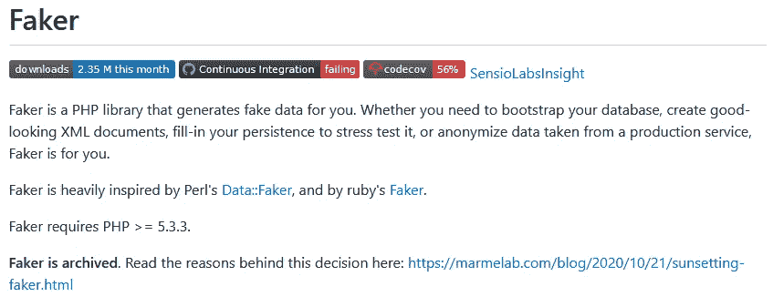
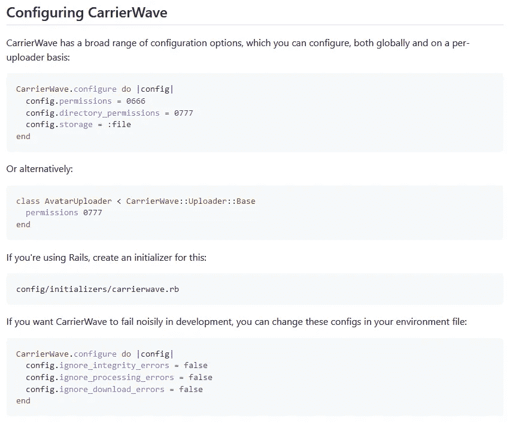
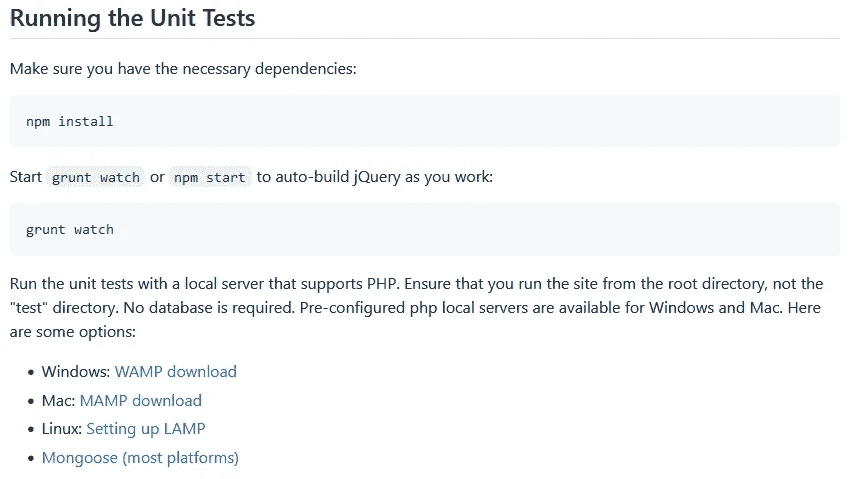
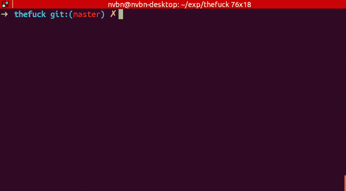
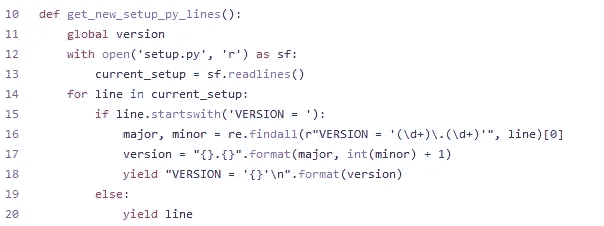

# 写一个非常好的自述文件

> 原文：<https://betterprogramming.pub/writing-a-damn-good-readme-file-145692138fa>

## 用例子概述步骤


佩雷亚努·塞巴斯蒂安在 [Unsplash](https://unsplash.com?utm_source=medium&utm_medium=referral) 上的照片

如果你读过自述文件，请举手。

现在，如果你曾经*写过*自述文件，请举起你的手。

我要在黑暗中试一试，假设你的手还举着；至少，它在精神上得到了提升，因为你可能会拒绝像一个疯子一样挥舞你的手臂，仅仅因为我让你这么做。

在代码注释之后，自述文件是当今软件开发中最常见的文档形式之一。虽然不是每个源代码库都有一个自述文件，但是每个*成功的*都有。这是因为 README 文件，顾名思义，通常是开发人员在使用新库时首先要阅读的内容。回到我们的文献比喻，如果代码注释是注释，那么自述文件就是总结；如果你不能简明扼要地解释你的代码库是谁、是什么、在哪里、何时以及为什么，那么读者很可能会选择一个可以的竞争对手。

# 自述文件的剖析

虽然 README 文件是传递软件库基本信息的事实上的标准，但是它的实际格式在不同的项目之间会有很大的不同；软件包的要求和功能会极大地影响自述文件的内容。[例如，GNU 编码标准](https://www.gnu.org/prep/standards/standards.html#index-README-file)明确要求一个 README 文件，其中包含一些关于软件包做什么和如何工作的基本信息，然而其他标准——如 Mozilla 编码标准——没有这样的要求。也就是说，许多高质量的自述文件彼此共享许多相同的部分和组件:

# 描述

也许几乎每个自述文件都应该包含的最明显的部分是项目描述。为什么创建这个项目，它到底是做什么的？虽然有些项目会用几个段落来回答这些问题，但是把生活故事留给营销团队，让事情变得简单。



*举例:Faker(*[*https://github.com/fzaninotto/Faker*](https://github.com/fzaninotto/Faker)*)*

# 要求

如果项目描述是自述文件中最明显的组成部分，那么需求是最重要的。作为一名开发人员，没有什么比试图安装一个新的软件包或工具，却在一个小时后发现自己在 MacBook Pro 上运行的 MS-DOS 版本是错误的更令人沮丧的了。


*例:作曲家(*[*【https://github.com/composer/composer】*](https://github.com/composer/composer)*)*

# 装置

无论一个项目是一个库、框架、产品，甚至是一种编程语言，概述开始使用它所需的步骤总是至关重要的。在某些情况下，这一部分就像一行安装命令一样简单，而其他部分则要复杂得多。不管有多复杂，如果你的软件包的消费者和潜在贡献者不知道如何安装它，那么他们就不会浪费太多时间去尝试使用它。


*举例:微软 TypeScript(*[*)https://github.com/Microsoft/TypeScript*](https://github.com/Microsoft/TypeScript)*)*

# 例子

示例通常与安装步骤一起作为“入门”部分，为用户开始使用项目提供了最快的途径。作为开发人员，我们倾向于边做边学，所以提供最基本的“Hello World”是展示软件包功能和可用性的好方法。虽然只举一个或几十个例子很有诱惑力，但平衡是关键。识别和展示一个库、语言或框架最常见的用例，对吸引用户大有帮助。


*举例:API 蓝图(*[*https://github.com/apiaryio/api-blueprint*](https://github.com/apiaryio/api-blueprint)*)*

# 配置

除了最初的“入门”步骤之外，许多项目需要一些基本的配置——或者它们提供比初始设置更高级的配置方法。虽然没有必要在自述文件中详细描述配置选项，但是确定如何以及在哪里配置项目可以帮助读者对软件包满足他们个人需求的能力更有信心。



*举例:carrier wave(*[*https://github.com/carrierwaveuploader/carrierwave*](https://github.com/carrierwaveuploader/carrierwave)*)*

# 贡献的

开源项目通常是一个团队的努力，但是它的独特之处在于团队是由一群完全不同的人组成的，他们可能从来没有见过面。这种类型的社区提出了一个挑战，因为没有经理或员工，每个人的时间都是自愿的。为了帮助解决潜在的混乱，许多项目在自述文件中包含了如何为项目做出积极贡献的指南。从风格指南到行为准则，概述交往规则是确保每个人一开始就达成共识的好方法。


*举例:自举(*[*【https://github.com/twbs/bootstrap】*](https://github.com/twbs/bootstrap)*)*

# 测试

与贡献指南一样，测试步骤通常包含在流行的开源项目的自述文件中，以确保贡献者确切地知道如何针对测试套件测试任何潜在的代码更改。虽然单元测试是一个被广泛采用的过程，但是没有两个项目以完全相同的方式设置他们的测试套件，这意味着一些指导可能是必要的，以便让新的参与者有一个正确的开始。



*举例:jQuery(*[*https://github.com/jquery/jquery*](https://github.com/jquery/jquery)*)*

# 批准

每个项目都是在某种许可下发布的。虽然 MIT 是较新项目中最常见的一种，但有几十种潜在的许可证可供使用，所以清楚地确定为你的项目选择哪一种是很重要的。用户能从中赚钱吗？他们能转卖吗？你对出现的任何问题负责吗？许可证确切地定义了允许用户对你的软件做什么，所以这不是一个轻率的决定。


*举例:Ruby on Rails(*[【https://github.com/rails/rails】T21](https://github.com/rails/rails)*)*

# 进一步阅读

虽然自述文件很重要，但通常并不意味着它就是文档的全部。许多项目需要详细的文档，这远远超出了自述文件的适用范围。例如，编程语言和框架通常使用它们的自述文件来提供项目本身的一些基本概要，然后链接到一个更强大的文档站点来传达用法、示例和语法。此外，许多项目突出了对项目做出重大贡献的开发人员，甚至是关于在哪里可以找到他们的社区的信息。

对于什么可以和什么不可以放入自述文件，没有硬性规定，但是一个好的经验法则是考虑您打算在哪里以及如何与您的用户交流。对于像编程语言、开发工具和库这样的高度技术性的开源项目，自述文件是表达谢意、提供支持和引导用户走向更合适的目的地以满足其需求的最佳场所。


【https://github.com/laravel/laravel】例子:拉勒维尔( [*拉勒维尔*](https://github.com/laravel/laravel) *)*

# GitHub 效应

感谢像 GitHub 这样的源代码托管服务，README 现在比历史上任何时候都更容易看到。曾经只是在大多数项目发布中发现的另一个顶级文本文件，现在是存在的每个软件项目的公开面孔。虽然这使得发现新的软件项目比以往任何时候都容易，但它也使得自述文件的*看起来和内容一样重要。仅仅写下一些有用的信息已经不够了。*

自述文件的设计和可读性现在对项目的可接受性的影响不亚于示例的详细程度。为了更好地理解我所说的自述文件是项目的公众形象是什么意思，让我们来看看 GitHub 如何利用自述文件为他们主持的每个项目提供一个干净的主页。

# 降价加价

自`README.txt`以来，我们已经走过了漫长的道路。

虽然 README 文件的目的在过去四十年中没有太大变化，但它的标准格式在过去十年中经历了巨大的转变，这在很大程度上要归功于 GitHub 根据文件扩展名来呈现 README 文件的决定。最初于 2008 年推出，支持`.markdown`、`.textile`和`.rdoc`，GitHub 的 README 渲染从那时起已经走过了漫长的道路，增加了另外六种标记和无数的后期处理功能，如表情符号支持、缓存等等。虽然 GitHub 的标记渲染器支持许多不同的语言，但最流行的一种——也是我个人最喜欢的——是 Markdown。

引用[官方 Markdown 文档](https://daringfireball.net/projects/markdown/)的话，“Markdown 是为网络作者提供的文本到 HTML 的转换工具。Markdown 允许您使用易读、易写的纯文本格式进行编写，然后将其转换为结构有效的 XHTML(或 HTML)。”为了提供一个例子，让我们来看看 Markdown 如何获取一个完全由纯文本文档组成的片段，并赋予它一些风格:

```
POSSOMSAUCEThis library randomly disables network access to various nodes within a Kubernetes cluster in order to stress test load balancing and failover functionality.INSTALLATIONTo install Possomsauce, run the following command from your terminal:emerge -atv possomsauce
```

*示例:纯文本自述文件*

纯文本自述文件很无聊。

虽然上面的代码片段足以提供基本信息，但是自述文件越大，解析起来就越困难。这既是一个可用性问题，也是一个营销问题。为了解决这些问题，让我们看一下同样的代码片段，但是添加了一些降低的内容。

```
# POSSOMSAUCEThis library randomly disables network access to various nodes within a
[Kubernetes](https://kubernetes.io/) cluster in order to stress test load
balancing and failover functionality.## INSTALLATIONTo install Possomsauce, run the following command from your terminal:emerge -atv possomsauce
```

*示例:Markdown 自述文件*

乍一看，除了一些额外的标签之外，这两个片段没有太大的区别。但是当通过 GitHub 这样的 Markdown processer 运行时，上面的代码片段会变成这样:

## POSSOMSAUCE

这个库随机禁止对 Kubernetes 集群中各种节点的网络访问，以便对负载平衡和故障转移功能进行压力测试。

## 装置

要安装 Possomsauce，请从终端运行以下命令:

```
*emerge -atv possomsauce*
```

*示例:渲染后的降价自述文件*

更好，对吗？

Markdown 的美妙之处在于，它是一种相对简单的标记语言，而且学习曲线非常低，这意味着您只需花费很少的时间和精力就可以为纯文本文件添加一些令人印象深刻的样式。

见鬼，我们说话这会儿我正在 Markdown 写这个。

# 可用性很重要

使用 Markdown 这样的标记语言格式化自述文件是有益的，但这只是问题的一半。另一半是考虑可用性。虽然我们在处理代码时并不经常想到用户界面/UX，但是无论你在构建什么，考虑你的最终用户总是很重要的。以 GitHub 上的 README 文件为例，考虑如何以一种清晰、易于理解的方式传达信息，可以大大提高读者的满意度。

## 徽章

如果你曾经在 GitHub 库中阅读过自述文件，你无疑会看到你的徽章。徽章是图形标签，通常包含在 GitHub 自述文件中，作为传达项目基本信息的一种方式。这些小标签通常以键值对的形式出现，呈现为主要的双色图像。


虽然从技术上讲，徽章可以包含任意数量的有用统计数据，但是它们最常见的用途是提供关于项目的健康状况和受欢迎程度的信息。代码覆盖率、构建状态、许可证、当前版本、下载数量……徽章可以用来在非常小的空间内传达大量信息，并且通常表明项目背后更高的专业水平和支持。

## 截图和动画

并非每个软件项目本质上都是基于文本的。除了标准的基于文本的文档之外，还有无数的图形库可以通过截图和动画更好地展示。虽然最好不要在自述文件中添加不必要的屏幕截图，但是在项目自述文件的顶部包含相关的屏幕截图或动画有助于快速轻松地展示其威力。



*举例:操(*[*【https://github.com/nvbn/thefuck】*](https://github.com/nvbn/thefuck)*)*

请记住，仅仅因为一个项目本质上不是图形化的，并不意味着它的文档不能从截图和动画中受益。与复制和粘贴应用程序的输出相比，使用真实的屏幕截图可以更有效地演示许多命令行实用程序。

## 代码突出显示

自从蓝屏白字时代以来，软件开发工具已经有了很大的改进。在过去的 40 年中，对代码编辑器的许多改进之一是代码突出显示，这是一种对源代码中的字符进行颜色编码的过程，以帮助开发人员更有效地扫描和识别代码。代码高亮是如此普遍，以至于你很难找到一个不使用它的开发者，那么为什么我们的自述文件会有所不同呢？

虽然大多数标记语言都提供了某种形式的代码突出显示，但是在 Markdown 中突出显示代码片段是非常简单的。通过用编程语言的名称来标记代码块，可以将它们从下面的代码块中去掉:

```
def get_new_setup_py_lines():
    global version
    with open('setup.py', 'r') as sf:
        current_setup = sf.readlines()
    for line in current_setup:
        if line.startswith('VERSION = '):
            major, minor = re.findall(r"VERSION = '(\d+)\.(\d+)'", line)[0]
            version = "{}.{}".format(major, int(minor) + 1)
            yield "VERSION = '{}'\n".format(version)
        else:
            yield line
```

变成这样:



显然，代码高亮显示不会改善自述文件的内容，但是它会让用户更容易解析其中包含的代码片段。这有助于减少压力，并以读者可以立即理解的方式将代码放在上下文中。

## 表情符号

GitHub 标记渲染器的真正魅力不在于它支持的语言数量；它执行的是后处理。虽然 GitHub 的 render 处理标记文件的大多数操作都是为了减少加载时间🕒并增加安全性🔒越来越多地使用的一个特别的功能是表情符号解析器，让我们面对现实吧…表情符号已经存在了。他们太受欢迎了，以至于一些疯子拍了一部电影《T2》🎥关于他们。然而，表情符号的问题在于，在智能手机之外📱除非你使用的应用程序本身支持表情符号快捷方式，否则输入起来会非常麻烦。

有了 GitHub 风格的标记，在自述文件中添加表情符号就像在推文中添加表情符号一样简单——或者像现在孩子们使用的任何东西一样简单🚀。每当 GitHub 的标记渲染器遇到类似于`:emojiname:`的东西时，它会尝试查找指示的表情符号，如果找到，就会渲染它，而不是⚡.标签这允许你以纯文本的形式在自述文件中添加相关的(最好是合适的)表情符号，而不必在表情百科上浪费时间📖。

## 简单点，笨蛋

在*大量的*信息和*太多的*信息之间只有一线之隔。虽然没有规则规定自述文件中有多少信息是过多的，但是记住上面的文学比喻中的“自述=摘要”是很重要的。项目的大小和复杂程度将强烈决定自述文件的长度，就像一本书的大小和复杂程度将决定摘要的详细程度一样，但是如果你不小心，你可能会在不知不觉中从写摘要变成写笔记。

关于 README-gone-astray 的一个很好的例子是[HTTP pie](https://github.com/jakubroztocil/httpie)的 README 文件，这是一个用于发出 HTTP 请求的流行命令行工具。HTTPie 的自述文件只有 6000 多字，比整篇文章还长几千字。稍微挖掘一下，就能看出 HTTPie 的 README 文件只是他们官方文档的一页版本，增加了一些标准徽章。虽然为这种规模的项目创建单独的文档是一个很好的主意，但是将它复制到自述文件中会使用户更难找到他们需要的信息，并减少了实际属于自述文件的信息的影响。

# 结论

写一个自述文件，因为你完全可以期待你的用户真的**阅读它**。概述如何开始一个新项目对于新用户来说是一个重要的入门步骤，对于老用户来说也是一个很好的复习课程。自述文件是交流(至少)使用新的库或框架所需的基本信息的最佳场所，虽然不是每个项目都保证有专门的文档，但它们都应该有一个有思想的、可用的自述文件。

```
This post was originally published at [flower.codes](https://flower.codes/2020/02/05/write-a-readme.html)
```