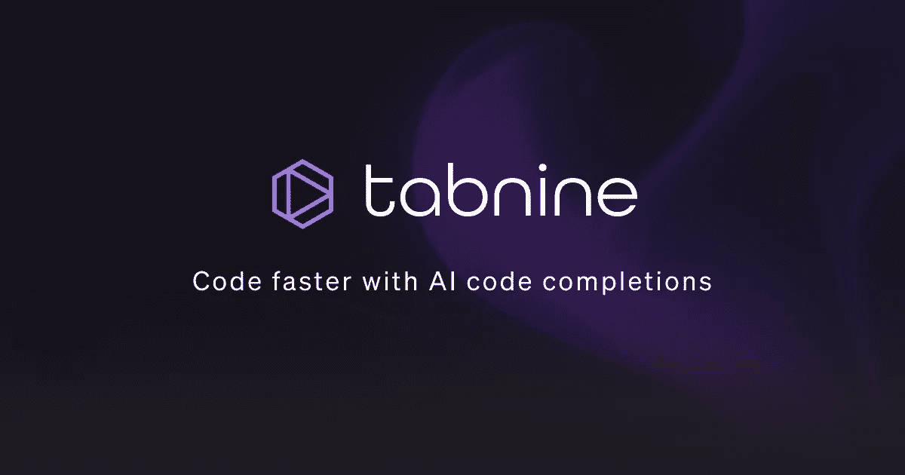

# 人工智能辅助编码

> 原文：<https://betterprogramming.pub/writing-ai-assisted-code-with-tabnine-11cae322c080>

## 更快地编写代码，提高工作效率

Tabnine 标志

人工智能辅助编码旨在帮助开发人员提高效率，更快地编写代码，减少错误，并减少在其他窗口和 IDE 之间的上下文切换。但 AI 辅助编码是银弹、蛇油，还是介于两者之间的东西？

在这篇文章中，我们将看看使用人工智能辅助编码的好处以及潜在的缺点。我们还将展示一个简短的演示，使用人工智能辅助编码解决方案 [Tabnine](https://www.tabnine.com/) 来帮助我们用 JavaScript 编写一些代码并做出反应。

# 什么是 AI 辅助编码，它是如何工作的？

人工智能辅助编码是由机器学习模型推动的，该模型是在其他代码上训练的。这些模型中最好的模型是在来自世界各地令人尊敬的开源项目的数十亿行代码上训练出来的。通过这种训练，模型“学习”什么字符和代码行经常一个接一个地出现。然后，当您编写代码时，它会直接在您的 IDE 中为您提供自动建议制表符结束。

举一个极其简单的例子，如果您在 IDE 中键入`import React`，自动完成会提供类似于`from ‘react’;`的内容来完成您的语句。

但人工智能辅助编码远不止于此；它也从你写的代码*中学习。该模型不断检查您如何编写代码，以及您通常遵循什么模式。你也可以在你的团队的代码仓库上训练一个更复杂的模型，这样它可以更好地理解你的公司是如何编写代码的，这有助于你作为一个团队更加一致。*

# 有什么好处？

那么，你为什么会选择使用人工智能编码助手呢？也许你更愿意依靠自己的大脑和一个不那么花哨的自动建议功能。

首先，人工智能辅助编码让你呆在 IDE 中，减少了切换到其他窗口的上下文。如果 autocomplete 可以为您提供正确的语法，您就不必再快速搜索 Google 来记住如何使用您有点生疏的 API。更少的上下文切换导致更高的生产率。

这些机器学习模型还可以促使你编写更好的代码，因为它们所训练的代码通常遵循最佳实践和众所周知的设计模式。这些提示可以成为一个教学机会，帮助你成为一个更好的开发人员。

# 潜在的不利因素是什么？

现在，为什么你*不想*使用人工智能辅助编码？

最大的顾虑是隐私。如果机器学习模型不仅在公共代码上进行训练，而且在你编写的代码上进行训练，那么这意味着你的代码可能会与使用相同机器学习模型的其他人共享。因此，在使用人工智能辅助编码解决方案之前，你应该始终查看产品的隐私声明，以了解该产品是否或如何收集或共享数据。

第二个关注点是模型训练得如何。如前所述，大多数模型都是在数十亿行代码上训练出来的。但是，如果这些代码回购是不好的呢？你知道那句老话:“垃圾进来，垃圾出去。”如果模型是在糟糕的代码上训练出来的，那么你得到的建议也会同样糟糕。

# 演示时间

那么，AI 辅助编码在实践中有多大帮助呢？为了找到答案，我用 Tabnine 进行了一次测试，这是一个流行的解决方案，支持 30 多种编程语言和 21 种 ide。例如， [VS 代码扩展](https://www.tabnine.com/install/vscode)有近三百万次下载。

安装扩展非常简单，只需单击 Install 按钮，等待几分钟模型初始化，然后在您的机器上重新启动 VS 代码。Tabnine 有一个[隐私声明](https://www.tabnine.com/code-privacy)出现在他们网站的显著位置，声明模型只在你的机器上本地运行，你的数据不会被共享。这种设置最酷的一点是，尽管您的数据不会与其他任何人共享，但模型仍然会根据您的代码进行训练(本地)，因此随着您使用它，建议会变得更好。

一旦我安装了 Tabnine 并准备就绪，我就开始编写代码。对于这个演示，我决定用 JavaScript 和 React 编写一个非常简单的登录表单。该表单包括用户名和密码输入以及一个提交按钮。这个 UI 非常简单，几乎每个前端工程师都会在某个时候构建它。

# 创建登录表单的结构

下面是我为登录表单编写 JSX 的一小段屏幕记录:

为登录表单编写 JSX 的屏幕记录

你会注意到有些建议是有帮助的，有些则没有。import 语句运行得非常完美，组件名`LoginForm`匹配文件名的建议很有帮助。

在为函数组件和 return 语句设置样板代码时，我没有收到太多有用的建议。

然后我创建了两个输入元素，这就是神奇开始发生的地方。在输入`<label`之后，那一行的其余部分被建议给我。知道我有一个用户名的 label 元素，然后我创建了一个 input 元素，AI assistant 给了我大部分文本输入的代码。后来，我自己添加了`id`属性。

同样的事情也发生在密码输入上，这是有意义的，因为用户名输入之后通常是密码输入。但是这次为了输入，人工智能助手为我添加了一个`id`属性。是学习！

最后，我添加了`htmlFor`属性，将标签链接到每组元素的输入。像往常一样，对于用户名的第一次使用，自动完成功能对我来说很困难，但是当我添加它作为密码时，建议就在那里。神奇！

# 使表单具有交互性

现在我已经有了 JSX，我需要编写剩下的 JavaScript 来为表单的 submit 事件和两个输入的 change 事件添加事件处理程序。让我们来看看这是怎么回事:

使登录表单交互的屏幕记录

你会在这个视频中注意到一个相似的模式。最初，这些建议并没有多大帮助。然而，随着我写了更多的代码，这些建议随着模型对我正在做的事情的理解而得到了改进。

当创建`handleSubmit`函数时，我需要自己提供事件对象`e`。但是在我输入`e.pre`之后，模型知道我想调用`e.preventDefault();`。然后，当我需要将这个事件处理程序添加到表单的`onSubmit`方法中时，模型知道我想做什么。

当创建两个变更处理函数时，我不得不自己使用`useState`钩子创建用户名的大部分设置。但当我再次按照相同的模式输入密码时，人工智能助手就在我身边，并准备好了我需要的代码。

这个趋势似乎是一致的:自己做一次事情，模型在默默观察学习。第二次做同样的事情，模型准备好帮助你了！

# 结论

人工智能辅助编码是一次有趣的经历。到目前为止，我只花了几个小时玩 Tabnine，其价值似乎是有形的。一旦你习惯了使用自动建议，我可以想象你的工作效率会直线上升。思科工程团队的[经验当然可以证明这一点。](https://blogs.cisco.com/developer/tabninepairprogramming01)

真正的力量似乎在于将一遍又一遍编写相同代码模式的单调工作自动化。为什么不让人工智能助手来帮忙呢？

人工智能辅助编码解决方案正变得越来越主流，我认为它们会一直存在下去。隐私问题是实实在在的，所以明智地选择一个具有你能接受的遥测水平的解决方案。不管你的立场如何，我认为任何认真对待生产力的开发人员至少应该尝试一下人工智能辅助编码解决方案。