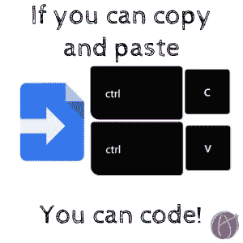

# 快速迭代的高质量 ML 代码

> 原文：<https://betterprogramming.pub/writing-beautiful-reproducible-reversible-tested-ml-code-should-save-time-not-cost-82f7c9cf03e7>

## 可重复、可逆、经过测试的代码，不会浪费时间



我没开玩笑。但是专业人员和初级开发人员之间的区别是使用 vim 的 y、x 和 p，而不是 ctrl-C。图片来自:[https://pin.it/7liORTR](https://pin.it/7liORTR)。

我经常看到新的程序员说他们不确定是应该快速编写代码还是编写好的代码。这是一种矛盾修饰法。好代码的全部意义在于节省你的时间。

感觉写好代码要花很长时间，因为你还不确定什么是好代码。因此，它需要一些教皇化和实验。但这从长远来看是有回报的！如果你致力于培养正确的习惯，你最终会达到这样一种境界，你可以不用思考就能写出相当好的代码。

学习写好代码的最好方法是用几千行代码编写自己的项目。直到你有了一个有几千行的项目，你才开始理解你的决策的长期后果。但是也许这些建议可以加速你的进步。

测试驱动的开发不需要这么多的规则。有一种自然的编码方式会导致:

1.  许多小型自动化测试
2.  许多小的纯粹的(如实用函数编程书[中所描述的)可重用函数。](https://livebook.manning.com/book/grokking-simplicity/chapter-1/18)

因为我花了很多时间写实验代码，所以我很少写单元测试，只是因为我觉得我应该这样做。我这样做是因为:

1.  错误的实验代码的成本实际上是非常高的。一些编码人员可能会认为，如果他们的实验代码不能投入生产，他们就可以对其掉以轻心。那些没有吓到我的可爱的 bug 是那些给我一个异常并使我的整个程序崩溃的 bug。然后我就知道问题是什么，并能解决它。让我夜不能寐的是那些导致不产生任何错误信息的错误。
    任何实验最糟糕的结果都是一个错误导致了一个负面的结果，而这个想法从根本上来说是好的，是可行的。这会误导你。如果想法是错误的，但执行是好的，那么至少我们知道什么是行不通的，这应该得到赞赏。
    [应鼓励发布无效结果](https://www.nature.com/articles/d41586-020-00530-6)。研究人员不公布他们的无效结果是我们目前使用科学方法的最大障碍之一，因为它导致了确认偏差，我们只看到与研究人员想要看到的相匹配的结果。
    在 ML 中，我不会责怪人们不知道什么将在一些特定的数据集上工作。但是我认为人们产生不正确的结果是错误的。好的科学不是得到你想看到的结果。这是为了得到准确的结果。我承认我偏向于优先编写可靠的代码，因为我讨厌调试，但喜欢编写好的代码。如果你喜欢有 bug，不喜欢写好代码，这篇文章可能不适合你。
2.  每个实验都很容易重复，因为它是在自己的单元测试中。对于我报告的每个结果，我都链接到相应的单元测试。
3.  当我单独测试一小段代码时，更容易发现问题。

# 我们仍然需要朱庇特和 REPL

单元测试开始时极其缓慢。当你加载一些数据集或做其他设置工作时，速度会变得更慢。这会降低你的工作效率。我不关心开始测试需要几秒钟。我担心这会打破我的心流状态。这只会让编码变得不那么有趣。Jupyter 对可视化特别有帮助，因为您可以在相应代码的正下方看到您的绘图。

**这个问题的最佳解决方案是让它在更少的迭代中工作。如果你使用输入提示，这将在你输入的时候给你即时的反馈。**

一种方法是首先用 Jupyter 编写代码，然后将其复制到单元测试中。使用 autoreload magic 命令，您可以无缝地将大部分代码保存在 python 文件中，同时从 Jupyter 或 REPL 调用它。要实现自动重新加载，请执行以下操作:

```
%load_ext autoreload
%autoreload 2
```

简单地用自动加载从 REPL 调用你的单元测试比重启单元测试给你更快的迭代速度。在您的 IPython 会话、Jupyter 笔记本或调试器控制台中，执行以下操作:

```
%load_ext autoreload
%autoreload 2
import sys
sys.path.insert(0, '<path to your tests directory')
import <unit test module name>
<unit test module name>.<unit test class name>().<unit test method name>()
```

此外，我建议使用 Pycharm。在 Pycharm 中，转到首选项|构建、执行、部署|控制台| Python 控制台。然后将以下内容添加到现有的启动脚本中:

```
%load_ext autoreload
%autoreload 2
sys.path.insert(0, 'tests')
```

然后执行视图|工具窗口| Python 控制台。注意 Pycharm 中 python 控制台左侧的 debug 按钮。

Jupyter 的另一个优势是很容易分享你的结果。为了在单元测试中复制这一点，您可以使用 Pycharm 中的 export test results 选项，并将结果文件存储在 git repo 中。

然而，你不能让你的 REPL 永远运行，所以我**推荐使用 Joblib 缓存和 Joblib 并行**来加速。

# 修改调用堆栈深处的代码

为此，我建议在您想要修改的部分设置一个断点，并使用 python 控制台运行 Pycharm 调试器。然后你就有了一个可以访问所有变量和整个调用栈的 REPL。我在 REPL 测试我的代码，然后将代码复制到文件中。

# 有机地复制和粘贴会产生可重用的、可逆的代码，甚至不用考虑它

当你一次做一个小的改变时，每一个错误都会立刻显现出来。你最后做的改动就是问题。但有时我会忘记以前是怎样的。因此，与其就地更改代码，不如将您的代码复制并粘贴到新的单元测试中，然后更改副本。这导致一系列越来越复杂的单元测试，越来越接近你的最终产品。通过将新的单元测试与通过的上一个单元测试进行比较，可以找到问题所在。您已经被告知不要复制和粘贴，但这是产生可重用代码的最有效的方法。

在 Pycharm 中，您复制的代码将用黄色下划线标出。如果你把你的光标放在那里，并按下 option-enter，你可以像这样显示所有的副本。然后选择该代码，右键单击所选代码，并点击 CMD-option-M 来提取该代码的方法。然后，您可能会在新生成的方法的声明中看到一条警告，提示它可能是静态的。在这种情况下，将光标放在新生成的方法的声明上，按下 option-enter，然后再次回车，将它转换为类外的函数。

我在这里概述的过程有机地发展了许多小的、快速的单元测试和小的可重用的纯函数。

我提倡复制粘贴的另一个原因是[标志参数是一种代码气味](https://martinfowler.com/bliki/FlagArgument.html)。不幸的是，python 社区中的许多库开发人员都遵循这种做法。也许，他们看问题的角度和我不一样，或者他们没有意识到。我经常发现 python 标准库中极其简单的函数的实现很难理解，因为围绕支持不同的标志和配置有一堆逻辑。我明白这其中的一些是必要的，只是因为 python 不支持重载。然而，通过复制和粘贴为不同的用例创建单独的函数，可以避免许多标志参数。

复制和粘贴是**特别有利于研究和实验**，因为它允许你保存你的旧实验，以防你想重温它们。这种方法使得**可逆性**(正如永恒的必读书籍《实用程序员》中所描述的)变得轻而易举。

# 基于属性的测试

许多单元测试只是测试人们想到的情况，但是最难的错误往往来自我们没有预见到的情况。请尝试使用随机生成的数据进行测试。对于这些随机生成的数据，您通常没有正确输出的标签，但是断言可以自动揭示许多问题。

**基于属性的测试**是一种对随机生成的数据进行测试的方法，结合了检查某些属性是否成立的断言。在基于属性的测试中，我们不会检查代码是否给出了特定的输出，因为我们通常不知道生成的数据应该有什么样的输出。

断言非常奇妙，因为它们每次都运行，甚至在代码运行结束之前就发现了错误。

# 每个 Bug 都是一个成功编写的单元测试

每当你遇到一个困难的 bug 时，想想将来如何能更快地找到那个 bug。本质上，你希望**自动化**调试过程。一种方法是创建一个最小的单元测试来重现这个 bug。在创建最小测试的过程中，您隔离了问题，因此您同时在修复 bug 方面取得了进展。

# 管理资源和数据集

我从 sklearn 获得了一些初步的灵感。project_dir 变量在主目录中定义了一个隐藏目录，我在那里缓存所有东西并存储数据集。我之前提到过，你应该用 joblib 缓存来加速你的测试。这里我在 project_dir 中定义了一个 joblib 缓存。

我使用了带有`cached_property`装饰器的方法，而不是变量，这样初始化的顺序就为您解决了。方法可以调用文件中较低层次定义的方法，而变量不能依赖于尚未定义的变量。

此外，缓存的属性被延迟实例化，因此我们只加载我们需要的资源。我在全局变量`project_res`中定义了一个 singleton。下面是我的方法的一个例子:

# 进一步阅读

有关我的 ML 工程技巧和诀窍列表，请参见:

 [## ML 的基本工程原则

### 加上深度学习的经验笔记

medium.com](https://medium.com/@jgardi/essential-engineering-principles-for-ml-aa190a5894a8) 

我也不能充分推荐务实的程序员。这本书读起来很快，但又很有价值。