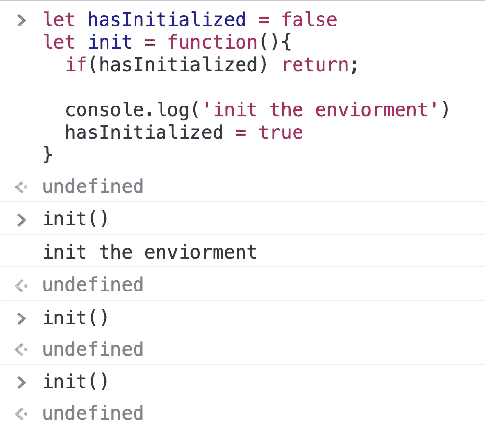
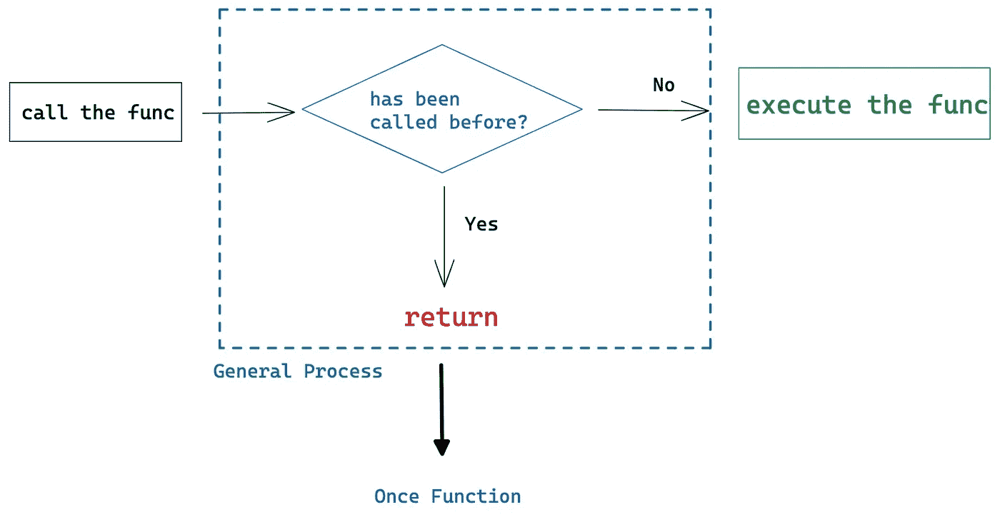
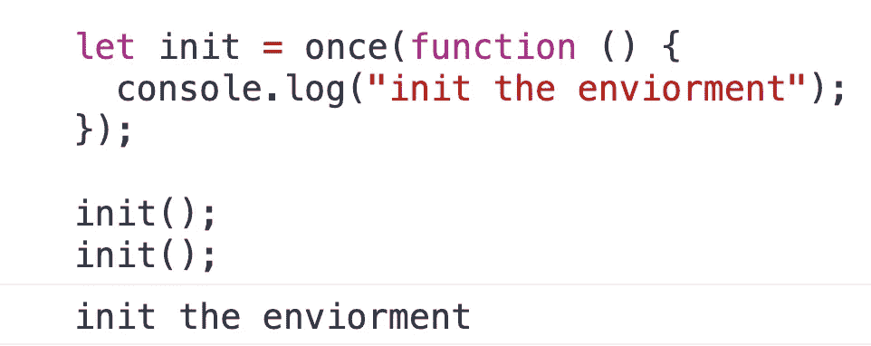
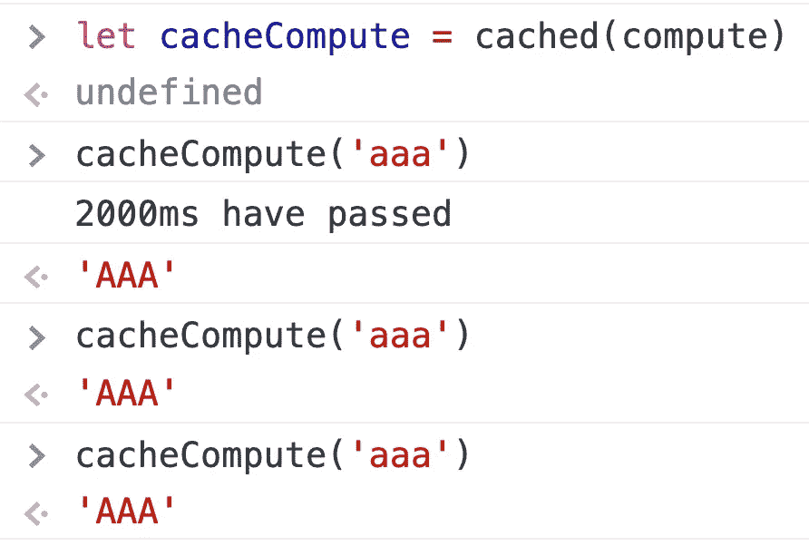
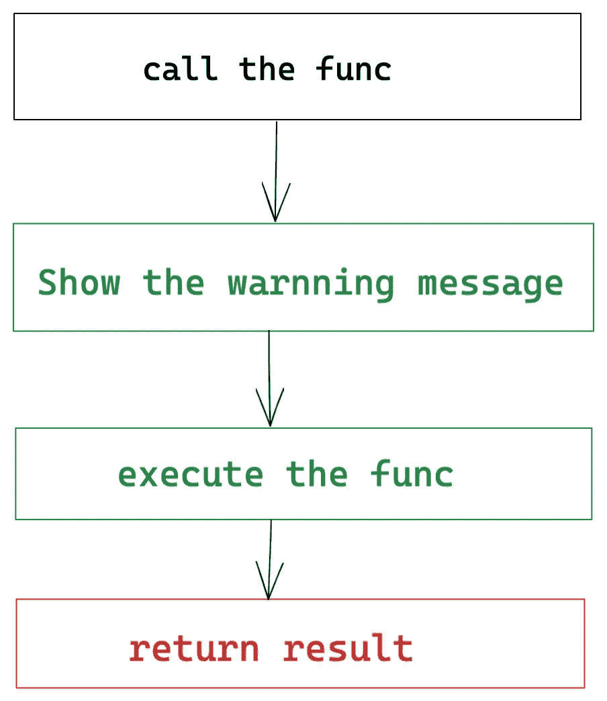
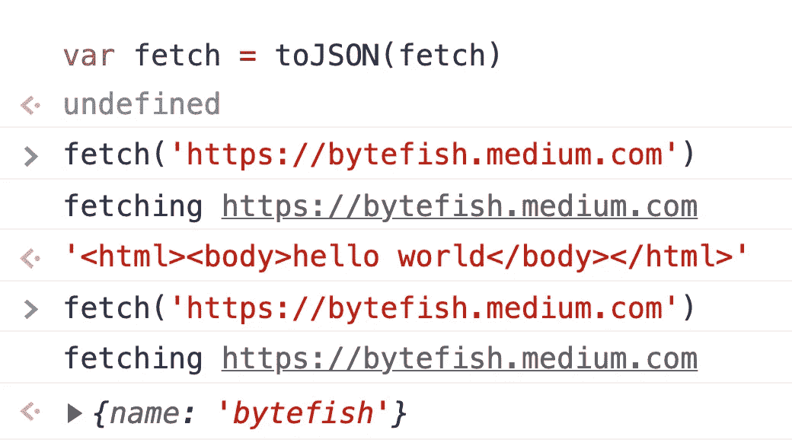
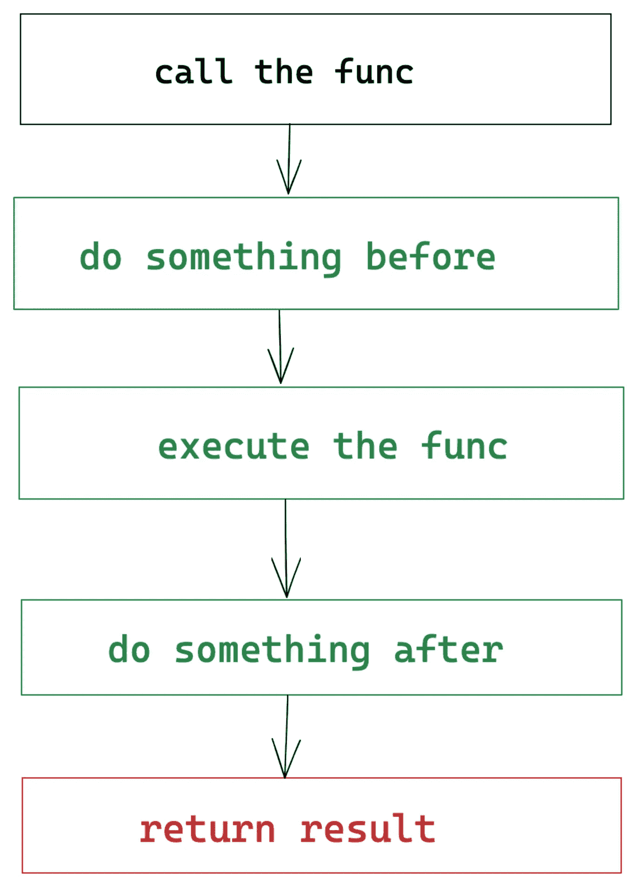
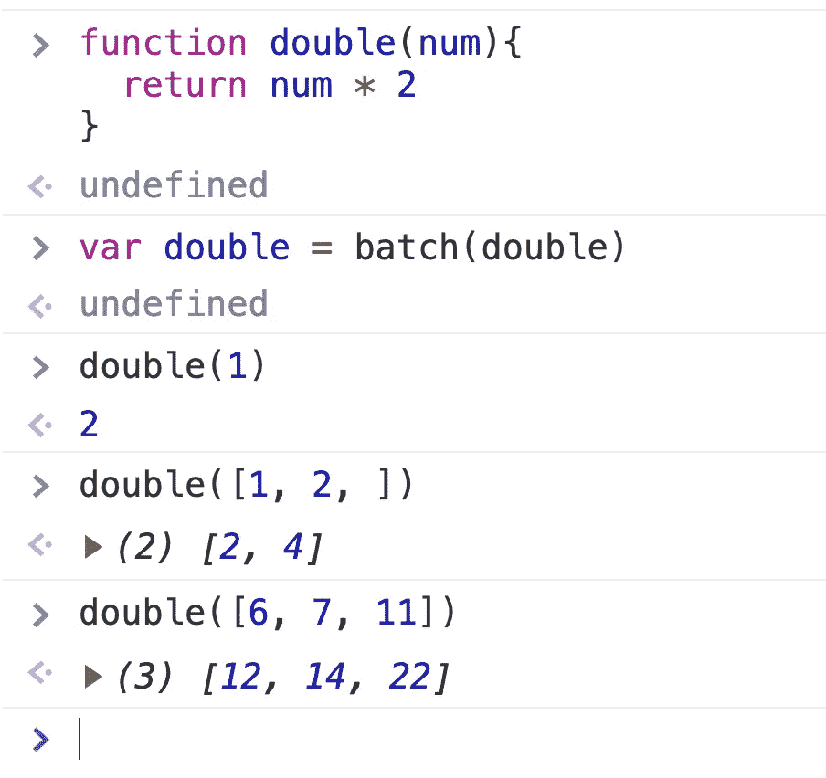
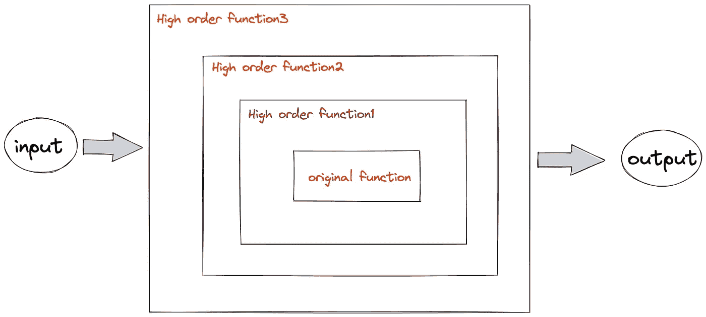

# 像高级 JavaScript 开发人员一样为通用流程编写高阶函数

> 原文：<https://betterprogramming.pub/writing-high-order-functions-for-general-process-like-a-senior-javascript-developer-4d025baa3dc6>

## 函数式编程的力量


我们知道函数是解题的基本单位。但是在现实世界中，一些原始函数并不能完全解决一个问题。这时，我们需要扩展我们现有的代码。

有些编码者可能会直接改变原来的功能，以达到存档的目的。嗯，这是初级开发人员的常用方法，也是一种直观的方法。

但是在很多情况下，这不是最好的解决方案，并且有一些缺点。在接下来的部分中，我将为您介绍一些带有示例的通用解决方案。

好了，我们走吧。

# 1.仅执行一次

很多时候，我们想要一个只执行一次的函数。

比如我们开发网页的时候，总会有一些提交表单的按钮。当用户点击按钮时，它的`onclick`事件将被触发。

*为了简化演示问题，该示例只记录一条消息，而不是向服务器发送数据。*

但这里有一个问题:由于网络延迟，我们不能立即显示用户的结果。然后，用户可以继续点击按钮并多次向服务器提交表单。


所以我们需要一个解决问题的方法。你的解决方案是什么？

一种常见的解决方案是在用户第一次单击按钮后禁用它。

```
document.getElementById('submit').onclick = function()
  document.getElementById('submit').disabled = true
  console.log("sending data to the server")
}
```


嗯，这个解决方案没有问题。

此外，我们还有一个不同的解决方案:

在这个解决方案中，我们使用一个标志来记录这个函数以前是否被执行过。


如果我们用图表来表示程序，它可能是这样的:


作者图片

但是，我们能得到所有这类问题的一般解吗？

让我们继续一个类似的例子。很多时候，在我们的程序中有一个 init 函数。

```
let init = function(){
  console.log('init the enviorment')
}
```

我们可以使用该功能来设置变量、读取配置等。而且这个功能应该只执行**一次**。为了确保它只执行一次并避免意外，我们可以对函数做一些修改:

好的，init 函数只会初始化环境一次。



只记录一次消息

我们也可以把程序绘制成图表。


作者图片

你发现表单提交和初始化函数有一些共同之处吗？是的，他们的程序非常相似！

如果我们进行高级抽象，过程应该是这样的:



作者图片

如果该函数以前被调用过，则是一个通用的过程。我们可以写一个高阶函数来封闭这个过程。

下面是`once`函数的一个实现:

现在，有了`once`函数，我们可以很容易地将执行一次函数的目的存档。

提交一次:

```
document.getElementById('submit').onclick = once(function() console.log("sending data to the server")})
```


初始化一次:



好，我们用 once 函数来解决我们的需求。

使用`once`功能的核心思想是什么？

正如我在标题中提到的:我们将一般过程抽象为高阶函数。程序性的——只执行一次功能——是一个通用的过程。它会被多次使用。如果我们不进行抽象，我们就必须为相同的逻辑在不同的函数中重复编写代码。

如果我们使用`once`功能，有很多好处:

*   我们不需要改变原来的功能。
*   保持业务逻辑和执行逻辑的分离，这样代码会更容易维护。
*   `once`函数是可重用的函数。

# 2.缓存结果

我们再来看另一个例子。如果有这样的功能:

```
function compute(str) {    
    // Suppose the calculation in the funtion is very time consuming        
    console.log('2000ms have passed')
    return str.toUpperCase()
}
```

*(其实这个案例是我从 Vue 源码中了解到的。)*

我们想要缓存函数操作的结果。以后调用时，如果参数相同，就不再执行该函数，而是直接返回缓存中的结果。我们能做什么？

这里有一个建议:**当你需要增强一个函数的时候，不要试图直接修改，考虑先写一个通用的高阶函数来包装它。**

缓存函数结果的一般流程是什么？下面是一个流程:


以下是缓存结果的实现:

现在我们可以使用这个缓存函数来增强`cumpute`函数:



我们做这个抽象并不是为了炫耀技巧，事实上这样的缓存功能有着广泛的用途。

我们知道，有一个著名的数列叫做斐波那契数列。

```
1, 1, 2, 3, 5, 8, 13, 21, 34, 55, 89, 144, ...
```

快速浏览后，您可以很容易地注意到序列的模式是每个值都是 **2 个先前值**的总和，这意味着对于 N=5 → 2+3 或在数学中:

```
F(n) = F(n-1) + F(n-2)
```

现在我们想写一个函数:

> 给定一个数字 *N* 返回斐波那契数列的索引值。

如何编写函数呢？

最简单的解决方案是递归解决方案:

但是这种实现是耗时的。如果 num 大于 35，您将需要等待一段时间才能得到结果。


但是如果我们使用缓存函数来重构实现，我们将得到一个高性能的函数。


# 3.函数拦截器

我们继续。

假设你是一个库的维护者，你准备在未来弃用一个叫做`request`的老 API。

```
function request(){
  console.log('request to server')
}
```

在当前版本中，您希望通过记录消息来警告用户 API 将被否决。

那你会怎么做？

最糟糕的方法是在函数中添加一个`console.warn`语句:

```
function request(){ console.warn(`The request will be deprecated in the future`) console.log('request to server')}
```

为什么这是最糟糕的解决方案？

你必须找到所有被否决的 API 并修改它们。这是一个非常繁琐的过程，而且非常容易出错。**如无必要，请勿更改现有功能。**

如果我们用图表来表示程序，那就是:



作者图片

正如我们在前两节中所做的那样，我们可以为该过程编写一个高阶函数。

然后我们可以对我们的项目做一些更改:

现在，如果您的库的用户调用请求函数，他们将会收到一条消息。

好，让我们继续一个类似的例子。

我们有一个 fetch 函数向服务器发送请求。它将返回一个 HTML 文本或 JSON 格式的文本。

我们现在要做的是，如果发现响应结果是 JSON 格式的字符串，我们就把它转换成 JSON 对象。如果是其他格式的字符串，则不会被处理。我该怎么办？

老规矩，先画个图:


作者图片

具体原理已经解释过很多次了，这里我直接给出一个高阶函数:

用法:



这两个例子有点简单。但是附近有一个更重要的想法。

*   `derecate`函数的目的是在原始函数执行之前做一些事情。
*   `toJSON`函数的目的是在原始函数执行后做一些事情。



作者图片

我们能把这个过程抽象成一个新的高阶函数吗？

当然可以。

如果你以前使用过 Axios，一个著名的 HTTP 请求库，你会知道 Axios 有一个拦截器 API 供用户拦截请求和响应。

# 4.一批

好，这是我们最后一个例子。

这是一个使输入加倍的函数。

```
function double(num){
  return num * 2
}
```

嗯，很简单的功能，只是为了演示。

如果我们希望这个函数接受一个数组作为参数，那么将数组中所有元素的值加倍，然后返回一个新的数组。你是怎么写代码的？

我们可以这样写:

```
function double(nums){
  return nums.map(num =>  num * 2)
}
```

确实可以这么写。

但遗憾的是，JavaScript 没有函数重载，后一个函数会覆盖前一个。为了让我们的 double 函数同时处理两个参数类型，我们必须在函数体中做出判断:

我们想要的是为所有这些问题创建一个通用的解决方案:一个高阶函数，它可以标记一个函数来处理单个参数或类似数组的参数。


下面是一个实现:



# 结论

好了，例子够多了。无论一次、缓存、拦截还是批处理，都是对某个进程做一些抽象。

*   我们想要一个只执行一次的函数，所以我们抽象了`once`。
*   我们需要一个函数来缓存相应参数的结果，所以我们抽象了`cache`。
*   我们想要一个在执行前后都做一些事情的函数，所以我们抽象了`intercept`。
*   我们希望 s 函数通过它的 params 类型改变它的执行流，所以我们抽象了`batch`。

它们都遵循一个共同的范式:即使用高阶函数来抽象任何一般过程。

# 嵌套的

嗯，最后我想说的是:如果有必要，我们可以嵌套这些高阶函数。



假设我们不仅要缓存`compute`函数的结果，还要在执行它之前记录它的参数，在执行它之后记录它的结果。然后，我们还想让它能够处理多个参数。我们可以这样写:


感谢阅读。希望这篇文章对你有用。