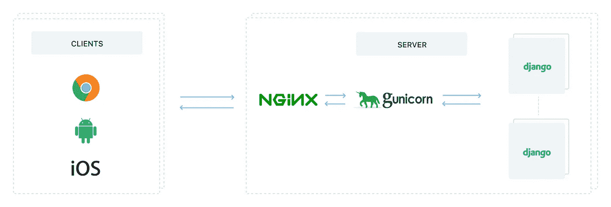

# 编写自己的 HTTP 服务器(第 1 部分)

> 原文：<https://betterprogramming.pub/writing-your-own-http-server-introduction-b2f94581268b>

## 学习用 Python 构建自己的 HTTP 服务器的基础知识

伊利亚·巴甫洛夫在 [Unsplash](https://unsplash.com/s/photos/create?utm_source=unsplash&utm_medium=referral&utm_content=creditCopyText) 上的照片

*这是“编写自己的 HTTP 服务器”系列的第一部分可以在这里阅读* [*Part 2*](https://medium.com/better-programming/writing-your-own-http-server-thread-based-implementation-40bce0142df9) *和*[*Part 3*](https://medium.com/better-programming/writing-your-own-http-server-implementing-wsgi-97706588ac20)*。*

今天，后端开发人员可以访问许多优秀的开源 web 服务器和框架。这使得人们可以通过代码解决业务问题，而不必担心网络、并发和协议。对于我们拥有的大多数典型的 web 应用程序来说都是如此。

但是在有些应用程序中，您必须处理可伸缩性、并发性和性能问题。仅仅通过优化我们的应用程序逻辑是不可能解决这些问题的。这时，我们需要查看我们的 web 服务器是如何配置的:它使用什么并发模型，我们的应用程序是受 IO 限制还是受计算限制，服务器是否配置为优化那种工作负载，等等。

为了能够以明智的方式做出这些选择，我们需要了解这些 web 服务器实际上是如何工作的。在我看来，最好的方法是自己编写一个 web 服务器。我们不需要写生产级的服务器。我们也不需要整合这些服务器拥有的所有功能或处理所有用例。我们只需要开发一个基本的工作服务器来理解我们所拥有的不同参数和设计选择。

在这一系列文章中，我们将从头开始开发一个 HTTP 服务器。虽然我们将使用 Python 开发服务器，但这里的知识是通用的，可以使用任何编程语言来实现。一些开发可能依赖于 Python 编程语言的特定特性，但是类似的特性在其他编程语言中也是可用的，或者作为语言规范的一部分，或者通过一个库。

必要时，我还会链接到外部资源，这样我们就可以了解所使用的技术，而不会因为太多的分歧而弄乱它们。

介绍完了，我们开始吧。

# 常见的部署场景

在 Python 世界中， [Django](https://www.djangoproject.com/) 是开发 web 应用程序的一个流行的框架选择。当 Django 被用来开发应用程序时，我们使用一个 [WSGI](https://wsgi.readthedocs.io/en/latest/what.html) 服务器来服务这些应用程序。流行的 WSGI 服务器有 [Gunicorn](https://gunicorn.org/) 、 [uWSGI](https://uwsgi-docs.readthedocs.io/en/latest/) 、[Apache HTTP Server](https://httpd.apache.org/)with`mod_wsgi`等。而且一般 [Nginx](https://www.nginx.com/) 在这些服务器前面都是作为反向代理使用的。

从客户端到应用程序的请求流

我们希望了解来自客户端的 HTTP 请求实际上是如何到达我们的应用程序的。为此，我们希望了解上图中每个部分的作用。

这个系列将展开如下:

1.  在这篇文章中，我们将讨论什么是 HTTP 服务器的基础知识。
2.  在第二部分中，我们将实现一个基本的基于线程的 HTTP 服务器。
3.  在第三部分中，我们将理解什么是 WSGI，并使我们的服务器符合 WSGI(嗯，差不多)。我们还将构建一个基本的 web 框架，它实际上可以使用 WSGI 与我们的服务器对话。

# 基础知识

在我们开始实现我们自己的服务器之前，让我们花一些时间来理解 HTTP 服务器实际上是什么。

当我们谈论客户机-服务器体系结构时，服务器是可以访问资源的应用程序。资源可以是文件、数据库、一些计算逻辑等。客户端想要访问该资源。因此，客户端需要首先与服务器连接，然后请求该资源。在这个过程中，它可能还需要对自己进行身份验证，服务器可能还会检查这个客户机是否有权访问所请求的资源。此外，服务器需要检查所请求的资源是否可用。如果没有，它需要通知客户。

因此，客户端和服务器需要在两件事情上达成一致:

*   客户端将如何连接到服务器
*   请求和响应的格式是什么

只要他们在这些问题上达成一致，并且他们有办法联系到对方(比如互联网)，他们就可以交谈。让我们逐一解决这两个问题。

## 运输

为了让两个应用程序进行通信，它们必须能够相互发送字节的数据。数据可以是任何东西，并且取决于应用。但是必须有一种方法将数据从一个应用程序进程转移到另一个应用程序进程。那是运输的工作。传输数据有许多不同的方式，可以使用哪种方式取决于服务器和客户端进程相对于彼此的位置。

例如，如果客户端和服务器进程都运行在同一台机器上，那么它们可以使用文件作为传输。客户端可能将请求写入一个文件，而服务器可能将响应写入另一个文件。当进程不在同一台机器上运行时，我们甚至可以使用文件，但是两个进程都需要以某种方式访问同一个文件。如果有像 NFS 这样的网络文件系统，这是可能的。虽然使用文件可能不是编排这种通信的最佳方式，但重要的是要认识到它是完全可行的。

同一台机器上的两个进程进行通信的另一种方式是通过管道或 Unix 套接字。另一个选择可能是共享内存。基本上任何 IPC 机制都可以工作。

但是，当我们希望不同机器上的进程进行通信时，我们需要以某种方式让网络参与进来。因此我们需要使用基于网络的传输。有许多基于网络的传输协议，但最流行、最可靠的基于 IP 网络的传输协议是传输控制协议(TCP)。所有浏览器都使用 TCP 连接到各种网站的服务器。因此，如果你想和一个浏览器客户端对话，你的选择就仅限于 TCP 了。即使不涉及浏览器，TCP 也是可靠通信的首选协议。

## 消息格式

现在我们知道了如何到达另一个流程，我们需要决定用于通信的消息格式。让我们看看需要从客户机向服务器发送什么数据，反之亦然，以便能够请求和提供资源。

第一，客户端需要以某种方式识别它想要访问的资源。它可能还需要提供更多的元数据，比如身份验证细节。此外，它可能需要向服务器传递其他信息，比如它是否可以接受压缩数据。

另一方面，服务器需要能够以客户机知道其开始和结束的方式发送实际的资源。服务器还应该传递其他元数据，比如内容是否经过压缩，而客户端应该在使用之前对其进行解压缩。如果因为不允许客户端访问资源、客户端请求了不存在的资源或者服务器出现故障而出现错误，它也需要进行通信。

这就是 HTTP 的用武之地。HTTP 是应用层协议。这意味着它是应用程序用来解释来自远程对等方的消息的格式。虽然 HTTP 不是唯一的应用层协议，但它是浏览器用来访问网站的协议。因此，任何需要浏览器访问的 web 应用程序都需要使用 HTTP。如果该应用程序只能被其他应用程序访问，他们可以选择通过他们希望的任何协议进行对话。

HTTP 有用于识别资源的 URL。它有方法/动词，可以用来表示想要对资源采取的动作。它有各种元数据的标题。有代表成功/错误情况的状态代码。最后，主体可以保存由资源表示的实际数据。

# 下一个

当我们说我们想要构建一个 HTTP 服务器时，我们的意思是我们想要创建一个可以连接到的应用程序，使用 TCP 作为传输层协议，它可以解释发送给它的 HTTP 消息，解析它们，并把它们交给 web 框架。当我们开始构建 HTTP 服务器时，这些是我们需要支持的最低要求。稍后，我们可以开始担心其他方面，例如服务器是否可以并行处理多个请求，或者它是否支持 Keep Alive 等功能。

在本系列的下一期中，我们将构建一个支持上述两个需求的服务器，因此可以作为 HTTP 服务器。