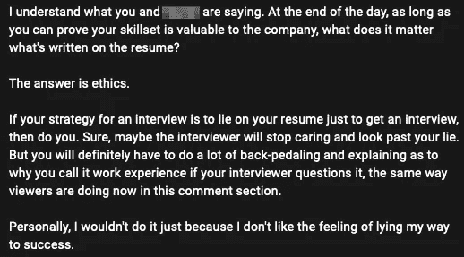
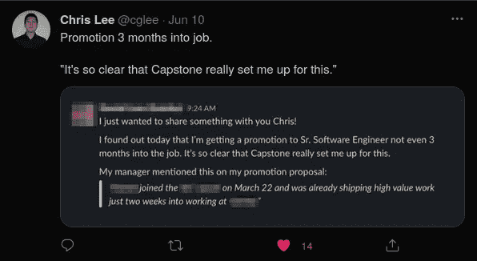

# 是的，个人项目是工作经验

> 原文：<https://betterprogramming.pub/yes-personal-projects-are-work-experience-1bf2f129d787>

## 不要相信守门人告诉你的话

照片作者:[萨贾德·侯赛因 M](https://burst.shopify.com/@sajjad01)

我在科技行业的第一份工作是在纽约市的一家设计工作室做网页开发。就工作而言，还不错。这是我得到的第一份工作，尽管是一台二手电脑。办公室位于纽约切尔西的一个充满活力的地区，我会在午休时间经常去美术馆和 Highline。

然而，作为一份技术工作，这很糟糕。首先，这项工作几乎不能被认为是网络开发。大部分工作是为那些太忙或者对电脑一窍不通的客户维护 Wordpress 网站。测试我的 JavaScript 能力的机会少之又少。

此外，该工作室没有遵循任何类型的工程最佳实践。所有代码和资产都存储在一台服务器上，没有任何版本控制。由于我和其他开发人员没有代码合并系统，我们会不断地覆盖彼此的文件。然后，令我们老板懊恼的是，我们不得不花一整天来修理它。由于缺乏资金和客户，我最终在仅仅五个月后被解雇了。虽然在这段时间里，钱还是不错的，但我不能说我没有如释重负。

丢掉设计工作室的工作后，我又继续学习了四个月的编程。在那之后，我和另外两个开发人员一起开始了一个雄心勃勃的项目，最终成为了[秘密会议](https://conclave-team.github.io/conclave-site/)。

[秘密会议](https://conclave.tech/)在行动

这个项目涉及大量的研究。我们查阅了白皮书，观看了会议讨论，并反复验证了多个概念。作为一个团队，我们举行了晨会。我们将所有代码保存在一个版本控制的存储库中，并对我们向它发出的拉请求执行代码审查。

这个项目最终花了几个月才建成。在文章的最后，我们还写了一篇关于我们所学的案例研究和一篇讨论我们如何构建它的中型文章，这篇文章已经获得了超过 20，000 的浏览量。我们的 [GitHub 知识库](https://github.com/conclave-team/conclave)也吸引了 600 多位明星。它还出现在[马丁·克莱普曼的 crdt . tech](https://crdt.tech/implementations#text-editors)([设计数据密集型应用](https://dataintensive.net/)的作者)中。

# 简历守门人

根据科技行业的某些人的说法，我上面列出的经历中只有一种算得上是真正的“工作经历”——而且很可能不是你想的那种。你看，虽然我和我的队友从建立秘会中学到了很多，但这是一个我们开源的个人项目。更重要的是，我们没有得到报酬。

对于简历看门人来说，这是无效的——他们不认为个人项目是合法的工作经历。不幸的是，这对那些向科技行业转型的人来说是一个巨大的障碍。

如果你没有意识到，当你没有任何经验时，很难找到一份软件工程的工作。对于没有上过大学，也没有机会通过实习获得工作经验的人来说，这可能会更加困难。雪上加霜的是，许多人力资源部门使用简历过滤软件，自动过滤/拒绝简历中没有特定关键词或工作经验不足的求职者。

为了适应这些障碍，自学成才的开发人员在简历中加入个人和副业项目，以绕过这些人力资源筛选，从而获得入门的机会，这已经变得司空见惯。这已经成为一种有用的策略，它简化了寻找第一份工作时经典的“第 22 条军规”:

> 我需要经验来找工作，但我需要工作来获得经验。

不幸的是，在科技行业中，有一些珍珠聚集者、邻避者和反对者谴责这些做法。他们声称这些技术的实践者是骗子和说谎者。作为一个在过去成功使用过这些策略的人，我的道德受到了质疑。所以在这篇文章中，我想探究一下这些人的一些观点，并给出我的看法，为什么他们是有缺陷的，却是合格的求职者。

# “只有有偿工作才算数”

"我对工作经验的定义是你得到报酬的工作."—作者截图

> 工作经验是你获得报酬的工作。

我多次看到这种说法，从表面上看，它是有道理的。金钱万能。有足够的技能来获得报酬是被雇佣的基本要求。但是现在我们都应该知道，在软件中没有绝对。

这种观点认为，通过有偿工作获得的经验和知识比通过无偿工作获得的经验和知识更好、更有价值。正如我在本文开头所指出的，这是不准确的。的确，有偿工作可以让你有机会解决复杂的问题，这将有助于你作为一名工程师的学习和成长，但志愿者和开源工作也是如此。

马克斯·豪厄尔([家酿](https://github.com/Homebrew/brew)的创造者)、史蒂夫·法兰克王国([雨果](https://github.com/gohugoio/hugo)的创造者)和大卫·海涅梅尔·汉森( [Ruby on Rails](https://github.com/rails/rails) 的创造者)应该被禁止在简历中列出他们的开源作品吗？他们创建这些项目并没有直接获得报酬，但无数盈利性公司依赖于这些项目。它们有价值，即使市场没有为此买单。

有人可能会说，拥有成千上万 GitHub 明星的健壮开源库和个人项目不一样，但是为什么呢？他们都是从个人项目开始的。对于许多创作者来说，它们仍然是创作者自愿维护的个人项目。有时，以牺牲自己的幸福为代价。

# “这是不道德的”

“我不喜欢这种靠撒谎来获得成功的感觉”——作者截图

我听过的更令人震惊的说法是，在简历中加入个人项目的人是不道德的骗子。这种说法有太多的错误，以至于光是想想我需要解开的所有错误假设就让我筋疲力尽。

首先，为了让某件事不道德，必须有一个普遍认可的标准，如[定义](https://www.wordnik.com/words/unethical)所示:

> "不符合公认的社会或职业行为标准的."

然而，这种说法有一个问题。

简历不规范。

我一定是错过了 RFC，它定义了简历中可以包含什么，不可以包含什么。如果你能找到它的链接，请告诉我。

第二，这种认为包含个人项目是不道德的想法认为，仅凭一份简历就能让你被录用。所以，如果有人对自己的技能撒谎，他们会很容易溜进工作岗位。完全不是这样的。

以下是我简历中的一个片段:

我在简历中提出的观点是不是很大胆？当然可以。招聘人员和面试官对我的这些说法提出质疑了吗？绝对的。如果我没有能力支持他们，我会被雇佣吗？不可能。

把个人项目放在简历上是为了更好地反映一个人的技能，而不是修饰它。如果一个软件工程师在 AWS 方面有丰富的经验，那么这种经验是否是通过个人项目积累的又有什么关系呢？

即使有人想在简历上撒谎，作为一个面试过几十个求职者的人，我可以告诉你，识破谎言非常简单。这就是技术筛选、编码评估和系统设计挑战的全部意义。如果你没有技能来支持你简历上的主张，你就不会成功。

最后，人们有一种误解，认为基于个人项目聘用的求职者会破产——这既是对公司资源的浪费，也是对面试官时间的浪费。有人需要提醒所有在职业生涯中表现出色的自学成才的开发人员，因为我不认为他们得到了备忘录。

“不到三个月，我就被提升为高级软件工程师”——作者截图

# 为什么这很重要？

你可能想知道我写这个是为了什么？毕竟只是网络上的巨魔在做他们做的事情。的确，从微观层面来看，争论什么可以写在简历上，什么不可以写在简历上是幼稚的。

但从宏观层面来看，这又是一个例子，说明科技行业的人在打击那些竭尽全力想分一杯羹的人。[好像有抱负的软件工程师不会面对那足够的](https://medium.com/free-code-camp/am-i-a-real-software-engineer-yet-a0f38a2248c0)。虽然只有一小部分人参与这种把关，而且整个行业正在改善，但仍有改进的空间。

我还想进一步消除个人项目不能让你为工作做好准备的观念。作为一个经常与新开发人员互动的人，我经常被他们创造的东西所震撼。以下是一些例子:

*   [Haven:一个开源的、基于云的秘密管理器](https://haven-secrets.github.io/)
*   [Stagehand:现代前端应用程序的自动审查应用程序](https://stagehand-framework.github.io/)
*   [Campion:基于边缘的断路中间件](https://campion-breaker.github.io/)

所有这些项目都是由软件工程师创建的，他们通过多年的自学和个人项目磨练了自己的技艺——现在都被雇用了，并且蒸蒸日上。

# “失败的互联网亿万富翁”

照片由 [Unsplash](https://unsplash.com?utm_source=medium&utm_medium=referral) 上的 [Jp Valery](https://unsplash.com/@jpvalery?utm_source=medium&utm_medium=referral)

这篇文章花了我不愿意承认的时间。很难想出一个积极的基调来结束这篇文章——既简洁又幽默，以平衡反动的基调。尽管我找到了其他人来帮我。

我最近在一个名为 [**的黑客新闻帖子上看到了**](https://news.ycombinator.com/item?id=27501316)**[的这个交流](https://news.ycombinator.com/item?id=27501681)问 HN:做了副业后如何重返就业市场？** 这完美地概括了我一直想说的话:

> 我们倾向于淡化我们所做的事情或我们自己构建的东西，就好像另一个人(老板)告诉我们去做某件事情的事实会比我们自己选择去做这件事情更有价值。
> 
> 并没有。你选择开发的应用程序和你开发的应用程序一样有价值，因为有人每月付钱给你让你开发。
> 
> *—达伦德夫*
> 
> 我把自己的头衔列为“失败的互联网亿万富翁”，然后列出项目、它们正在解决的问题以及技术栈。记住，如果是技术性面试，面试你的人很可能也做过兼职项目。
> 
> — *蓝色魔鬼 2k*

我自己说得再好不过了。

[*订阅我的个人资料*](https://medium.com/subscribe/@SunnyB) *如果您想在我上传新故事时收到通知。*