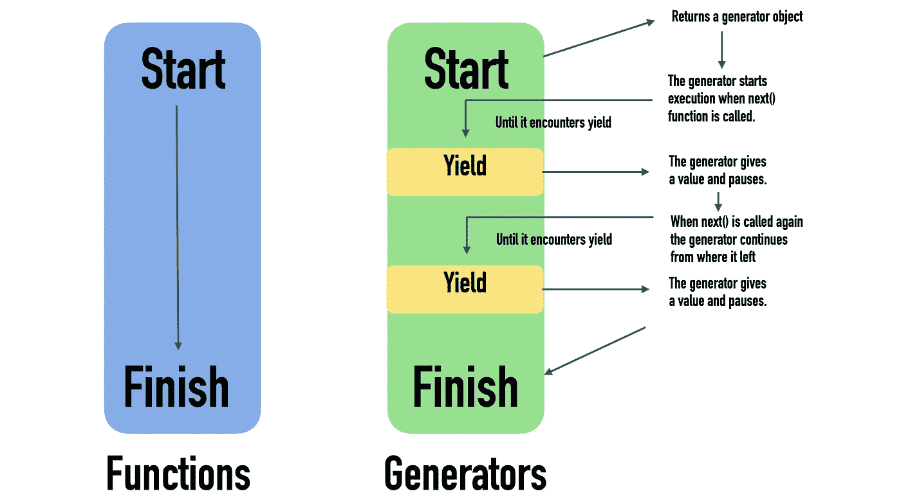

# 如何在 Python 中使用 Yield 让你的函数更高效

> 原文：<https://betterprogramming.pub/yield-in-python-76413d5e2a27>

## 使用 yield 将您的函数转换成内存高效的生成器


Chris Ried 在 [Unsplash](https://unsplash.com?utm_source=medium&utm_medium=referral) 上拍摄的照片。

在 Python 中，`yield`用于从函数*返回，而*不会破坏其变量。从某种意义上说，`yield`暂停了函数的执行。当再次调用该函数时，从最后一条`yield`语句继续执行。

使用`yield`将函数转换为*生成器*。下面是函数与生成器的对比图:



图片由作者提供。

生成器返回一个生成器对象，也称为 [*迭代器*](/what-are-python-iterators-and-iterables-c1dd67559d2f) ，一次生成一个值。它不存储任何值。这使得生成器的内存效率更高。

例如，您可以使用生成器循环遍历一组数字，而无需将它们存储在内存中。

# 如何将一个函数变成一个生成器

`yield`把一个函数变成一个生成器，产生一个值而不是返回它。这使得函数返回一个生成器对象。这是一个迭代器，你可以像遍历列表一样遍历它。

## 例子

让我们创建一个`square()`函数，它对输入的数字列表求平方:

输出:

```
[1, 4, 9, 16, 25]
```

让我们把这个函数变成一个生成器。您可以一次存储一个值而不存储它们，而不是将平方数存储到一个列表中:

输出:

```
**<generator object square at 0x7f685175b510>**
```

现在你不再得到平方数的列表。这是因为结果`squared_numbers`是一个*生成器对象*。

## 使用 next()函数获取值

生成器对象不在内存中保存数字。相反，它一次计算一个结果。只有当您使用`next()`函数请求下一个值时，它才会这样做。

让生成器计算第一个平方数:

```
print(next(squared_numbers))
```

输出:

```
1
```

让我们再调用`next()`四次，让它计算其余的数字:

```
print(next(squared_numbers))
print(next(squared_numbers))
print(next(squared_numbers))
print(next(squared_numbers))
```

输出:

```
4
9
16
25
```

现在生成器已经将所有的数字平方。如果你再叫一次`next()`:

```
print(next(squared_numbers))
```

出现错误:

```
**Traceback (most recent call last):
  File "<string>", line 13, in <module>
StopIteration**
```

这个错误让你知道没有更多的数字要平方。换句话说，发电机是*耗尽了*。

现在您了解了生成器是如何工作的，以及如何让它计算值。

## 不要使用 next()函数

使用`next()`函数很好地演示了发电机是如何工作的。

在现实中，你不需要调用`next()`函数。相反，您可以使用一个`for`循环，其语法与您遍历列表时使用的语法相同(`for`循环为您调用了底层的`next()`函数)。

例如，让我们使用一个`for`循环来重复生成器的例子:

输出:

```
1
4
9
16
25
```

# 带生成器的无限数字流

生成器对象(迭代器)只关心当前值，不存储任何值。因此，创造无限的价值流是可能的。

## 例子

让我们创建一个无限生成器，它产生一个起点之后的所有数字:

```
**def** infinite_values(start):
    current = start
    **while** True:
        **yield** current
        current += 1
```

该发生器产生从`start`到无穷大的值。让我们运行它:

```
infinite_nums = infinite_values(0)**for** num **in** infinite_nums:
    print(num)
```

输出:

```
0
1
2
3
4
5
.
.
.
```

从语法上看，`infinite_nums`似乎是一个我们正在循环的无限数字列表。实际上，它是一个逐个计算值的生成器。

# 生成器与列表—运行时比较

让我们对生成器和函数进行运行时比较。

在这个例子中，有一个十个数字和两个函数的列表:

*   一个`data_list()`函数从列表中随机选择一个数字`n`次。
*   一个`data_generator()`发生器函数也从列表中随机选择一个数字`n`次。

这段代码比较了使用这些函数构建一百万个随机选择数字的列表的运行时间:

结果:

```
List creation took 0.6045370370011369 Seconds
Generator creation took  3.48799949279055e-06 Seconds
The generator is **173319** times faster
```

这显示了如何更快地创建生成器。这是因为当你创建一个列表时，所有的数字都必须存储在内存中。但是当你使用发电机时，这些数字不会存储在任何地方，所以速度非常快。

# 在 Python 中使用生成器时

要知道什么时候你可以使用发电机，问问你自己，“我需要同时有多个项目吗？”如果答案是否定的，你可以使用发电机。

让我们回到平方数字的例子。如果你想打印平方数，你可以使用生成器。这是因为平方数并不相互依赖。因此，你可以一个一个地计算它们。

如果列表很小，那么你用不用发电机都没什么区别。但是随着列表变得越来越大，生成器的功能开始发挥作用。

想象一下遍历一个包含十亿个字符串(比如密码)的文件。你不可能在一个列表中存储那么多的字符串。在这种情况下，您可以使用一个生成器来逐个遍历它们，而不是一次性存储它们。

# 创建生成器的简写

最后，让我们来看看在处理生成器时如何缩短代码。

您之前看到的`square()`函数引入了多余的代码行。

你可以使用 list [comprehension](https://medium.com/codex/python-make-your-code-fly-with-comprehensions-147873eea0ef#:~:text=for%20instance%2C%20you%20can%20use%20a%20comprehension%20to%20replace%20this%3A) 来保存 6 行代码，而不是创建一个函数:

输出:

```
[1, 4, 9, 16, 25]
```

类似的简写也可以用于发电机。

生成器理解，更好地称为*生成器表达式*，是创建生成器的简写。语法类似于列表理解。

以前，您是这样定义`square()`生成器的:

但是您可以使用生成器表达式来做完全相同的事情:

结果:

```
**<generator object <genexpr> at 0x7f37a094a580>**
```

要打印`squared_numbers`，你可以通过生成器循环:

```
**for** n **in** squared_numbers:
    print(n)
```

输出:

```
1
4
9
16
25
```

# 结论

在 Python 中，`yield`是一个把函数变成生成器的关键字。

与列表不同，生成器不存储值。相反，它知道当前值以及如何获得下一个值。这使得生成器的内存效率更高。

遍历生成器的语法与遍历列表的语法相同。

每当您循环访问一大组项目，并且不需要一次存储所有项目时，使用生成器非常有用。

感谢阅读。编码快乐！

# 你可能会发现这些文章很有见地

[](/50-python-interview-questions-and-answers-5230fe2a0db6) [## 50 Python 面试问答

### Ace 您的下一次编码面试

better 编程. pub](/50-python-interview-questions-and-answers-5230fe2a0db6) [](/10-useful-python-snippets-to-code-like-a-pro-e3d9a34e6145) [## 10 个有用的 Python 片段，让你像专业人士一样编写代码

### 我每天使用的有用的提示和技巧

better 编程. pub](/10-useful-python-snippets-to-code-like-a-pro-e3d9a34e6145) 

# 参考

 [## 文件

### 欢迎光临！这是 Python 3.9.6 的文档。

docs.python.org](https://docs.python.org/3/)