# 你的 JavaScript 面试指南

> 原文：<https://betterprogramming.pub/your-guide-to-acing-javascript-interviews-3318b10a5a83>

## 顶级问题，已解释


JavaScript 面试并不是最容易的，许多候选人花了无数时间钻研零散的编码问题来建立自信。虽然大量的练习非常重要，但是如何练习也很重要。有一个结构化的计划将帮助你掌握面试官期望的所有基本和高级的概念。

为了让你熟悉面试准备流程和你应该知道的问题，我们整理了一份需要知道的概念和实用编码解决方案的列表。

**今天我们将讲述:**

```
1\. How to Prepare for JavaScript Interviews
2\. Language Basics
3\. Type Coercion
4\. Object-Oriented Programming (OOP) in JavaScript
5\. Functional Programming
6\. The Document Object Model (DOM) and the Web Browser
7\. Miscellaneous Questions
8\. Resources
```


# 如何准备 JavaScript 面试

编码面试是出了名的严格，许多候选人对如何准备感到困惑。严酷的事实是，在你的 JavaScript 面试中，没有什么灵丹妙药；这完全取决于你准备了多少，准备得有多好。让我们跳进来。

## 第一步:知道你需要学习什么

你已经知道你将使用什么编程语言——所以现在你需要研究该语言的哪些方面将被测试。这一步有三个方面:

**知道你面试的级别。**不太可能期望初级开发人员了解很多关于并发性的知识。高级开发角色可能会测试您的系统设计能力。提前知道你面试的级别将会让你更好地专注于重要的事情。我们都知道这些级别可能是任意的，但了解公司的组织方式会让你更有能力。

**知道考什么技能。JavaScript 是一种庞大的语言，拥有多个版本和无限的功能。但并不是所有这些都会在面试中得到检验。总体来说，了解面试中包括哪些技能也很重要。例如，你可能知道，数据结构和算法在面试中经常出现，而基本的语言问题就不太常见。**

**了解组织期望什么。一些公司会期望不同于其他公司的技能。一些公司比其他公司更关注某些 JavaScript 工具。你需要知道组织对你的期望。你可以在公司网站上，通过职位描述，或者在像[编码面试](https://www.codinginterview.com/)这样的网站上做这项研究。让你的准备符合组织的要求，你会节省时间和精力。**

## 第二步:制定计划

很多人错过了这一步，最终以零散的方式准备。尽早制定计划可以确保你涵盖所有需要做的事情，并让你更有动力。一般来说，你需要三个月的时间来准备编码面试。

有很多内容要讲，你也不想在最后一分钟临时抱佛脚。留出足够的时间来做这件事，并在这段时间的开始制定一个计划。

我们整理了一份受人喜爱的[三个月明确的面试准备路线图](https://www.codinginterview.com/interview-roadmap)，你可以用它来制定你的计划。该路线图从复习基础知识开始，然后在深入更复杂的概念之前转向数据结构和算法。

重要的是不要忽略最初的复习或练习。许多人没有复习基本的 JavaScript 原则，最终在面试时被难住了。从基础到复杂的东西，你的学习会更加专注和自然。

## 第三步:不要忘记行为面试

编码面试将伴随着行为面试。这是面试官了解你的地方，看看你的价值观是否适合他们的组织。这些面试对于做出雇佣决定非常重要。许多候选人忘记准备行为面试，只关注技术技能。

这是一个很大的错误。

虽然行为面试需要较少的时间来准备，但它对你的成功仍然至关重要，应该在你的计划中考虑进去。

现在你已经知道如何准备面试了，让我们深入到面试中最重要的 JavaScript 问题。


# 关于 JavaScript 语言基础的问题

## 提升

一个关于吊装的问题，可能问的是高年级或者低年级。为了测试您对 JavaScript 中提升的理解，您可能会被问到这样一个问题:

下面代码的输出会是什么？


在 JavaScript 中，我们可以在变量被使用后声明它，因为使用`var`的变量声明在编译时被提升到它们的函数作用域的顶部。这意味着变量可以在声明之前被初始化。让我们看另一个例子。

**注意:**只有声明会被提升到顶部，初始化不会。

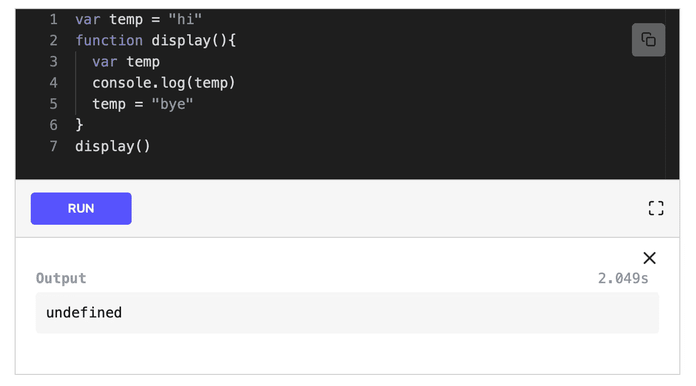

这里，`var temp = ‘bye’`是一个函数范围的变量。它的声明`var temp`在编译时被提升到`display( )`函数的顶部。因为值`bye`在第 4 行之后，所以输出是未定义的。

## 检查括号

检查平衡括号是 JavaScript 面试中常见的问题。你可能会被问到这样一个问题:

**编写一个括号检查函数来确定输入字符串的左括号和右括号是否正确嵌套。**

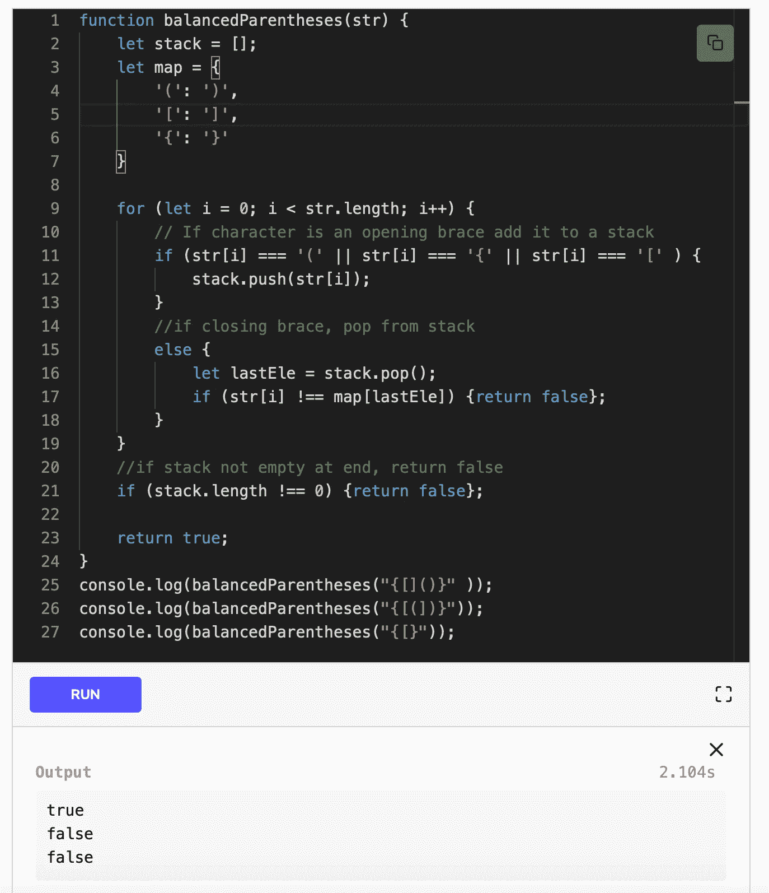

这个问题的解决方案比看起来简单。首先，我们在第 2 行声明一个堆栈，它包含所有的开始括号。然后，我们在第 3-6 行声明一个对象`map`。这包含了三种类型的左括号和右括号。

然后，我们在第 9 行遍历传递给函数的字符串表达式。如果当前字符是打开的，我们把它压入堆栈。如果它是一个右括号，我们从堆栈中取出它。如果这个字符和开始的括号不匹配，我们告诉程序返回`false`。当我们到达终点时，`stack`中剩余的开括号将返回`false`。

## 数组析构

JavaScript 面试中的一个常见挑战是要求你使用数组析构来移除数组的前两个元素。我们来看看解决方案。

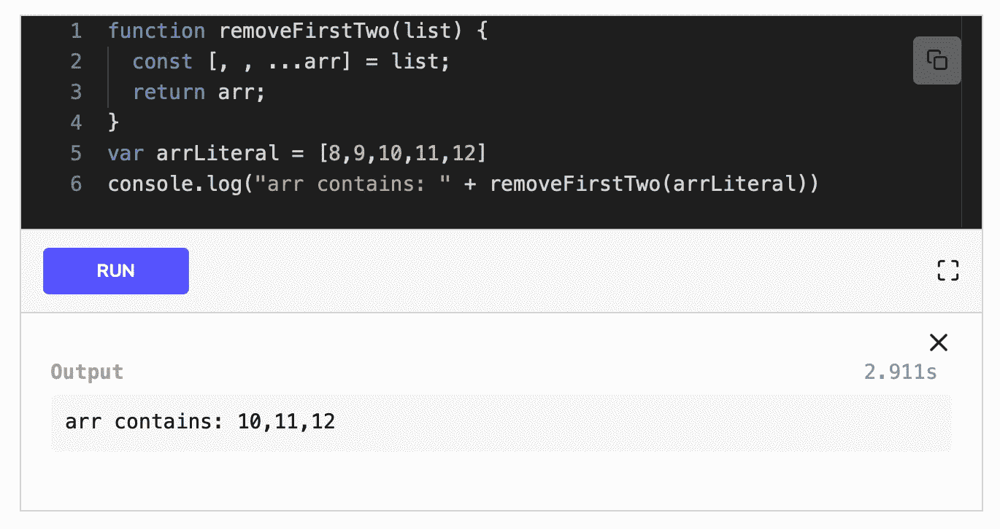

析构数组使用与数组文字相似的语法。在等式的左边，我们定义要从右边检索哪些值。

```
const [value1, value2] = arrLiteral
```

让我们来看看它是如何储存的。


`value1`将值存储在`arrLiteral`、`8`中，`value2`将其对应值存储在`arrLiteral`、`9`中。我们可以使用`,`逗号操作符跳过前两个值。因此，`value1`和`value2`存储接下来的两个值，`10`和`11`。

然后我们可以使用 rest 参数`arr`将剩余的值收集到一个数组中。我们在最后返回`arr`。看看这里。

```
function removeFirstTwo(list) {
 const [, , ...arr] = list; 
 return arr; // line 3 of original code
}
```

## 未定义的解构

这个常见的挑战要求您在 JavaScript 中析构`undefined`。假设您输入了`point`变量，我们想要`name`和`age`属性的输出值。看一看。


如果是对象，代码显示`point`的`name`和`age`值，会给出错误`undefined`。我们需要将`point`扩展到一个对象中，然后才能析构它。

```
const {name:n,age:a} = {...point}
```

我们使用`{...point}`来实现，它使用`point`的属性创建一个新对象。现在，新对象将包含所有与副本相同的值。值`undefined`和`null`被忽略。当`undefined`展开时，没有值存储在新对象中，所以不会抛出错误。因此，当我们访问`name`和`age`时，我们会看到`undefined`。

## 其他问题

还有许多其他的 JavaScript 面试问题来测试你的语言基础知识。其中包括:

*   定义一个函数`createPhoneNumber`，它接受 10 个整数(从 0 到 9)的数组，并以电话号码的形式返回这些数字的字符串。
*   给定一个数组`coins`，写一个函数来计算用这些硬币做出`amount`的方法。
*   箭头功能与其他功能有何不同？
*   `Function.call`和`Function.apply`方法的显著区别是什么？
*   JavaScript 中有可能运行异步代码吗？
*   给你一个函数`returnNthCat`，它带有一个变量`n`并定义了一个对象`state`。返回第`n`个 cat 对象的`name`值。

# 关于类型强制的问题

## ' instanceof '

JavaScript 面试的一个常见问题是关于`instanceof` 操作符。你可能会遇到这样的问题:

下面代码的输出会是什么？


`instanceof`操作符检查一个操作数是右边传递的对象的一个实例还是它的任何祖先的一个实例。答案`false false true true`是正确的，因为我们正在使用一个数组`names`，它包含字符串、数字和布尔类型的值。

`names`不是字符串或数字的实例，而是一个数组，它是`Array`的实例。在 JavaScript 中，`Array`是一个对象，所以`names`也是`Object`的一个实例。

## 阵列还是不阵列？

一个常见的测试问题如下:

**实现一个函数** `**check**` **接受一个对象并判断它是否是一个数组。它应该返回** `**true**` **或** `**false**` **。**

看一下答案:

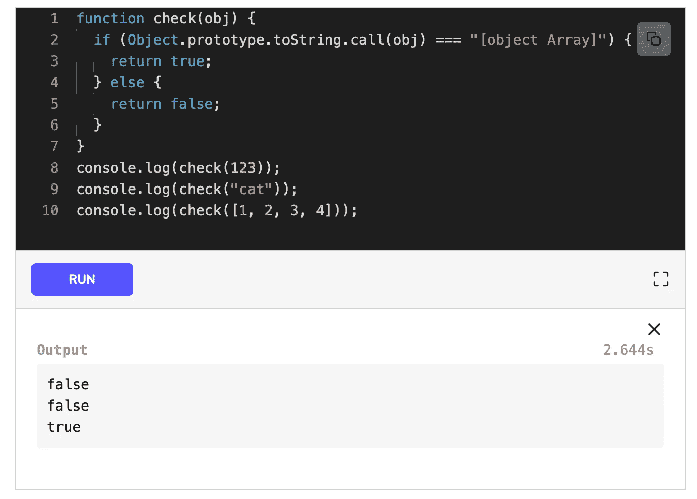

为了检查一个对象是否是一个数组，我们必须使用`Object.prototype.toString`方法，它以`[object Type]`的形式返回一个字符串。如果我们在`123`上调用它，我们返回字符串`[object Number`。如果我们在`{}`上调用它，我们将返回`[object Object]`。如果我们在数组上调用它，我们应该返回`[object Array]`。

在第 2 行，看看我们如何比较从`Object.prototype.toString`返回的字符串和`[object Array]`。如果匹配，我们返回`true`；否则就是`false`。

## 数组的实例？

这个问题，考验你对`instanceof`的了解，有点棘手。看看下面的代码:


`check`函数包含`tempFunc`的定义，在第 4 行，我们正在检查`tempFunc`的实例是否是`Array`的实例。您的任务是在第 3 行编写代码，以便语句返回`true`。我们来分解一下解决方案。

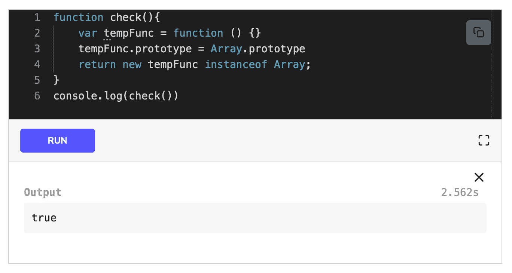

我们需要修改代码，使新对象成为数组的一个实例。我们需要做一个修改，使`Array.prototype`出现在`tempFunc`的原型链中。

```
tempFunc.prototype = Array.prototype //line 3
```

现在，我们将`tempFunc.prototype`设置为等于`Array.prototype`。它现在应该会返回`true`。

## 其他问题

还有许多其他的 JavaScript 面试问题来测试您的类型强制基础知识。其中包括:

*   下面的代码会显示什么？

```
console.log(Object.prototype.toString.call(new (function Custom(){})));
```

*   `typeof`运算符的用途是什么？
*   使用 JavaScript 中的`typeof`操作符来验证你的论证技巧。
*   使用`prototype.toString`和箭头功能验证你的约会技巧。
*   还有更多。

# 关于 JavaScript 中面向对象编程(OOP)的问题

## ' isPrototypeOf '

这个问题挑战您在 JavaScript 中使用`isPrototypeOf`函数实现对象方法的能力。假设您得到了以下代码:

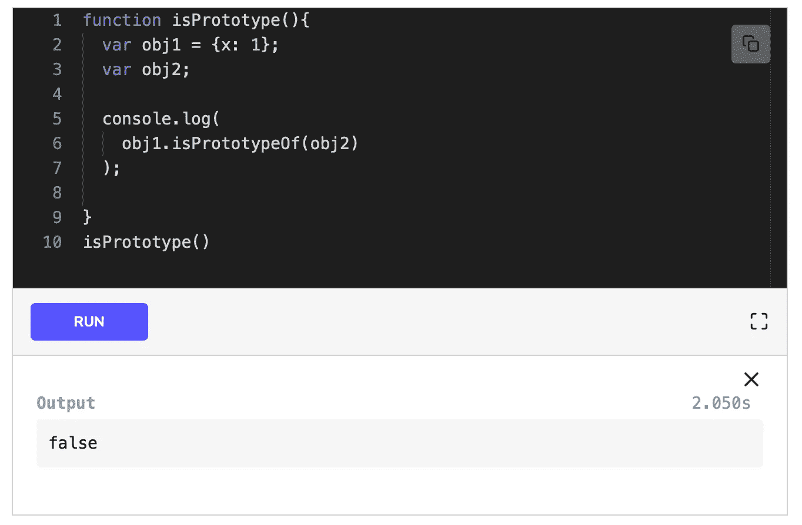

你将被要求为`obj2`写代码，以便语句在第 5 行返回`true`。我们需要`obj1`成为`obj2`原型链的一部分。我们可以使用`Object.create`函数来做到这一点，该函数创建一个对象来存储在变量`obj2`中。

`Object.create`将其作为参数，并返回一个具有指向`obj1`的 prototype 属性的对象。这使得`obj1`成为原型链，因此`Object.getPrototypeOf(obj2)`将作为`obj1`返回。


## ES6 类

ES6 技能在 JavaScript 面试中很重要，因为它们表明你掌握了最新的 JavaScript 技能。假设您得到了以下代码:


您将被要求修改代码来解决它的错误，但是您只能使用 ES6 类。这段代码中的错误是因为`meow`没有在原型`Cat`上定义，所以它没有被对象`catty`继承。我们需要将关键字`function`替换为`class`，将其重新定义为原型。

然后，我们可以在类中定义一个`constructor`，将`name`作为参数。一旦我们这样做了，我们就可以在新类中定义一个新方法`meow`，这样`meow`就成为了`Cat`的一部分。然后它会继承它的所有方法，所以`catty.meow()`不会导致错误。

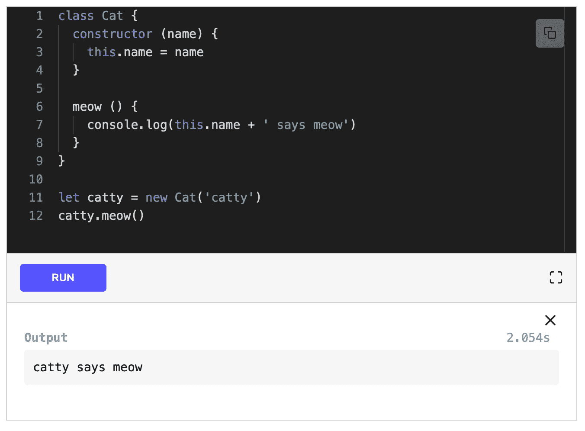

## 原型遗传

由于 JavaScript 是一种基于原型的继承语言，您可以期待类似这样的问题来测试您的技能。假设你给出下面的代码:

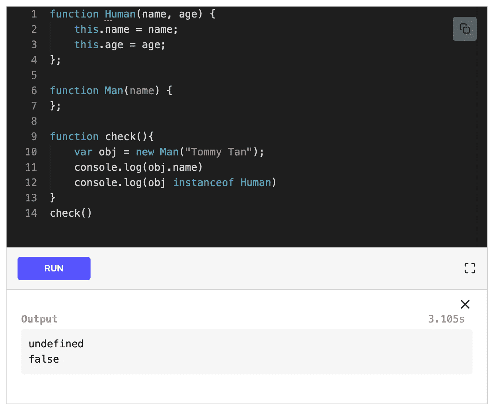

你需要在类`Human`和`Man`之间实现继承。代码应该可以成功编译。我们来看看解决方案。


`Human`是父代，子代`Man`继承它。为了让`Man`继承它的属性，我们必须在`Man`的构造函数中调用父节点的构造函数。这将初始化来自父节点`name`和`age`的成员。

这个过程使`obj`能够访问`name`属性，所以您将看到`name` 而不是`undefined`。第 10 行创建了一个原型链，这意味着任何`Man`都将把`Human`作为其原型。现在，`obj instanceof Human`将返回`true`。

一旦我们将`Man.prototype`设置为`Human`，它的构造函数指针就会指向它。我们通过将`constructor`属性设置为指向第 11 行的`Man`来纠正这个问题，但是这对于保留构造函数属性是可选的。

## 其他问题

还有很多其他的 JavaScript 面试问题来测试你的 OOP JavaScript 知识。其中包括:

*   与`this`关键字相关的问题。
*   与`super`关键字相关的问题。
*   ES5 和 ES6 的区别。
*   从类创建对象实例。
*   以下哪些是原生 JavaScript 对象？
*   JavaScript 中的对象是如何工作的？
*   如何创建一个对象文字？
*   还有更多。

# 关于函数式编程的问题

## 纯函数

纯函数是一项重要的 JavaScript 技能。你可能会遇到类似这样的问题来测试你解决问题的能力。

**下面这段代码有一个不纯的函数叫做** `**addAndPrint**` **。修改成纯函数。**

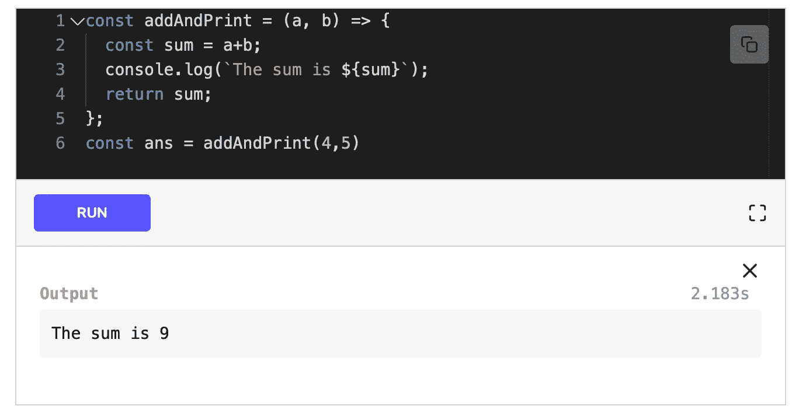

首先，你必须弄清楚为什么函数是不纯的。`addAndPrint` 似乎对外部状态没有负面副作用。然而，`console.log`语句有一个副作用，违反了结果不应该引起副作用的规则，比如可变对象的变异。我们必须通过移除`console.log`将其转换为纯函数。

注意:记住函数执行的任何与计算最终输出没有直接关系的工作都是副作用。


## 浅层复制

你可以预料到关于 JavaScript 中浅层复制的问题。假设你给出下面的代码并要求它的输出。


正确的输出是`30 30`。为什么？对象`girl`具有属性`name`和`info`。我们通过使用 spread 操作符将该对象的属性复制到`newGirl`中，这将创建一个浅层副本。两者共享一个引用，因为在 JavaScript 中对象是通过引用传递的。

这意味着当你将一个对象赋给一个变量时，它就与该对象的标识相关联。当我们将`girl`赋给`newGirl`时，`newGirl`与`girl`指向同一个对象，所以如果改变，它们的属性都会改变。

## 高阶函数

关于高阶函数的问题对于在 JavaScript 面试中脱颖而出非常重要。你可能会想到这样的问题。

**研究下面的代码。** `**func1**` **是高阶函数吗？**

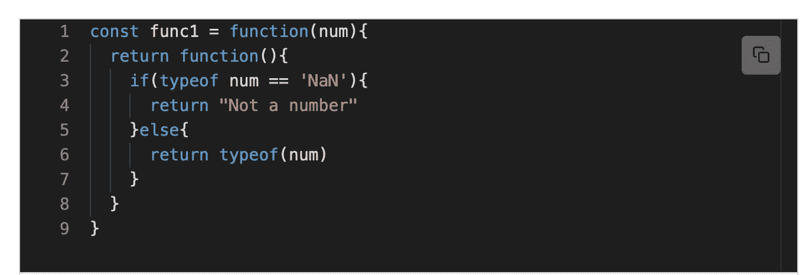

高阶函数是那些接受函数作为参数或者返回一个函数作为输出的函数。当我们看代码时，我们可以看到`func1`没有将函数作为参数。但是，如果我们仔细看第 2 行，我们会发现它确实返回了一个函数作为输出。因此，是的，它是一个高阶函数。

## 其他问题

JavaScript 面试中还有很多其他问题可以测试你的函数式编程知识。其中一些问题和概念可能是:

*   将不纯函数转换为纯函数，返回包含新属性的新对象。
*   创建一个名为`maxCookies`的函数，该函数返回一个食谱中可以烹饪的完整饼干的最大数量
*   在 JavaScript 中实现 reduce 函数。
*   currying 函数的基础。
*   实现部分函数的基础。
*   还有更多。

# 关于文档对象模型(DOM)和 Web 浏览器的问题

## 什么是 DOM？

为了测试您的 JavaScript 知识和 DOM 技能，您可能会被问到这样的问题:

**特征检测和特征推断有什么区别？**

我们可以使用特征检测和特征推断来确定浏览器中是否存在 web 技术。*功能检测*判断特定浏览器中是否存在功能。*功能推断*假设如果一个功能在一个浏览器中可用，那么它在其他浏览器中也可用。这个问题可能在初级的面试中被问到。

您还可能会被问到属性和特性。一个*属性*写在 HTML 文档中，其中 HTML 标签可能有属性。当文档被转换成 DOM 时，属性被转换成*属性。*

## 隐藏和显示

您还需要展示自己实现 DOM 相关函数的能力，比如隐藏和显示文本。例如，你需要实现文本隐藏功能，点击按钮隐藏文本`Hello World!`。看一下解决方案。

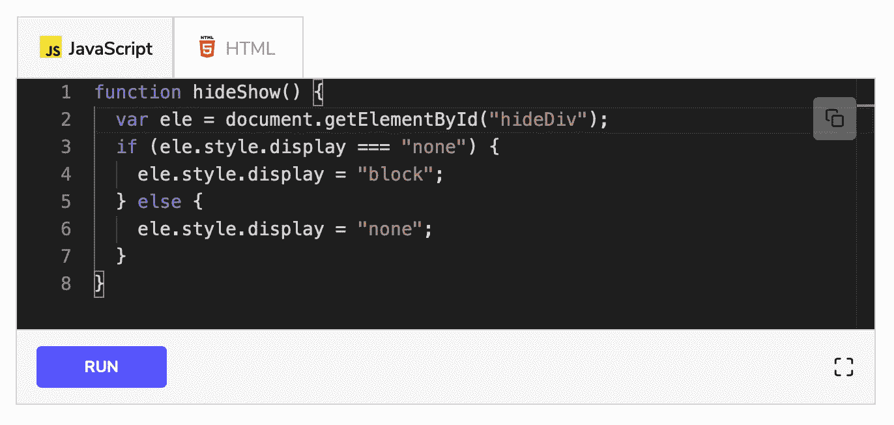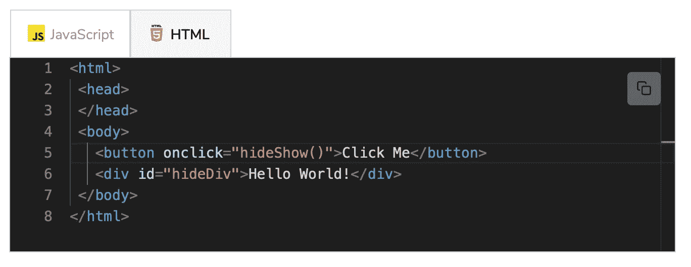

我们创建一个执行`hideShow`功能的`button`和一个包含文本的`div`。我们使用`getElementById`来访问`div`元素。在第 3 行，我们检查`style.display`属性是否是`none`(也就是隐藏的)。如果是`true`，我们通过将`display`属性设置为`block`来显示元素。如果`false`，我们通过将`display`的值设置为`none.`来隐藏它

## 其他问题

还有许多其他 JavaScript 面试问题来测试您的 DOM 知识和 JavaScript web 浏览器技能。其中包括:

*   创建`getElementByAttribute`的 DOM 相关函数。
*   实现查询选择器以添加类。
*   销毁并创建新按钮。
*   实现一个与 DOM 相关的函数来查找元素是否是子元素。
*   还有更多。

# 杂项问题

您还可以看到 JavaScript 中处理安全性、事件处理和异步回调的问题。让我们来看看一些你应该知道的常见概念。

## 事件处理

*   JavaScript 中的事件循环、事件队列和调用堆栈。
*   调用栈和任务队列有什么区别？
*   事件冒泡和控制台输出。
*   事件捕获和控制台输出。
*   哪些方法可以防止事件冒泡？
*   还有更多。

## 异步回调

*   异步和等待原则。
*   修改带有`func is not a function`错误的代码。
*   执行`checkName`函数以执行错误检查。
*   修改带有`Cannot read property ‘text’ of undefined`错误的代码。
*   承诺、链接、`.then`和`.catch`语句的基础。
*   按顺序打印数字 0-9，以便在随机等待一段时间后打印每个数字。
*   还有更多。

## 安全性

*   同源政策是什么？
*   理解/实现 JavaScript 中的严格关键字。
*   修改代码以针对特定更改引发错误。
*   还有更多。

# 资源

JavaScript 面试准备需要大量的时间和努力，但最终还是值得的。JavaScript 仍然是最受欢迎和收入最高的编程语言之一。制定一个详细的计划，好好学习，有问题提出来。

为了让你更好地准备接下来的学习，我们整理了一份有用的资源清单来帮助你准备面试。

## 课程

*   [《JavaScript 面试手册》](https://www.educative.io/courses/javascript-interview-handbook):“我们已经编制了一份 100 多个面试问题的列表，这些问题都是一些需要知道的话题，可以简化你的面试准备过程。本课程着重于面试官希望你知道的 JavaScript 基本问题。通过动手实践和编码来学习。
*   [“JavaScript 中的数据结构——可视化和练习](https://www.educative.io/courses/data-structures-in-javascript-with-visualizations-and-hands-on-exercises):“想要更多的实践吗？本课程通过简单的视觉效果和测验切入数据结构问题的核心。
*   [“掌握 JavaScript 面试](https://www.educative.io/courses/master-the-javascript-interview):“一旦你掌握了数据结构技能，就该更新你所有与 JS 面试相关的知识了。这门课应有尽有。

## 文章

*   ["JavaScript ES6 教程](https://www.educative.io/blog/javascript-es6-tutorial-a-complete-crash-course):"刷新你的 JavaScript 技能，并保持与 ES6 及以后的所有新东西的同步
*   [“为编码面试做准备的 5 个可靠的技术](https://www.educative.io/blog/5-tried-and-true-techniques-to-prepare-for-a-coding-interview):“在准备和进行编码面试时，向专家学习技巧
*   [关于 JavaScript 数据结构库的堆栈溢出问题](https://stackoverflow.com/questions/5909452/javascript-data-structures-library):这是一个很好的资源，可以发现有用的库，比如 JSClass、Buckets 等等
*   [“破解 JavaScript 面试的完美指南](https://medium.com/dev-bits/a-perfect-guide-for-cracking-a-javascript-interview-a-developers-perspective-23a5c0fa4d0d):“根据你需要知道的最重要的概念，为你的面试准备提供一步一步的指导。