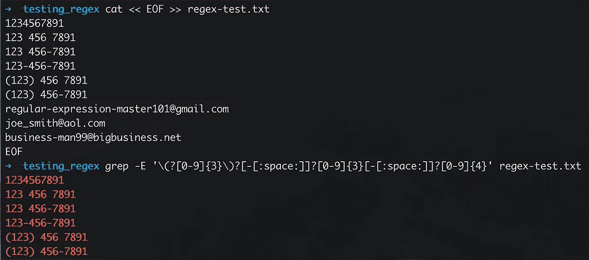

# Python 和终端正则表达式指南

> 原文：<https://betterprogramming.pub/your-guide-to-regular-expressions-in-python-terminal-b54d25cbe185>

## 增强您的正则表达式知识

正则表达式。如果你知道如何使用它们，它们是令人敬畏和强大的。如果不是，它们看起来就像是需要解码的外星语言。无论如何，本指南将涵盖正则表达式的基础知识，以及如何使用它们来简化程序员的生活。然后我们将讨论基本和扩展集，以及它们如何在 Python 和终端中使用。最后，您将拥有足够的正则表达式知识来加快您的日常编码。

# **基础知识**

正则表达式是在数据集中搜索模式的一种方式。它本身并不是一种编程语言，但是所有主流语言都有一个内置的 regex 引擎供您使用。

究竟什么是正则表达式？

> "正则表达式是定义搜索模式的字符序列."— [维基百科](https://en.wikipedia.org/wiki/Regular_expression)

“字符序列”是正则表达式语法，如果你见过它，你就会知道它是多么陌生，更不用说理解了，尤其是在开始的时候。例如:

`*^\(?[0-9]{3}\)?[\-\s]?[0-9]{3}[\-\s]?[0-9]{4}$*`

乍一看，这可能是相当压倒性的。我们中的大多数人甚至不想去尝试去弄明白它。但是，这只是一个匹配电话号码的表达式。我们将在本文的后面对此进行深入分析，所以如果您现在还不理解，请不要担心。

## **何时使用，何时不使用正则表达式**

正则表达式有助于以编程方式:

*   在数据集中查找模式和匹配:无论是. csv 还是。txt，他们掩护你
*   验证表单和输入:在提交表单之前，在前端验证表单和输入，以确保表单发送后不会出现任何问题。
*   从网页上抓取信息:想从网页上抓取每一个链接吗？对此有一种说法。

## **正则表达式有什么局限性？**

*   正则表达式不是一种编程语言。它们是工具，所有主要语言都使用它们。
*   难以阅读。尤其是如果你不熟悉他们，这是相当令人生畏的，大多数人，包括我自己，都倾向于尽可能地远离他们。
*   即使你知道自己在做什么，也很难写正确。有时候，要让它完全按照你想要的方式工作，需要进行多次尝试。

# **不同类型的正则表达式**

至此，我们对什么是正则表达式以及如何使用正则表达式有了基本的了解。然而，能够自己编写它们是一个很有价值的工具。让我们开始吧。

## **基本&扩展集**

正则表达式有一个基本集和一个扩展集。对于本指南，我们将涵盖基本集和扩展集的部分内容，要查看可用内容的详尽列表，请查看 Python 的[正则表达式操作文档](https://docs.python.org/3/library/re.html)。

**基本设定符号**

`.` —句点(通配符):替换任何字符

`^` —插入符号:匹配字符串的开头

`$` —美元符号:匹配字符串的结尾

`*` —星号:匹配前面的表达式**零次或多次**

`\` —正斜杠:代表特殊字符和转义字符

`()` —括号:将表达式组合在一起

`?` —问号:匹配前面表达式的零个或一个

`\s` —转义的‘s’:表示空白

`[wxyz]` —方括号，文字:代表**里面的一个**字符(w、x、y 或 z)

`[w-z]` —方括号，范围:代表**范围内的一个**字符(w、x、y 或 z)，也可用于数字[10–100]。

`[^wxyz]` —方括号，取反:表示集合中除以外的任意字符**(除 w、x、y 或 z 以外的任何字符)。注意方括号**内的插入符号**，与上面的插入符号有不同的含义。**

`\w` —单词:匹配任何 ASCII 字母、数字或下划线

**扩展设置符号**

`+` —加号:匹配前面的表达式**一次或多次**

`|` —管道:用作**或“比较运算符**。将匹配表达式 1 或表达式 2:表达式 1 |表达式 2

`{n}` —将匹配前面表达式的**、`+`和`?`的“n”次出现，除非您用`n`定义了最大出现次数。**

使用基本集和扩展集的主要区别在于终端。例如，当使用扩展集合中的符号时，需要在`grep`之后跟随`-E`。

`grep -E ‘your-extended-regex’`

# 分解表达式

让我们从头再看一遍这句话:

`^\(?[0-9]{3}\)?[\-\s]?[0-9]{3}[\-\s]?[0-9]{4}$`

为了更容易阅读，让我们把它分成更小的块，并对它进行逆向工程，以显示它实际上是如何匹配一个电话号码的。使用上面标记的符号作为指南。你也可以查看 RegExr 并跟随查看他们创建的比赛。

`^` —脱字符号:这表示我们字符串的开始。很简单。

`\(?` —可选的左括号:我们首先对`\`进行转义，这样它将作为文字字符`(`出现。然后我们将添加一个`?`来查找它，或者是零次，或者是一次，使它成为可选的。

`[0–9]{3}` —查找任意三个连续的数字，也称为区号(305，801，702)。

`\)?` —可选的右括号

此时，表达式将匹配 123 或(123)。

`[\-\s]?` —可选空格**或**破折号:`\s`是空格或空格的表达式，括号内有一个`\-`(转义破折号)，后跟一个`?`，因此它将查找它零次或一次。

`[0-9]{3}` —查找任意三个连续数字

`[\-\s]?` —可选破折号或空格。

`[0-9]{4}` —结束标记前的最终表达式，查找任意四个连续数字。

`$` —字符串结束。

在这种情况下，`^`和`$`都可以省略，并且对于该特定表达式不是必需的。我把它们留在这里是因为在这种情况下，了解它们并以任何方式工作都是有用的。如果电话号码在其他文本的中间，你会想把它们都去掉。

分解了也没那么差吧？该表达式将匹配以下任何电话号码格式:

*   1234567891
*   123 456 7891
*   123 456–7891
*   123–456–7891
*   (123) 456 7891
*   (123) 456–7891

如果我们希望忽略原始表达式的某些部分，我们可以简化:

`*[0-9]{10}*` *—* 可能是最简单的检查方式，如果包含任何破折号、空格或括号，则不匹配。只查找连续的十位数。

`[0-9]{3}[0-9]{3}[0-9]{4}` —书写连续十位数表达式的不同方式(这与上面的表达式基本相同)，使得添加破折号或空格更容易。

`[0-9]{3}[\-\s]?[0-9]{3}[\-\s]?[0-9]{4}` —与先前相同，检查破折号和空格

现在，让我们看看一种识别模式和构建我们自己的正则表达式的方法。

# 匹配电子邮件地址的正则表达式

至此，我们已经基本了解了一些可用于构建这些表达式的符号和工具。让我们看看另一个我们都熟悉的常见模式，电子邮件地址。

在我们真正开始创建正则表达式之前，让我们先来看一个三步过程，以帮助我们确定想要匹配的模式。

1.  需要包含或排除哪些内容？
2.  在包含/排除中寻找模式。
3.  在正则表达式中编写这些模式。

以这些电子邮件为例:

*   regular-expression-master101@gmail.com
*   joe_smith@aol.com
*   business-man99@bigbusiness.net

让我们将上面的三个步骤应用到我们的电子邮件中

1.  **需要包含或排除什么？**
    ——我们会把邮件分成几个部分。
    `<username>@<second-level-domain>.<top-level-domain>`
    ——顶级域名可能以。com，。网，。org 等。为了这个例子，我们说最大长度是四，(类似于。信息)。
2.  **在包含/排除**
    中查找模式——用户名需要非常开放，但我们不允许下划线、破折号和句点之外的特殊字符。
    -我们将有一个固定的`@`符号
    -二级域名将排除除下划线、破折号和句号之外的特殊字符。
    -顶级域名只能是字母，最大长度为 4，最小长度为 2。
3.  **将这些模式写入 RegEx**
    - Username，`[\w\-\.]+`，`\w`与任何 ASCII 字母、数字、下划线匹配。`\-`是字面上的破折号。`\.`是句号。用方括号将它们括起来以匹配其中的任何一个，并在后面添加`+`以一次或多次包含它。
    -修正了`@`符号只与`@`符号匹配。这是必需的。
    -二级域名`([\w\-]+\.)+`，与用户名表达式类似，只是它允许多个表达式串在一起，并用括号`()` ( `example@**myurl.co**.uk` )
    -顶级域名`[a-zA-Z]{2,4}`，允许从“A”到“Z”，小写和大写均可，长度为 2 到 4 个字符。

将所有这些放在一起，在开头有一个插入符号，在结尾有一个美元符号，让我们看看它是什么样子的。

`^[\w\-\.]+@([\w\-]+\.)+[a-zA-Z]{2,4}$`

太美了。将其放入 RegExr 中，并针对每封电子邮件单独进行测试，或者删除插入符号和美元符号，并一起进行测试。我还鼓励您添加和删除正则表达式的某些部分，看看是否可以使它更灵活或更不灵活。

**挑战**:编写上面的正则表达式，不要在表达式的任何地方使用`\w`。

学习正则表达式固然很好，但是我们如何将它应用到日常编程中呢？让我们看看如何在终端和 Python 中使用正则表达式。

*注意:
不同的正则表达式引擎以各自的方式处理表达式。有时候，在*[*regexr.com*](http://regexr.com)*或者 grep 中有效的东西在 Python 中可能无效&反之亦然。在你的正则表达式像预期的那样工作之前，你可能需要尝试用一些方法来制作它*

# 终端中的正则表达式

对于这个例子，我们将使用`grep`。Grep 是一个用于搜索纯文本数据集的命令行实用程序，它内置了自己的 regex 引擎！让我们获取到目前为止我们已经使用过的电话号码和电子邮件，并把它们放在一个. txt 文件中，我们可以用它进行搜索。复制下面的文本并粘贴到终端窗口。

```
cat << EOF >> regex-test.txt
1234567891
123 456 7891
123 456-7891
123-456-7891
(123) 456 7891
(123) 456-7891
regular-expression-master101@gmail.com
joe_smith@aol.com
business-man99@bigbusiness.net *EOF*
```

这将创建一个名为`regex-test.txt`的新文件，其中包含电话号码和电子邮件。从这里，我们可以使用`grep`来搜索匹配。

对于我的 grep 版本(2.5.1)，`\s`并不总是识别空白。因此，您可能需要也可能不需要用`[:space:]`或一个实际的空格来替换`\s`的实例。考虑到这一点，下面是一个更新的正则表达式，可以和`grep`一起使用来搜索电话号码。请注意，我已经将`\s`改为`[:space:]`，并移除了`^`和`$`。

电话号码正则表达式:与`grep
\(?[0-9]{3}\)?[-[:space:]]?[0-9]{3}[-[:space:]]?[0-9]{4}`一起使用

将所有这些放在一起，在与您刚刚创建的`regex-test.txt`文件相同的目录中运行这个命令。如果不起作用，尝试用`\s`或实际空白替换空格。

`grep -E '*\(?[0-9]{3}\)?[-[:space:]]?[0-9]{3}[-[:space:]]?[0-9]{4}*' regex-test.txt`



作者提供的屏幕截图

**挑战**:用我们上面写的电子邮件正则表达式做实验，看看你是否能让它和 grep 一起工作来找到这个文件中的电子邮件匹配。

# Python 中的正则表达式

我发现在 Python (vs. `grep`)中运行正则表达式的一个关键区别是，它不是检查整个文件，而是一次检查一个条目。

对于这个例子，我已经将电子邮件添加到一个列表中，我们将循环通过它来逐个检查每封邮件。如果电子邮件匹配，它将打印 match.group() —它匹配的内容—如果不匹配，它将打印“无效电子邮件”

对于这个例子，电子邮件正则表达式与上面的完全相同。

# 结论

这就是了。我们已经介绍了正则表达式的基本概述，并学习了如何在终端和 Python 中应用它们。有了这些知识，您就可以利用正则表达式的力量，成为一名更高效的程序员。

有用链接
- [正则表达式可视化器](https://blog.robertelder.org/regular-expression-visualizer/)
-[Regexr](https://regexr.com/)
-[Python 正则表达式 HOWTO](https://docs.python.org/3/howto/regex.html)