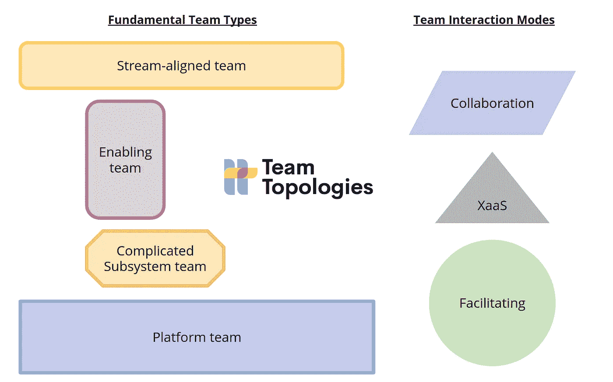
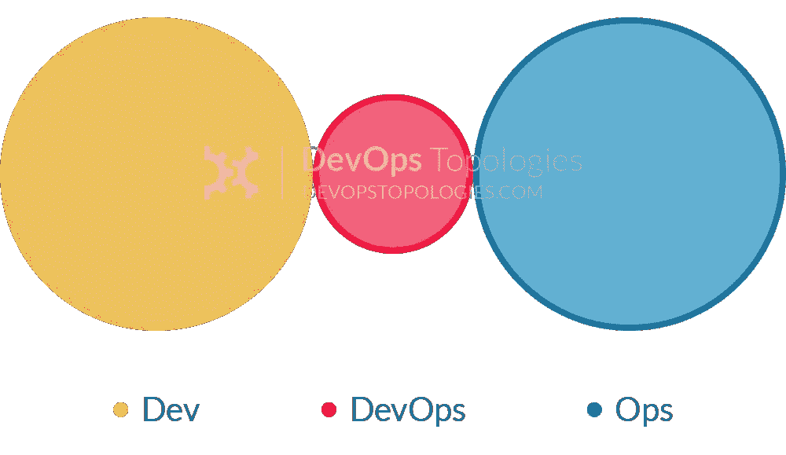
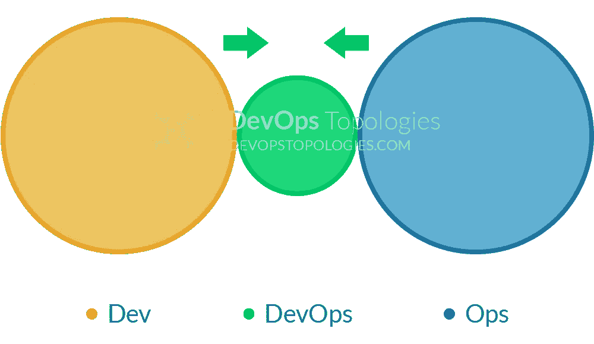
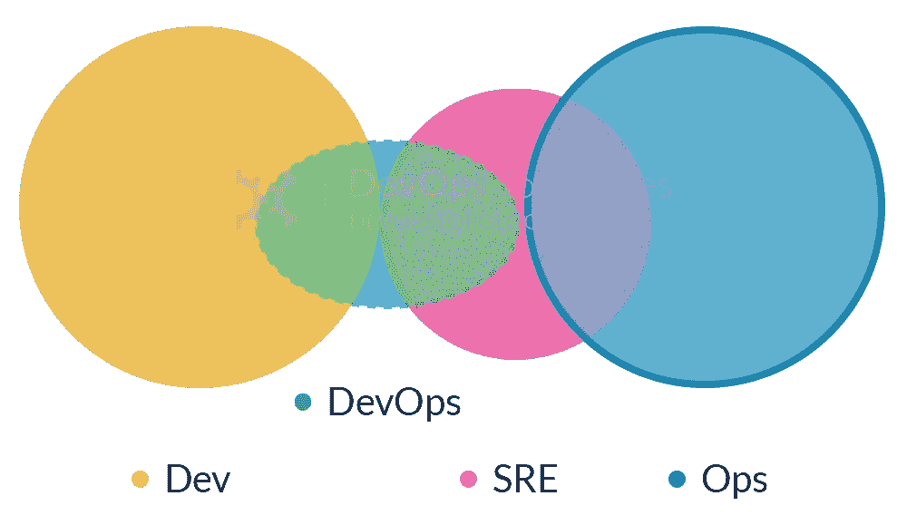
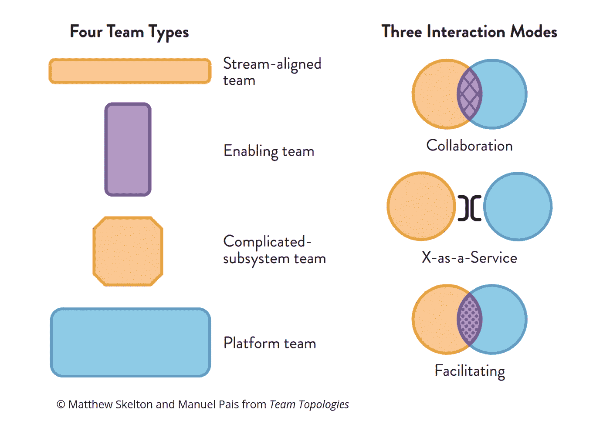

# 你的团队结构不起作用。让我们应用团队拓扑

> 原文：<https://betterprogramming.pub/your-team-structures-aint-working-let-s-apply-team-topologies-470e8d4f7fe5>

## 组建团队总是很棘手。让我们好好干吧

使用[团队拓扑形状模板](https://github.com/TeamTopologies/Team-Shape-Templates)制作的图像。模板版权 2018–2020[团队拓扑](https://teamtopologies.com/) —根据 [CC BY-SA 4.0](https://creativecommons.org/licenses/by-sa/4.0/) 授权。

我们想要理解为什么团队结构很重要，以及如何在软件交付的大环境中最有效地使用它们。Matthew Skelton 和 Manuel Pais 所著的《团队拓扑:组织业务和技术团队实现快速流程》一书对此进行了详细解释。让我们回顾一下它的关键见解以及如何应用它们。

团队结构可能是一个有分歧的问题。在团队类型上有一些大的争议。我们先来看看这些，然后看看*团队拓扑*如何让我们超越争论最佳团队类型。相反，它给了我们评估和调整团队结构以适应我们的情况的工具。

# 背景:关于团队的争议

让我们来理解围绕团队结构的几个最大的争议。一旦我们对*团队拓扑*方法有了更多的了解，我们可以稍后再回到这些。

## 争议 1:组件团队 vs .功能团队

组件团队的典型例子是“前端团队”或“后端团队”或“数据库团队”。这些是由技术领域确定的团队。功能团队开发系统中的整个功能领域，例如负责预订或新客户注册的部分。

我们可以将功能团队视为垂直的技能切片。这意味着功能团队通常需要前端、后端和任何其他技能。一个组件团队被认为是水平分割的，所以只包含一个专业的技能，例如，前端。

图片作者。

通常，组件团队[会受到批评](https://www.agil8.com/blog/component-teams-vs-feature-teams/),因为他们没有与客户直接反馈保持一致，或者没有与客户价值保持一致。反馈不一致对敏捷来说不是好事。但是我们能简单地取消所有的组件团队吗？我们稍后将回到这个争论。

## 争议二:敬业的 DevOps 团队？

鉴于特性与组件的争论，专门的 DevOps 团队受到批评并不奇怪——它显然不是一个特性团队。它冒着成为一个孤岛的风险，所有的 DevOps 知识都保存在这个孤岛中，并且不与其他团队共享。但这是否意味着我们永远不应该有 DevOps 团队？

## 分析争议

这两个争议听起来相当片面。许多人可能会得出结论，功能团队就是要走的路。但是围绕这个话题有更多的细微差别。先说 DevOps。

# DevOps 如何融入团队？

导致*团队拓扑*的工作始于 [DevOps 拓扑](https://web.devopstopologies.com/)网站。DevOps 团队作为一个竖井反模式如下所示:

来源 d [进化拓扑](https://web.devopstopologies.com/)。com —根据 CC BY-SA 4.0 获得许可。

DevOps 拓扑结构表明，只有当开发人员和运营人员之间存在孤岛时(运营人员负责基础设施)，才应该使用该模式作为过渡。处于开发和运营之间的 DevOps 团队可能会持续 12-18 个月。这是反模式的一个积极变化，将它转换成如下所示的模式:

来源 d [演化拓扑](https://web.devopstopologies.com/)。com —根据 CC BY-SA 4.0 获得许可。

另一个积极的变化是 DevOps 倡导团队。这将有助于开发人员和运营人员之间的持续协作。这是一个积极的模式，因为它继续授权并导致更好的实践。

一个更复杂的变化是由谷歌首创的网站可靠性工程(SRE)模型:

来源 d [演化拓扑](https://web.devopstopologies.com/)。com —根据 CC BY-SA 4.0 获得许可。

在 SRE 模式中，是 SRE 团队在生产中支持软件。但是与 Dev vs. Ops 反模式不同，Dev 不能将软件扔过墙。SRE 团队有软件需要满足的标准，可以拒绝不满意的软件。还有 SRE[的变体](https://cloud.google.com/blog/products/devops-sre/how-sre-teams-are-organized-and-how-to-get-started)，SRE 团队的行为就像是性能和可靠性的传道者。

这给了我们*团队拓扑*方法的味道。这不是本质上结构好坏的问题。它是关于行为模式和被结构鼓励的合作。

# 团队拓扑应用于开发团队:规模挑战

通过查看一些 DevOps 模式，我们发现并不是每个团队都必须是功能团队。这让我们可以进一步思考如何构建可扩展的开发团队。

很好理解，微服务可以为团队提供结构和边界。随着软件变得越来越大，我们必须把它分开。

> “软件开发中最根本的问题是复杂性。应对复杂性的基本方法只有一个:分而治之。”—比雅尼·斯特劳斯特鲁普

我们必须像程序员一样划分软件，这样我们就可以一次专注于一个部分。*团队拓扑*将这个想法扩展到团队，并讨论团队的“认知负荷”。给团队一个自然的职责范围，可以让团队专注并深化推进特定领域所需的知识和技能。

我们不希望团队的职权范围变得太大，以至于团队总是在追赶，无法创造性地工作。*团队拓扑*建议通过问团队一个简单的问题来确定这一点——“你觉得你是有效的，能够及时对你被要求做的工作做出反应吗？”他们甚至[提供模板调查](https://github.com/TeamTopologies/Team-Cognitive-Load-Assessment)。

团队的职权范围应该受到限制，单个团队的规模也应该受到限制。这是为什么，值得欣赏。限制权限是关于认知负荷的。但是限制团队规模的原因并不明显。

随着团队越来越大，每个人与每个人交流变得越来越难。这方面还是挺有形的。任何试图与一个太大的团队进行站立会议的人都会经历这种情况——时间太长，注意力分散。规模也导致了更多的错误交流的风险，X 报告了 Y 对 z 说的话。

限制团队规模的更重要的原因是信任关系。团队需要有一种信任的关系，以便互相挑战和公开辩论想法。否则，人们会因为害怕建议会被认为是针对个人的而退缩。建立信任需要时间，这在大型团队中很难实现。想想在你开始忘记名字、每个人的兴趣、他们的个人目标、优点、缺点和幽默感之前，需要多少人。

结果是，我们只能和一小部分人保持最牢固的关系。从那以后，关系变得越来越弱。罗宾·邓巴(Robin Dunbar)对此进行了研究，他的研究表明，团队规模为 5-15 人时，信任度较高(类似于亚马逊著名的“两块披萨法则”)，辐射水平也较高:

邓巴的数字图像由 Jono Hey—[sketchplanations.com/dunbars-number-150](http://sketchplanations.com/dunbars-number-150)， [CC BY-SA 3.0](https://creativecommons.org/licenses/by-nc/3.0/) 。

这并不意味着所有的团队都需要完全相互独立。在团队/部门/部落中可以有连锁的层级。关键是，对于一个最有效的团队来说，它应该有一个集中的职权范围，不需要超过 15 个人。是关于我们如何分工。

所以把软件分成足够小的部分——微服务——是有以人为中心的原因的。我们也可能有其他[的理由想要微服务](https://www.cio.com/article/3201193/7-reasons-to-switch-to-microservices-and-5-reasons-you-might-not-succeed.html)，比如可伸缩性、弹性或者能够独立发布部分。

如果我们想要微服务，那么将团队分配到特定的微服务是有意义的——无论是单独的服务还是相关的组。否则，可能发生的情况是，由同一个团队负责的本应独立的服务开始相互混淆。他们的 API 变得模糊，或者他们开始通过后门共享数据或配置。(这是康威定律的一种体现，即组织结构将驱动所生产软件的结构。)

所以，**我们希望团队有清晰合理的职责**。问题是:如何实现这一点？我们如何划分软件以适应团队的最佳工作流程？

# 团队边界和分裂巨石:断裂平面

*团队拓扑*建议从多种角度来看待如何划分系统。它建议寻找自然的分界线——“断裂面”——并选择那些感觉最合适的。它建议观察的角度是:

1.  **业务领域有界上下文。这意味着识别业务领域。领域驱动的设计技术可以帮助解决这个问题。**
2.  **法规合规性。**有时，监管需求会影响系统的各个部分，这意味着它们在逻辑上是分离的(例如，处理支付或个人数据的部分)。
3.  **改变节奏。**系统的某些部分可能比其他部分发布得更频繁或更不频繁。这可能是断裂面的标志。
4.  **团队位置。**如果一个团队可以面对面地交流，那么这将会有所不同。
5.  **风险。**系统的各个部分可能或多或少具有风险容忍度(例如，取决于它们拥有多少用户或交易的财务价值)。
6.  **绩效水平。**有时，系统的某些部分具有更加苛刻的扩展或吞吐量要求。
7.  **技术。**科技的差异对认知负荷很重要。你应该小心不要要求一个团队使用太多种技术。
8.  **用户角色。**例如，考虑管理用户与新用户。或者在免费使用的产品上使用付费附加功能的用户。

关键点是团队结构既影响被交付的软件，又需要反映我们想要被交付的软件。我们希望团队得到授权，这意味着围绕软件构建团队——而不是报告线或古老的组织结构图。

这给了我们一些提示，告诉我们如何将系统分成几个区域。但是什么样的团队应该负责这些领域呢？

# 什么类型的团队？

*团队拓扑*为团队类型和团队如何互动提供了一套模式。这些是可能被分配到系统部分的团队类型的模板。指导原则是让团队交付业务价值，并使用其他结构来支持这些团队。相互依赖应该被最小化，但是深入的互动在实验阶段是有价值的。

# 团队类型和交互的模式

这本书提出了四种基本的团队类型和三种协作模式。这些可以作为如何理解和设计团队的模板。

图片版权 2018–2020[团队拓扑](https://teamtopologies.com/)。

让我们了解这些元素，并探索如何应用它们。

# 团队类型

## 流程一致的团队

与流程一致的团队与单一的工作流程一致。这可能是一个特性，一个产品或服务，一个用户角色，或者任何其他的交付直接商业价值的工作流。

流程一致的团队应该是组织中的主要团队类型。其他类型的团队旨在提供服务、工具和支持，以最大化与流程一致的团队的流动。

## 平台团队

平台团队的任务是通过提供较低层次的详细知识，打包成服务，来减少与流程一致的团队的认知负荷。例如，考虑诸如供应、监控或部署之类的服务。平台团队将这些服务打包，使其易于通过自助服务 API 使用。

有了平台，满足消费团队的需求至关重要。平台发展的风险在于，它会决定消费团队能做什么，不能做什么。作者谈到了瞄准一个最薄的可行平台来服务于实现的目的。

## 复杂子系统团队

复杂子系统团队处理系统中需要大量专业知识的部分。拥有这样的团队减少了与流程一致的团队的认知负荷。对复杂子系统团队的需求是一种认识，即系统的某些部分足够复杂，你需要一个专家团队来公正地处理它。例子可以是高度数学化或涉及复杂算法的子系统。

## 扶持团队

与流程一致的团队总是试图做新的事情，并随着业务需求不断前进，同时跟上行业趋势。支持团队由特定领域(例如，技术领域)的专家组成，并提供补充流程调整团队的功能。

支持团队能够很好地进行研究，尝试各种可能性，并对工具或实践提出建议。这个想法是，授权团队授权给与流程一致的团队，目的是最终不再需要帮助(至少不再需要相同的帮助)。

# 交互模式

## 合作

协作有利于快速发现。这涉及到相关团队之间的大量互动。这允许思想和创新的碰撞。这往往意味着交互团队之间的边界模糊，但如果它有助于团队进行实验并找到最佳方法，这可能是一件好事。这种短期的界限模糊会导致后来的清晰。

## x 即服务

这适合于一个团队提供另一个团队使用的库、组件或 API 的情况。所提供的服务应该简单地工作，不需要团队的大量输入。如果需要大量输入来定义服务应该做什么，那么可以暂时使用协作模式。

## 促进

这是一个赋能团队的主要运作模式。我们可以将此视为“指导”或提供类似的基于技能或基于建议的服务。

# 重新审视争议

根据我们所学到的，组件团队与功能团队的争论看起来过于简单了。当然，在可能的情况下，应该避免简单地根据前端或后端专业化组建团队。但是如果团队在必要的时候偶尔由专家组成也是可以的(例如，复杂的子系统团队)。团队可以为其他团队服务，而不是直接为客户服务(例如，平台团队)。

我们现在有了比“特性”和“组件”团队更精炼的概念。我们现在可以将我们在现实世界中看到的团队与流对齐、授权、复杂子系统和平台团队的模式进行比较。

我们还了解到，围绕 DevOps 和团队有一系列模式。开发运维技能可能嵌入到团队中，或者可能有一个支持开发运维的团队，或者可能使用 SRE 模型。

关键是**我们评估一个团队结构是否运转良好**。具体来说，我们可以看看:

*   团队成员的认知负荷。
*   断裂面是否正确。
*   团队和其他团队的界限是否清晰？
*   团队之间有摩擦吗？
*   我们是否在团队之间的移交中看到很多延迟？
*   沟通开销和团队规模。
*   团队成员和技能，以及团队是否有能力实现其目标。

我们不需要争论哪种团队类型是最好的。我们可以评估我们的结构对我们的团队工作得有多好，并将它们与众所周知的模式进行比较。

# 应用团队拓扑

我们谈论的技术并不意味着要严格应用。我们不需要解散现有的团队，因为我们不会立即看到他们如何适应一种类型。

> *“团队拓扑*旨在提供清晰的模式，便于许多不同的团队和组织遵循和解释，而不是命令优秀的玩家如何执行*”—团队拓扑*

灵活性也是该方法的关键，因为团队结构意味着随着时间的推移而发展。

> “组织不仅需要努力建立自主团队，他们还需要不断思考和发展自己，以便快速向客户交付价值”——*团队拓扑*

这本书谈到了一个“发现到建立”的过程。我们应该期望看到团队需要在初始阶段紧密合作，以便更好地定义边界(API、移交等)。).这种协作将随着时间的推移而减少，并转变为符合 X 即服务交互模式的明确边界。

软件也会随着业务的变化而变化。曾经经历了大量发展的领域可能以后会进入维护模式。业务环境也可能导致想要发展已经处于维护模式的领域，并且随着新工具的不断出现，这种业务变化将在技术领域变化的背景下发生。

不要认为团队结构是固定的，我们可以考虑组织的方向以及团队结构如何与之相适应。如果一个组织试图做一些新的事情，认识到这一点会有所帮助。这让我们更加意识到需要一段时间的创新和合作。我们希望优化自主性和快速流动，但我们应该注意这是以创新为代价的。

团队拓扑给了我们如此深刻的视角，值得提醒我们自己团队结构并不是团队工作的全部。团队之间的摩擦可能不是结构性问题——它[可能是筒仓问题](https://www.infoq.com/articles/silos-politics-software-products/)。团队内部的功能障碍[可能源于与其他团队的互动，也可能源于团队内部。](https://dzone.com/articles/agile-teamwork)

Skelton 和 Pais 专注于团队合作的团队结构方面，并且做得很好。这本书为设计、分析和调整团队结构提供了一个视角和一套工具。这是一本很好的读物，其中有丰富的细微差别和例子，我无法在这里介绍。2019 年底出版，影响力越来越大。期待在未来听到更多关于这本书及其方法的内容。