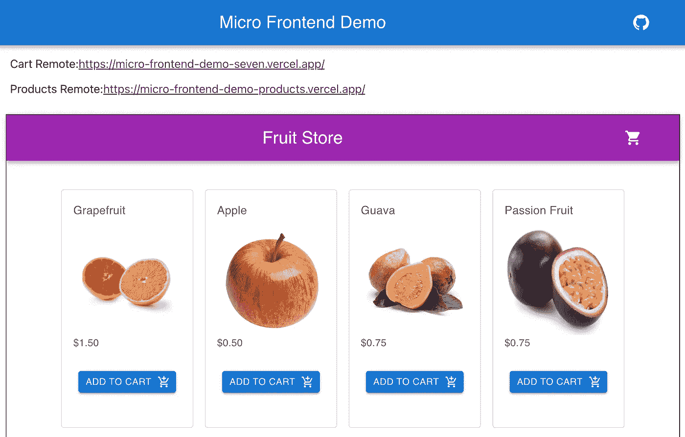

# 祖站在微前端

> 原文：<https://betterprogramming.pub/zustand-in-a-micro-frontend-b92d02a51577>

## 状态管理变得简单。

由[曼尼·韦塞拉](https://unsplash.com/@mannyb?utm_source=medium&utm_medium=referral)在 [Unsplash](https://unsplash.com?utm_source=medium&utm_medium=referral) 拍摄的照片

当您开发使用 Webpack 的模块联合构建的大规模微前端应用程序时，您最终将需要在您的微应用程序之间共享数据和通信。我将在后面的文章中介绍许多可用的选项，但首先我想与您分享一个使用状态管理解决方案的示例。

> 注意:在微前端架构中共享全局状态应该是最后的手段，并且应该仔细设计，因为它会在您的团队之间引入不必要的耦合。

Zustand 是一个相对较新的状态管理工具，仍处于其生命周期的早期，每周下载量仅为 47 万次，但它的发展势头很快。这是一个优雅且有趣的解决方案，我强烈建议您尝试一下。

我们如何建立一个可以在我们的微应用中使用的 Zustand 商店？

# 创建共享 Zustand 商店

首先，我们需要在我们的一个微应用程序中实例化一个 Zustand 商店。它可以是任何公开具有模块联合的远程模块。

在这个例子中，我们有一个商店，它跟踪某种形式的购物车，并使用方法在购物车中添加或删除商品。

注意，我们通过创建一个`useStore`钩子来实例化商店。这是我们将向其他应用程序公开的内容。

接下来，我们更新我们的`webpack.config.js`:

现在，我们可以在其他微应用中使用商店了:

瞧啊。您已经在微前端架构中创建了一个全局状态。恭喜你！

# 活生生的例子

看看我的微前端演示应用:[https://micro-frontend-demo-main.vercel.app/](https://micro-frontend-demo-main.vercel.app/)

这是一个购买不同种类水果的虚拟电子商务网站。它由一个主机应用程序和两个遥控器组成:购物车和产品。cart remote 公开了一个 Zustand 存储，用于管理购物车中的商品，并添加和删除它们。产品遥控器使用它，因此它知道哪些商品已经添加到购物车中，以及添加了多少，允许您更改数量或删除/添加商品。另外，本例中的 Zustand 存储将购物车状态存储在本地存储中，并在页面加载时进行水合物处理，因此我们可以跨会话持久化您的购物车。

你可以在这里查看源代码:[https://github.com/rautio/micro-frontend-demo](https://github.com/rautio/micro-frontend-demo/tree/zustand-remote-state)

如果你喜欢这篇文章，请在 Medium 上关注我，了解更多关于微前端和 Webpack 模块联盟的故事。